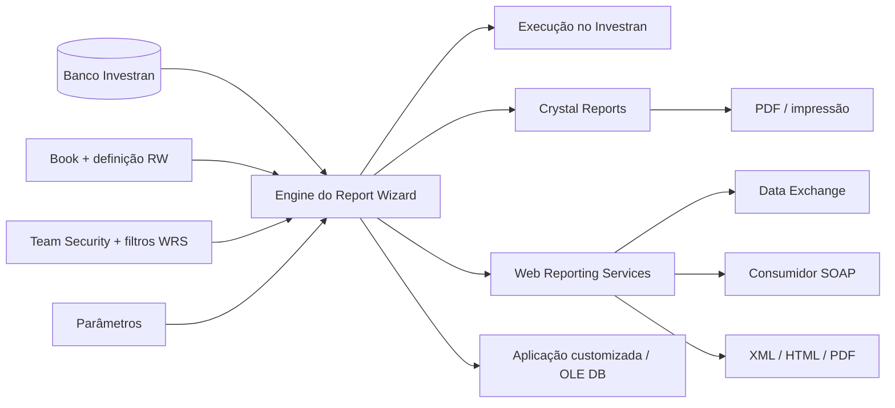

# Report Wizard, Crystal Reports e Web Reporting Services

Esta área descreve a cadeia completa de reporting do Investran: definição e execução de relatórios no Report Wizard (RW), formatação no Crystal Reports e exposição externa pelo Web Reporting Services (WRS).

> Os manuais disponíveis são do Investran 7 e foram publicados principalmente em 2014. Confirme componentes, versões, URLs e procedimentos no ambiente atual antes de qualquer intervenção.

## Guias desta área

- [Guia prático do Report Wizard](reporting/guia-pratico-report-wizard.md): criação, parâmetros, integração Crystal, validação, performance e troubleshooting com telas das ferramentas.
- [Guia prático do Web Reporting Services](reporting/guia-pratico-reporting-services.md): instalação, segurança, publicação, API SOAP, formatos e suporte com telas das ferramentas.
- [Microsoft SQL Server Reporting Services](reporting/04-microsoft-ssrs.md): diferenças em relação ao WRS, possíveis padrões com Investran, administração, segurança e troubleshooting.

| Guia | Use quando precisar |
|---|---|
| [Report Wizard: desenvolvimento e operação](reporting/02-report-wizard-desenvolvimento-operacao.md) | criar, alterar, parametrizar, executar, versionar ou diagnosticar um relatório RW |
| [Web Reporting Services](reporting/03-web-reporting-services.md) | entender instalação, publicação, segurança, usuários, API SOAP e formatos de saída do WRS |
| [Arquitetura de reporting](reporting/01-arquitetura-reporting.md) | localizar a camada responsável por uma falha ou avaliar o impacto de uma mudança |
| [Runbook - Falha de reporting](../runbooks/falha-reporting.md) | atuar durante um incidente de Report Wizard, Crystal ou WRS |

## Visão resumida

## Diferença entre os componentes

| Componente | Responsabilidade | Não confundir com |
|---|---|---|
| Report Wizard | selecionar dados, aplicar filtros/parâmetros, agregar, ordenar e executar | layout avançado de impressão |
| Crystal Reports | apresentação, seções, fórmulas, grupos, subreports e layout final | fonte primária ou regra de segurança |
| RW/Investran OLE DB Provider | permitir que Crystal ou código execute um report RW como fonte de dados | acesso SQL genérico sem regras do RW |
| WRS | publicar e executar reports RW remotamente por Web Service | a Web API REST construída pela equipe |
| Data Exchange | portal/consumidor que chama o WRS | engine de execução do relatório |

## Regra de ouro para mudanças

Um report RW deve ser tratado como um contrato compartilhado. Uma alteração em coluna, nome, tipo, filtro, parâmetro, agregação ou cardinalidade pode quebrar Crystal Reports, Active Templates, Allocation Rules, Business Events, WRS e aplicações customizadas.

Antes de alterar:

1. identifique o book, report, owner e todos os consumidores;
2. exporte ou salve uma cópia da última versão válida;
3. registre schema, parâmetros, totais e tempo de execução atuais;
4. faça a alteração em ambiente não produtivo;
5. valide o RW isoladamente com dados conhecidos;
6. teste cada consumidor e formato de saída;
7. publique com plano de rollback e evidência de reconciliação.

## Catálogo mínimo por relatório crítico

Registre para cada report:

- nome e book/pasta;
- objetivo de negócio e owner;
- tipo: RW puro, driver, shell Crystal ou dependência técnica;
- consumidores humanos e automáticos;
- parâmetros, tipos, defaults e exemplos válidos;
- colunas, tipos, ordenação, agrupamentos e totais esperados;
- filtros e security levels;
- formatos permitidos e frequência;
- volume e duração de referência;
- dependências e versão publicada;
- procedimento de validação e rollback.

## KT prioritário

- inventário dos reports críticos da organização e respectivos owners;
- reports usados como drivers de Active Templates e Allocation Rules;
- shells e drivers de Crystal Dynamic Reporting;
- security levels, filtros WRS e contatos de teste;
- URL, CompanyID, app pool, certificado e logs do WRS por ambiente;
- baselines de volume e performance;
- processo real de promoção entre DEV, UAT e PROD;
- incidentes conhecidos, consultas de diagnóstico e critérios de escalonamento.

## Fontes

- *Internal_Inv7_INV_RW_Dev_Guide_7.pdf*.
- *Internal_Inv7_INV_WRS_Install-Admin_7.pdf*.
- *Internal_Inv7_InWRS_API_Guide.pdf*.
- *Crystal Reports Guidebook.pdf*.
