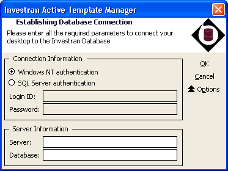
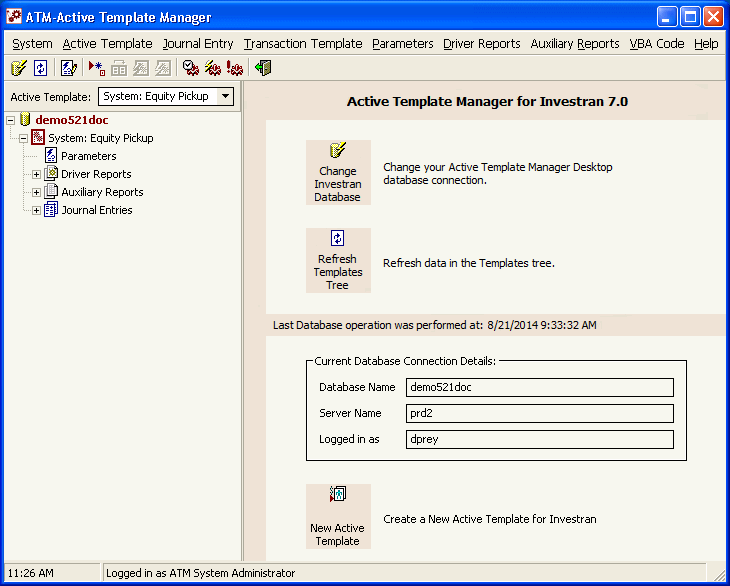
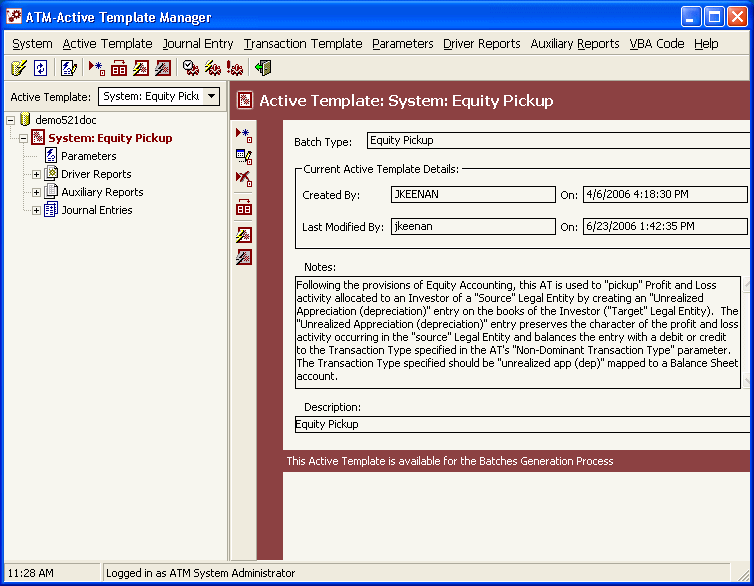
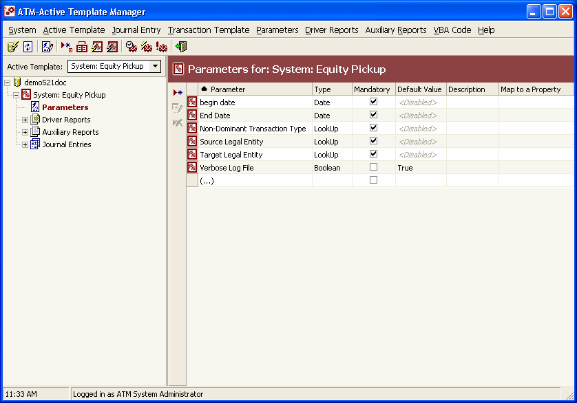
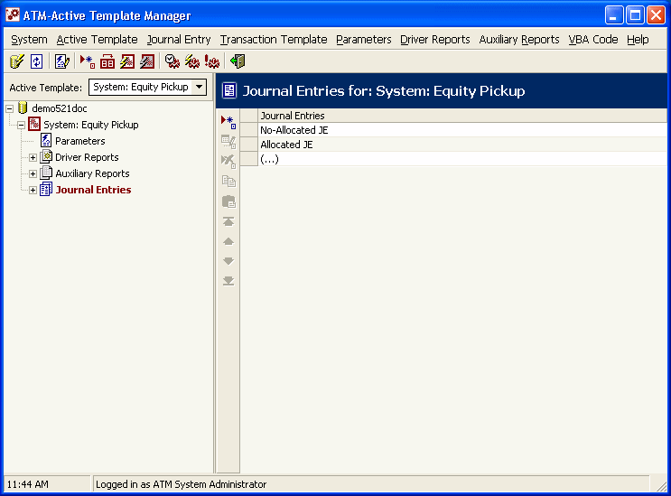
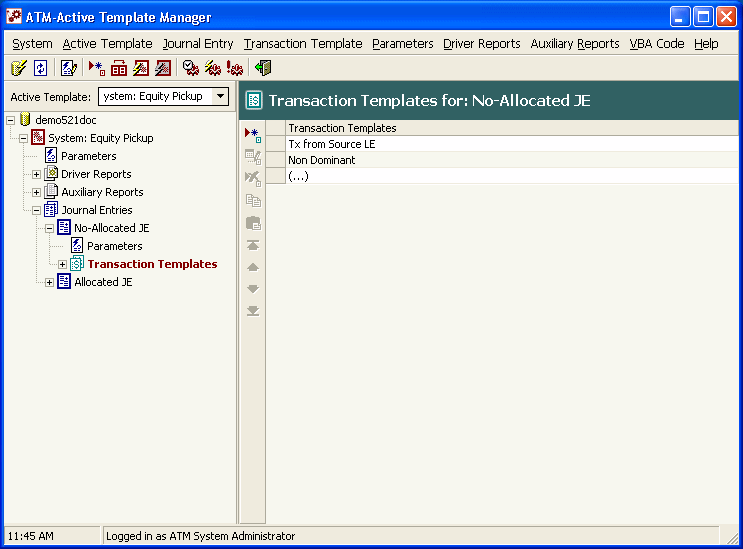
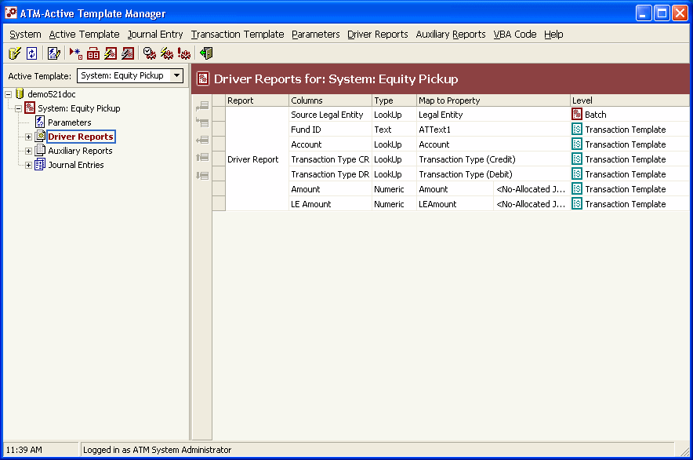
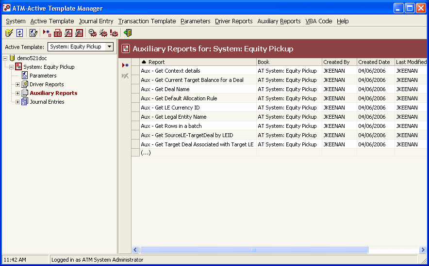
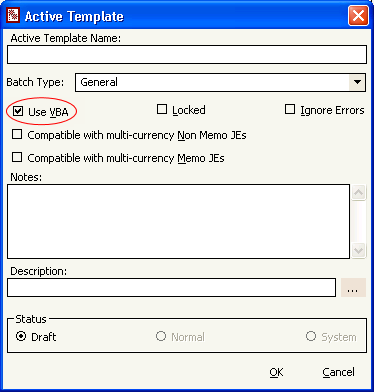

# Active Template Manager - interface, acesso e navegação

## Onde encontrar

O produto padrão fornece uma aplicação desktop chamada **Active Template Manager (ATM)**. Ao abri-la, aparece uma tela de login semelhante às telas do Investran e do Report Wizard. Informe os dados do database e clique em `OK`.



*Tela de conexão do ATM. Confirme servidor, database e método de autenticação antes de prosseguir. Fonte: Investran 7 Developer's Guide to Active Template Manager, p. 3.*

O manual não define o caminho do executável ou atalho em cada cliente. Registre durante o KT:

- servidor ou workstation onde o ATM está instalado;
- nome do atalho/executável e versão;
- databases de DEV, UAT e PROD;
- como reconhecer visualmente cada ambiente;
- entitlements necessários no Team Security.

## Como localizar um Active Template

Após a conexão, o ATM carrega os templates disponíveis no database. Use a lista suspensa de Active Templates no painel principal e selecione o nome desejado.



*Tela principal após a conexão, com árvore de templates à esquerda, ações centrais e informações do database à direita. Fonte: guia de ATM, p. 10.*

Ao selecionar um AT, confira no painel direito:

- creator e created date/time;
- last modified by e last modified date/time;
- notes;
- Batch Type;
- status: `Draft`, `Normal` ou `System`.



*Detalhes do template selecionado, incluindo Batch Type, datas, Notes, Description e aviso de estado. Fonte: guia de ATM, p. 11.*

O manual não documenta busca por ID. Se houver templates de nomes semelhantes, confirme atributos, dependências, Batch Type e consumidor antes de editar.

## Árvore do template

```text
Active Template
├── Parameters
├── Driver Reports (até 3)
│   ├── Columns
│   └── Parameters
├── Auxiliary Reports (quantidade ilimitada)
│   ├── Columns
│   └── Parameters
└── Journal Entries
    └── Transaction Templates
```

Selecione um nó à esquerda para visualizar detalhes no painel direito. Expanda reports para conferir columns e parameters.



*Nó Parameters selecionado na árvore. A grade permite conferir tipo, obrigatoriedade, default e property mapping. Fonte: guia de ATM, p. 12.*

## Menus principais

### System

| Opção | Ação |
|---|---|
| `Change Database` | abre novamente o login para trocar o database |
| `Refresh Tree` | recarrega templates e metadados desde o último login/refresh |
| `Exit` | fecha o ATM |

### Process Maintenance

| Opção | Ação |
|---|---|
| `Processes Notification` | configura notificações de geração, commit ou falha |
| `Batch Generation` | acompanha a fase de geração no Staging |
| `Commit Transactions` | acompanha a fase de transferência ao Investran |

### Active Template

| Opção | Ação | Observação |
|---|---|---|
| `Add` | cria AT | nasce em `Draft` |
| `Edit` | altera atributos | indisponível enquanto outro usuário executa o AT |
| `Delete` | exclui AT | indisponível enquanto o AT está em execução |
| `Duplicate` | cria cópia | use como base segura conforme convenção local |
| `Run` | agenda execução no Scheduler | pode gerar dados no Staging e posteriormente no Investran |
| `Simulate` | executa em memória | não grava no Staging nem no Investran |

### Journal Entry e Transaction Template

Os dois menus permitem `Add`, `Edit`, `Delete`, `Copy`, `Paste`, `Top`, `Up`, `Down` e `Bottom`. A ordem é funcional porque define `JEIndex` e `TXIndex` recebidos pelos eventos VBA.



*Journal Entries definidos no template. A ordem da lista determina o `JEIndex`. Fonte: guia de ATM, p. 14.*



*Transaction Templates dentro de um Journal Entry. A ordem determina o `TXIndex`. Fonte: guia de ATM, p. 15.*

### Parameters

- `Define`: cria um parâmetro Investran reutilizável por AT, AR e RW;
- `Add`, `Edit`, `Delete`: mantém o parâmetro no template;
- ordenações por level, name, type, mandatory status e property mapping.

### Driver Reports

- `Insert Before` / `Insert After`: adiciona report de pasta Public Read-only;
- `Remove`: remove associação;
- `Up` / `Down`: muda a ordem dos drivers.

Um AT suporta no máximo três Driver Reports. A ordem pode afetar a hierarquia e a geração.



*Driver Reports associados ao template. Expanda o report para revisar Columns e Parameters. Fonte: guia de ATM, p. 13.*

### Auxiliary Reports

Permite adicionar/remover e ordenar. Não há limite documentado. Auxiliary Reports são executados explicitamente pelo VBA; o engine executa Driver Reports automaticamente.



*Lista de Auxiliary Reports disponíveis para consumo pelo VBA. Fonte: guia de ATM, p. 13.*

### VBA Code

| Opção | Ação |
|---|---|
| `Show VBA Editor` | mostra o módulo VBA do AT |
| `Save VBA Module` | persiste as alterações feitas no código |

Não confunda `Save VBA Module` com mudança de status, exportação ou promoção. São operações separadas.

## Atributos do Active Template

Abra `Active Template > Edit` para consultar ou alterar:



*Janela Add/Edit do Active Template, com Batch Type, Use VBA, Locked, Ignore Errors, compatibilidade multi-currency, Notes, Description e Status. Fonte: guia de ATM, p. 17.*

| Atributo | Efeito |
|---|---|
| `Active Template Name` | identidade funcional do AT |
| `Batch Type` | tipo dos batches gerados |
| `Use VBA` | habilita o módulo VBA |
| `Locked` | somente o desenvolvedor que bloqueou pode modificar |
| `Ignore Errors` | continua após falhas, grava transações válidas no Staging e erros no log |
| compatibilidade multi-currency non-memo | declara suporte quando essa configuração estiver habilitada |
| compatibilidade multi-currency memo | declara suporte quando essa configuração estiver habilitada |
| `Notes` | documentação técnica/funcional |
| `Description` | texto enviado a `BatchComments`; aceita placeholders de parâmetros |
| `Status` | `Draft`, `Normal` ou `System` |

### Cuidado com `Ignore Errors`

Quando marcado, o processo pode terminar com parte das transações válidas no Staging e erros no Error Log. Isso pode gerar um resultado tecnicamente “concluído”, porém funcionalmente incompleto. Mantenha desmarcado por padrão e só use com requisito explícito, reconciliação e aprovação.

### Description parametrizada

O texto pode conter placeholders. Por exemplo, `Valuation as of <GLDate>` é convertido em runtime usando o valor do parâmetro. Ao renomear um parâmetro, revise também Description, reports e VBA.

## Como confirmar que está no lugar certo

Antes de qualquer alteração:

- [ ] database correto;
- [ ] AT correto e não apenas nome semelhante;
- [ ] Batch Type correto;
- [ ] status e lock conhecidos;
- [ ] nenhum usuário executando o AT;
- [ ] creator/last modified registrados;
- [ ] árvore e dependências exportadas/inventariadas;
- [ ] ticket e comportamento esperado confirmados.

## Fonte

- *Internal_Inv7_INV_ATM_Dev_Guide_7.pdf*, capítulos Getting Started in ATM, Menu Options, Active Template Attributes e Navigation.
