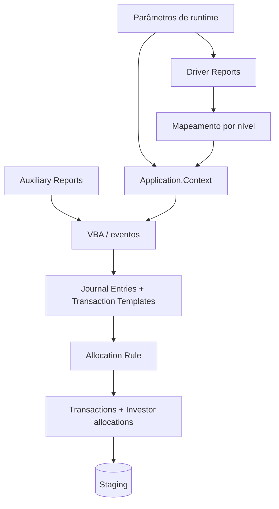
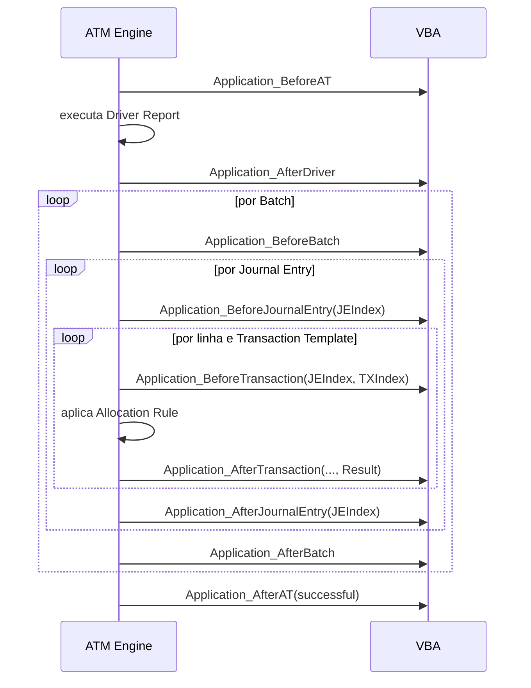

# Active Templates - estrutura e funcionamento

## Fluxo de execução



O ATM Engine combina a definição do AT com os valores fornecidos em runtime. Um processo bem-sucedido gera batches temporários no Staging, aguardando Preview e Commit.

## Parameters

Parameters são os valores solicitados ao usuário quando o AT é executado, como Legal Entity, GL Date, Deal ou Transfer Date.

Ao adicionar um parâmetro, defina:

- tipo e lookup, se aplicável;
- nível: Batch, Journal Entry ou Transaction;
- obrigatoriedade (`Is Mandatory`);
- valor default;
- `Map To a Property`, quando o valor deve preencher diretamente o `Context`.

Todos os parameters são apresentados juntos em runtime, independentemente do nível.

### Mapeamento direto

Um parâmetro mapeado sobrescreve a property correspondente em runtime. O nível deve ser compatível com a property. Se um valor precisa de transformação ou validação, pode ser lido pelo VBA com `Application.Context.Value("Nome")` e atribuído explicitamente.

## Driver Reports

Driver Reports controlam o conjunto processado pelo AT. O engine os executa automaticamente. O número de linhas retornadas determina, em grande parte, quantas transactions podem ser criadas.

Um AT aceita de zero a três drivers.

### Regras do mapping

Cada coluna visível deve ser mapeada para uma property do `Application.Context` e para um nível:

| Nível | Quando usar | Efeito de mudança entre linhas |
|---|---|---|
| Batch | valor que separa batches, como Legal Entity em certos cenários | inicia novo batch |
| Journal Entry | valor que separa lançamentos dentro do batch | inicia novo Journal Entry |
| Transaction Template | valor específico da transação | cria/preenche transaction |

Colunas numéricas também devem indicar a quais Transaction Templates se aplicam. Isso permite, por exemplo, mapear uma coluna positiva para rebook e outra negativa para reversal.

### Contrato de nomes

Parameters do AT que devem alimentar parameters do Driver Report precisam ter o mesmo nome. O engine faz a propagação pela correspondência de nomes.

### Zero transactions

Cada linha do driver tenta criar as transactions definidas no template. Uma transaction pode ser eliminada quando todos os valores relevantes são zero e `Allow zero transactions` não está marcado.

## Auxiliary Reports

Auxiliary Reports fornecem dados complementares e são executados pelo VBA:

```vb
Dim report As RWReport
Set report = Application.Reports.Item(, "Book", "Report")
report.Parameter("LEID") = Application.Context.LegalEntity
report.Run
```

Valide explicitamente a cardinalidade:

- zero linhas: ausência de dado deve ser tratada;
- uma linha: cenário esperado quando o lookup é singular;
- mais de uma linha: erro ou regra de agregação precisa ser definida.

Todos os reports usados pelo AT devem estar em pastas Public Read-only. Depois de alterá-los, execute Refresh no ATM.

## Journal Entry Templates

Definem a estrutura dos Journal Entries que o AT produzirá. É possível adicionar, editar, excluir, copiar, colar e reordenar.

O atributo `Allow zero transactions` determina se transactions com Amount local e LE Amount iguais a zero permanecem na saída.

## Transaction Templates

São os moldes das transactions de cada Journal Entry. A ordem define `TXIndex` no VBA e pode separar dominant, reversal, rebook e non-dominant.

Ao revisar uma transaction, identifique:

- Transaction Type;
- Account;
- Deal, Position, Lot, Pool e Income Security;
- GL Date, Effective Date e Settlement Date;
- Amount, LEAmount e Quantity;
- moeda e escalas;
- Allocation Rule;
- comentários, referências e UDFs;
- papel dominant ou non-dominant.

## VBA e object model

### `Application`

Representa a execução do AT. Membros úteis:

- `ActiveTemplateID`;
- `Context`;
- `DriverReport`, `DriverReportCurrentRow` e `DriverReportRecordCount`;
- `Reports` para Auxiliary Reports;
- `ProcessID` e `LogFileName`;
- `Log(message)`;
- `CancelExecution()`;
- `NewInvestorSet(...)`.

### `Application.Context`

É a interface entre o VBA e o ATM Engine. Suas properties formam os registros gerados. Algumas importantes:

- `LegalEntity`, `GLDate` e `EffectiveDate`;
- `Deal`, `Position`, `Account`, `Pool`, `Lot` e Income Security;
- `Amount`, `LEAmount`, `Quantity` e escalas;
- `TransactionCurrency`;
- `AllocationRule`;
- `Value("ParameterName")` para valores sem property direta.

`LegalEntity`, `GLDate` e `EffectiveDate` são obrigatórias segundo o manual. Outros campos dependem do Transaction Type e do processo.

## Ordem dos eventos



### Onde colocar cada lógica

| Evento | Uso recomendado |
|---|---|
| `BeforeAT` | inicialização global e validações anteriores ao driver |
| `AfterDriver` | validações do driver antes de criar batches |
| `BeforeBatch` | inicializar acumuladores ou validar contexto do batch |
| `BeforeJournalEntry` | preencher/validar campos comuns do JE |
| `BeforeTransaction` | definir valores, tipos, datas e Allocation Rule antes da alocação |
| `AfterTransaction` | revisar/modificar `InvestorSet`; implementar User Provided |
| `AfterJournalEntry` | validar balanceamento/acumuladores do JE |
| `AfterBatch` | validações finais do batch |
| `AfterAT` | logging/limpeza final, inclusive em falha |

Com Driver Report, eventos podem disparar muitas vezes. `BeforeTransaction` e `AfterTransaction` disparam para cada linha e para cada Transaction Template aplicável.

## Regras contábeis confirmadas

- um Journal Entry não pode misturar transactions alocadas e não alocadas;
- todas as Investor allocations de uma transaction devem ter o mesmo sinal;
- Journal Entries non-memo devem balancear a zero;
- o tratamento da non-dominant depende da configuração de multi-currency;
- use `Option Explicit`;
- use UDFs/reports para valores mutáveis, evitando hard-code.

## Como entender um AT desconhecido

1. Leia atributos e Notes.
2. Desenhe a árvore de JEs/Transactions com índices.
3. Liste parameters e mappings.
4. Execute Driver Reports isoladamente.
5. Identifique Auxiliary Reports chamados pelo VBA.
6. Marque quais eventos existem.
7. Para cada evento, registre quais properties lê e altera.
8. Identifique Allocation Rules e uso de `Result`.
9. Calcule quantidade esperada de batches/JEs/transactions.
10. Compare com Simulation e Preview.

## Fonte

- *Internal_Inv7_INV_ATM_Dev_Guide_7.pdf*, capítulos Navigation, Commonly Used VBA Classes e Active Template Examples.
