# Active Templates - alteração, salvamento e publicação

## Antes de alterar

Não comece pelo código. Primeiro:

1. confirme ambiente/database;
2. confirme nome, Batch Type, status e last modified;
3. verifique `Locked` e se alguém está executando o AT;
4. reproduza o comportamento atual;
5. identifique o componente responsável;
6. inventarie dependências;
7. preserve a versão aprovada por duplicação/export conforme o processo local;
8. trabalhe em `Draft` e fora de produção.

## Escolher o ponto correto de alteração

```mermaid
flowchart TD
    S[Sintoma] --> P{Entrada do usuário errada?}
    P -->|Sim| PARAM[Parameter / mapping / default]
    P -->|Não| D{Conjunto de linhas errado?}
    D -->|Sim| DR[Driver Report / filtro / nível]
    D -->|Não| A{Dado auxiliar errado?}
    A -->|Sim| AUX[Auxiliary Report / chamada VBA]
    A -->|Não| J{Estrutura do lançamento errada?}
    J -->|Sim| JT[JE / Transaction Template / ordem]
    J -->|Não| V{Valor ou regra muda durante execução?}
    V -->|Sim| VBA[VBA / Context / evento]
    V -->|Não| CFG[Allocation Rule / configuração / Scheduler]
```

### Alterar atributos

Use `Active Template > Edit`. Revise o impacto de:

- Batch Type;
- `Use VBA`;
- `Locked`;
- `Ignore Errors`;
- flags de multi-currency;
- Notes e Description;
- status.

Salvar o diálogo persiste os atributos, mas não substitui `Save VBA Module` para mudanças no código.

### Alterar Parameters

Selecione `Parameters` ou o nível correspondente e use `Add`/`Edit`/`Delete`.

Ao renomear ou alterar um parâmetro, procure referências em:

- Description placeholders;
- Driver Report parameters;
- Auxiliary Report parameters;
- `Application.Context.Value("...")`;
- mappings;
- schedules/processos externos.

### Alterar Driver Report

Prefira corrigir o report no Report Wizard, validá-lo isoladamente e depois executar Refresh no ATM.

No ATM, confira:

- ordem dos drivers;
- parâmetros com nomes idênticos aos parameters do AT;
- cada coluna visível mapeada;
- property e nível corretos;
- Transaction Template correto para colunas numéricas;
- cardinalidade e ordenação estáveis.

### Alterar Auxiliary Report

Depois da mudança no RW:

1. execute com os mesmos parâmetros;
2. confirme columns e tipos consumidos pelo VBA;
3. execute Refresh no ATM;
4. valide zero, uma e múltiplas linhas;
5. simule o AT.

### Alterar Journal Entry/Transaction Template

Use `Edit` para propriedades ou `Copy/Paste` para criar uma variação. Reordene com `Top/Up/Down/Bottom`.

Depois de reordenar, revise todos os testes por `JEIndex` e `TXIndex` no VBA. Um simples movimento pode mudar qual branch do código é executado.

### Alterar VBA

1. Marque `Use VBA` nos atributos, se necessário.
2. Abra `VBA Code > Show VBA Editor`.
3. Garanta `Option Explicit` na primeira linha.
4. Faça a menor mudança possível.
5. Salve com `VBA Code > Save VBA Module`.
6. Inicie Simulation para validar sintaxe e lógica.

Não feche, troque de database ou promova assumindo que o editor salvou automaticamente.

## O que significa “salvar” no ATM

| Mudança | Como persistir | Como validar |
|---|---|---|
| atributos do AT | confirmar o diálogo Add/Edit | selecionar novamente o AT e conferir painel |
| Parameter | confirmar Add/Edit | reabrir o nó e verificar mapping/default |
| Journal Entry/Transaction Template | confirmar diálogo | reabrir, conferir ordem e propriedades |
| associação/mapping de report | confirmar no painel correspondente | Refresh/reabrir e conferir columns/parameters |
| código VBA | `VBA Code > Save VBA Module` | fechar/reabrir editor e simular |
| status | `Active Template > Edit` e confirmar | conferir `Draft`/`Normal` no painel |
| versão entre bancos | ARM & ATM Export-Import Console | abrir no destino e executar smoke test |

## Sequência de alteração segura

1. Capture baseline: parâmetros, reports, logs e Preview atual.
2. Duplique/exporte a versão anterior.
3. Mantenha a nova versão em `Draft`.
4. Altere um componente por vez.
5. Salve pelo mecanismo específico desse componente.
6. Reabra/recarregue para confirmar persistência.
7. Execute reports isoladamente.
8. Simule com o cenário original e casos de borda.
9. Compare batches, JEs, transactions e allocations.
10. Execute pelo Scheduler com Preview.
11. Obtenha aprovação funcional/contábil.
12. Mude para `Normal`.

## Testes obrigatórios

- cenário que reproduz o defeito;
- cenário nominal conhecido;
- zero linhas e uma linha no driver;
- múltiplas linhas e mudança de nível;
- valores zero e negativos aplicáveis;
- parâmetros vazios/default;
- sinais e balanceamento;
- Local Amount, LEAmount e Quantity;
- dominant/non-dominant;
- Investor allocations;
- multi-currency quando aplicável;
- volume representativo.

## Publicação entre ambientes

O manual confirma o **ARM & ATM Export-Import Console** para transferir Active Templates e reports relacionados entre databases. O processo Goldman Sachs ainda precisa definir:

- origem/destino e permissões;
- objetos incluídos no pacote;
- parâmetros, UDFs, Allocation Rules e outros itens promovidos separadamente;
- tratamento de conflitos e IDs;
- ordem de importação;
- ticket, approvals e janela;
- smoke test e rollback.

### Checklist de publicação

- [ ] versão anterior preservada;
- [ ] AT em `Normal` somente após testes;
- [ ] reports em Public Read-only e atualizados;
- [ ] mappings conferidos no destino;
- [ ] Allocation Rule IDs validados;
- [ ] referências VBA disponíveis;
- [ ] Scheduler/Staging saudáveis;
- [ ] parâmetros e UDFs presentes;
- [ ] Preview reconciliado no destino;
- [ ] owner aprovou o resultado.

## Rollback

O rollback técnico deve restaurar o conjunto coerente, não apenas o VBA:

- AT e atributos;
- Driver/Auxiliary Reports;
- Parameters/mappings;
- JEs/Transaction Templates;
- Allocation Rules e configurações dependentes.

Se batches incorretos já foram commitados, restaurar o template não desfaz a contabilidade. Interrompa novas execuções e siga o processo aprovado de reversão/rebook.

## Fonte

- *Internal_Inv7_INV_ATM_Dev_Guide_7.pdf*, seções de menus, exemplos, development tips e execução.
