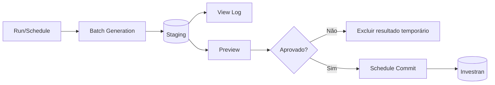

# Active Templates - debug, execução, Preview e Commit

## Duas fases de teste

### Simulation Mode

Executa tudo em memória. Não grava transactions no Staging nem no database Investran. É o primeiro modo para validar sintaxe, lógica e resultado.

### Scheduler Engine

Executa o processo assíncrono real. A fase Batch Generation grava resultados no Staging. Depois, o usuário pode revisar e agendar o Commit ao database Investran.

Simulation bem-sucedida não substitui teste pelo Scheduler.

## Debugging no VBA Editor

### Barra de ferramentas

| Comando | Comportamento |
|---|---|
| `Start/Resume` | valida/inicia VBA e abre parameters quando necessário |
| `Pause` | suspende temporariamente |
| `End` | encerra; não pode continuar do mesmo ponto |
| `Toggle Break` | adiciona/remove breakpoint na linha |
| `Evaluate Expression` | avalia expressão no Immediate Window |
| `Show Current Statement` | localiza a próxima linha |
| `Step Into` | entra em Subs/Functions |
| `Step Over` | executa a chamada como uma linha |
| `Step Out` | termina a Sub/Function atual |

### Validar sintaxe

1. Salve o módulo.
2. Clique `Start/Resume` ou use `Simulate` no ATM.
3. Preencha parameters, se solicitado.
4. O interpretador verifica variáveis, tipos e blocos.
5. A linha com erro aparece em vermelho e a descrição na status area.
6. Use `Exit` no diálogo de parameters, corrija e salve novamente.

Se a janela **Immediate** aparecer atrás do diálogo, o manual indica que o código passou pela validação sintática inicial.

Mensagens podem ser pouco precisas. `Expecting an existing scalar var`, por exemplo, pode significar variável/constante não declarada ou tipo incorreto.

### Depurar lógica

1. Coloque breakpoint clicando na margem da linha.
2. Inicie/retome a execução.
3. A linha amarela indica a próxima instrução.
4. Use Step Into/Over/Out.
5. Inspecione variáveis no Immediate e Watch.
6. Use Stack para entender a cadeia de chamadas.
7. Compare `JEIndex`, `TXIndex`, driver current row e properties do Context.

## Debug Log

Depois da simulação, o ATM mostra um log com as etapas executadas e os dados que seriam gravados nas tabelas de Staging, incluindo transactions e Investor allocations.

O VBA pode registrar mensagens:

```vb
Application.Log "Amount=" & CStr(Application.Context.Amount)
```

Registre informações úteis sem dados sensíveis:

- evento;
- driver row;
- `JEIndex`/`TXIndex`;
- IDs de contexto;
- valores antes/depois do cálculo;
- Allocation Rule;
- quantidade de Investors;
- totais de Amount, LEAmount e Quantity.

## Roteiro de Simulation

1. Confirme que a versão está salva e em `Draft`.
2. Selecione o AT.
3. Clique `Simulate` ou inicie pelo VBA Editor.
4. Informe todos os parameters obrigatórios.
5. Percorra breakpoints relevantes.
6. Deixe a execução terminar.
7. Revise o Debug Log.
8. Valide quantidades e valores gerados.
9. Repita com casos de borda.

## Pré-requisitos do Scheduler

O manual destaca:

- Scheduler Service instalado/configurado;
- identidade do serviço com permissões no Master e Staging;
- Staging e Investran databases conectados corretamente;
- `UseATM=Yes` e `IsMaster=Yes` no Master;
- `StagingConnection` completa;
- `MasterServer` e `MasterDatabase` corretos no Staging.

Não altere diretamente essas configurações sem autorização de administração/DBA.

## Executar pelo Scheduler

1. Mude para `Normal` somente após Simulation aprovada.
2. Selecione o AT na árvore.
3. Clique no ícone **Batch Generation**.
4. Preencha os runtime parameters.
5. Use `Show values in controlled context` para restringir lookups conforme valores já escolhidos.
6. Abra `Run AT Schedule` pelo ícone de exclamação vermelho.
7. Escolha data/hora ou `Run AT Immediately`.
8. Durante desenvolvimento, selecione **Show temporary results Preview**.

Evite **Commit process without showing results** em teste: essa opção envia automaticamente os resultados ao Investran sem revisão.

O Scheduler não permite agendar o mesmo AT para execução recorrente na mesma definição de scheduling descrita pelo manual.

## Monitorar Batch Generation

Em `Process Maintenance > Batch Generation`, acompanhe:

- `Pending`: enfileirado;
- `Running`: em processamento;
- `Cancelled`: cancelado;
- aba `Generated`: finalizado, com duração e indicador `Succeeded`.

Um `Succeeded` vazio nem sempre é erro: o AT pode legitimamente não gerar batch. Confirme parâmetros, driver rows e regra de negócio.

Use Refresh para atualizar o estado.

## View Log e Preview

Depois da geração:

- `View Log` ou `Ctrl+L`: abre o log do Process ID;
- `Preview` ou `Ctrl+P`: mostra os batches gerados quando o processo permite.

No Preview, reconcilie:

- quantidade de batches;
- Batch Type, Description e GL Date;
- Journal Entries e balanceamento;
- Transaction Types e Accounts;
- Deal, Position, Lot, Pool e Income Security;
- Amount, LEAmount, Quantity, moedas e escalas;
- Allocation Rule e resultado por Investor;
- dominant/non-dominant;
- zeros, sinais, comentários, referências e UDFs.

## Commit

Após aprovação do Preview, o commit pode ser agendado pelo ícone vermelho na janela de Preview ou pelo menu `Schedule`/`Ctrl+R` no Process ID.

A tela **Commit Maintenance** acompanha a fase de Commit, mas não fornece Preview. Por isso, a revisão deve ocorrer antes de agendar.



Depois do Commit, excluir/reverter um batch exige procedimento contábil; não é mais apenas limpeza de Staging.

## Troubleshooting documentado

| Erro | Causa indicada | Ação |
|---|---|---|
| `Multiple-step operation generated errors` com boolean | Auxiliary Report retorna boolean sem configuração correta | definir `FetchBoolean=True` no objeto report usado pelo VBA |
| `ATM execution failed. Overflow` | mais de 32.766 chamadas de comandos SQL em eventos de commit | reduzir comandos/escopo, por exemplo informando filtro mais restritivo |
| `Check each status value` | driver devolve string vazia em vez de `Null` | normalizar property vazia para `Null` antes da gravação |
| GP LE recebe `NULL` para todos Investors | `AfterTransaction` aloca partindo do null/unallocated Investor | depurar `Result` e usar Investors associados à GP Legal Entity |
| `Row index out of range` | driver devolve mais linhas no ATM que no RW isolado | comparar execução, parameters, contexto e dados do report |

## Quando interromper

- resultados excedem o escopo esperado;
- Journal Entry não balanceia;
- Investors incorretos recebem valores;
- Preview diverge da Simulation sem explicação;
- `Ignore Errors` produziu saída parcial;
- processo anterior continua `Running` ou estado é desconhecido;
- configuração do Scheduler/Staging parece incorreta;
- não existe versão anterior ou plano de rollback.

## Evidência de conclusão

- logs de Simulation e Scheduler;
- parameters usados;
- Process ID;
- Preview aprovado;
- comparação antes/depois;
- totals reconciliados;
- aprovação funcional/contábil;
- resultado do Commit ou descarte do Staging;
- documentação e pacote de versão atualizados.

## Fonte

- *Internal_Inv7_INV_ATM_Dev_Guide_7.pdf*, capítulos Debugging Active Templates, Executing Active Templates, AT Execution Maintenance e Troubleshooting.
