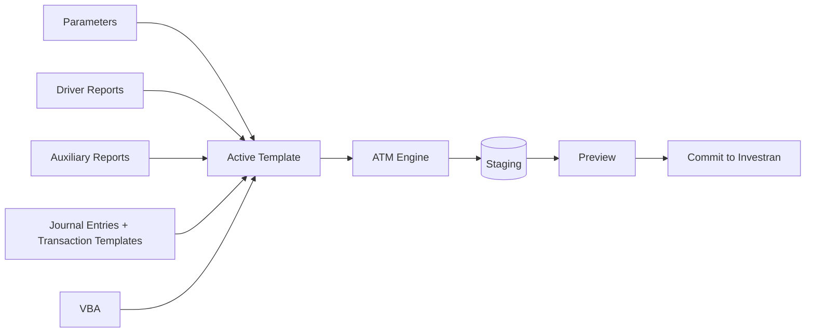

# Active Templates - Support and maintenance guide

This area explains how to find, understand, change, save, test, and run Active Templates (AT) in Investran 7.

> The reference manual is from 2014. Standard tool names are documented, but installation path, databases, permissions, and promotion process must be confirmed in the current environment.

## Where to start

- [ATM practical guide](guia-pratico-atm.md): interface, components, creation, change, Simulation, Scheduler, Preview, Commit, and publication with tool screenshots.

| Need | Document |
|---|---|
| Find ATM and locate a template | [Interface, access, and navigation](01-interface-acesso-navegacao.md) |
| Understand how an AT creates batches | [Structure and behavior](02-estrutura-e-funcionamento.md) |
| Know what and how to change/save | [Change, saving, and publication](03-alteracao-salvamento-publicacao.md) |
| Simulate, debug, run, and check results | [Debug, execution, Preview, and Commit](04-debug-execucao-preview-commit.md) |
| Gather environment-specific information | [KT pending](KT-PENDENCIAS.md) |

## What is an Active Template?

An Active Template is an executable unit made of parameters, Report Wizard reports, Journal Entry Templates, Transaction Templates, and usually VBA. The ATM Engine runs this definition and creates new batches.

ATM does not edit existing batches.

## Quick answer: where to find and change it

1. Open **Active Template Manager** and connect to the correct database.
2. Choose the AT from the drop-down list in the main panel.
3. Confirm name, Batch Type, status, creator, and last modified date.
4. Expand the left tree: `Parameters`, `Driver Reports`, `Auxiliary Reports`, `Journal Entries`, and `Transaction Templates`.
5. Use `Active Template > Duplicate` before significant changes, following the environment convention.
6. Keep the development copy in `Draft`.
7. Change only the component responsible for the behavior.
8. If VBA exists, open `VBA Code > Show VBA Editor` and save through `VBA Code > Save VBA Module`.
9. If an RW report changes, use `System > Refresh Tree`/Refresh in ATM before testing.
10. Run `Simulate`, review the Debug Log, and compare results.
11. Then test through Scheduler using **Show temporary results Preview**.
12. Move to `Normal` only after approval.
13. Promote with ARM & ATM Export-Import Console under the organization's internal process.

## What normally needs changing

| Symptom | First component to check |
|---|---|
| Incorrect prompt or value does not reach batch | Parameter and `Map To a Property` |
| Incorrect number of transactions/batches | Driver Report, mapping level, and returned rows |
| Incorrect supporting data | Auxiliary Report or VBA that runs it |
| Incorrect entry structure | Journal Entry/Transaction Template and order |
| Incorrect value, date, Deal, or Position | Mapping to `Application.Context` or a VBA event |
| Incorrect Investor allocation | Allocation Rule and `Application_AfterTransaction` |
| Zero should be removed/kept | `Allow zero transactions` in Journal Entry |
| Error occurs only when scheduled | Scheduler, Staging, permissions, or configuration |

Do not change VBA until you prove that the error is not in the report, mapping, parameter, or configuration.

## Template states

- `Draft`: Development and simulation; unavailable for normal execution.
- `Normal`: Available after testing.
- `System`: Reserved for supplier templates.

## Safety rules

- Never develop directly in production.
- Never use **Commit process without showing results** during development.
- Do not enable `Ignore Errors` without assessing partial-batch risk.
- Do not move to `Normal` before simulation, Scheduler, and Preview.
- Do not promote an AT without required reports, parameters, Allocation Rules, UDFs, and references.
- Preserve the previous version and rollback plan.
- Reconcile batches, not only the process technical status.

## Source

- *Internal_Inv7_INV_ATM_Dev_Guide_7.pdf*.
