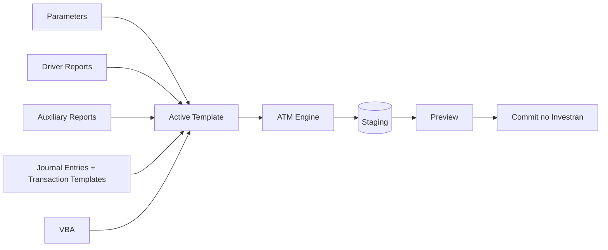

# Active Templates - guia de suporte e manutenção

Esta área explica como localizar, compreender, alterar, salvar, testar e executar Active Templates (AT) no Investran 7.

> O manual de referência é de 2014. Os nomes padrão da ferramenta estão documentados, mas caminho de instalação, bancos, permissões e processo de promoção precisam ser confirmados no ambiente atual.

## Por onde começar

| Necessidade | Documento |
|---|---|
| Encontrar o ATM e localizar um template | [Interface, acesso e navegação](01-interface-acesso-navegacao.md) |
| Entender como o AT gera batches | [Estrutura e funcionamento](02-estrutura-e-funcionamento.md) |
| Saber o que e como alterar e salvar | [Alteração, salvamento e publicação](03-alteracao-salvamento-publicacao.md) |
| Simular, depurar, executar e verificar resultados | [Debug, execução, Preview e Commit](04-debug-execucao-preview-commit.md) |
| Levantar informações específicas do ambiente | [Pendências de KT](KT-PENDENCIAS.md) |

## O que é um Active Template

Um Active Template é uma unidade executável formada por parameters, Report Wizard reports, Journal Entry Templates, Transaction Templates e, normalmente, VBA. O ATM Engine executa essa definição e cria batches novos.

O ATM não serve para editar batches existentes.

## Resposta rápida: onde encontrar e como alterar

1. Abra o **Active Template Manager** e conecte-se ao database correto.
2. Escolha o AT na lista suspensa no painel principal.
3. Confirme nome, Batch Type, status, creator e last modified.
4. Expanda a árvore à esquerda: `Parameters`, `Driver Reports`, `Auxiliary Reports`, `Journal Entries` e `Transaction Templates`.
5. Use `Active Template > Duplicate` antes de mudanças relevantes, conforme a convenção do ambiente.
6. Mantenha a cópia de desenvolvimento em `Draft`.
7. Altere somente o componente responsável pelo comportamento.
8. Se houver VBA, abra `VBA Code > Show VBA Editor` e salve com `VBA Code > Save VBA Module`.
9. Se um report RW for alterado, execute `System > Refresh Tree`/Refresh no ATM antes de testar.
10. Execute `Simulate`, confira o Debug Log e compare os resultados.
11. Depois, teste pelo Scheduler usando **Show temporary results Preview**.
12. Mude para `Normal` somente depois da aprovação.
13. Promova com o ARM & ATM Export-Import Console seguindo o processo interno da organização.

## O que normalmente deve ser alterado

| Sintoma | Primeiro componente a verificar |
|---|---|
| prompt incorreto ou valor não chega ao batch | Parameter e `Map To a Property` |
| número errado de transações/batches | Driver Report, nível do mapping e linhas retornadas |
| dado complementar incorreto | Auxiliary Report ou VBA que o executa |
| estrutura do lançamento errada | Journal Entry/Transaction Template e ordem |
| valor, data, Deal ou Position incorretos | mapping para `Application.Context` ou evento VBA |
| Investor allocation incorreta | Allocation Rule e `Application_AfterTransaction` |
| zero deveria ser removido/mantido | `Allow zero transactions` no Journal Entry |
| erro somente no agendamento | Scheduler, Staging, permissões ou configuração |

Não altere o VBA antes de provar que o erro não está no report, no mapping, no parâmetro ou na configuração.

## Estados do template

- `Draft`: desenvolvimento e simulação; indisponível para execução normal.
- `Normal`: disponível depois de testado.
- `System`: reservado a templates do fornecedor.

## Regras de segurança

- nunca desenvolver diretamente em produção;
- nunca usar **Commit process without showing results** durante desenvolvimento;
- não ativar `Ignore Errors` sem avaliar risco de batches parciais;
- não mudar para `Normal` antes de simulação, Scheduler e Preview;
- não promover o AT sem reports, parameters, Allocation Rules, UDFs e referências necessárias;
- preservar versão anterior e plano de rollback;
- reconciliar batches, não apenas o status técnico do processo.

## Fonte

- *Internal_Inv7_INV_ATM_Dev_Guide_7.pdf*.
