# Active Template Manager - guia prático de uso

Este guia apresenta o ATM como ferramenta: para que serve cada componente, como navegar, como criar ou alterar um Active Template e como conduzir o fluxo seguro de Simulation, Scheduler, Preview e Commit.

> As telas pertencem ao Investran 7 documentado no guia de 2014. Aparência, permissões e nomes podem variar. Confirme sempre ambiente, database e processo interno antes de executar.

## O que o ATM faz

O **Active Template Manager** cria processos executáveis que transformam parâmetros e dados de Report Wizard em batches contábeis.

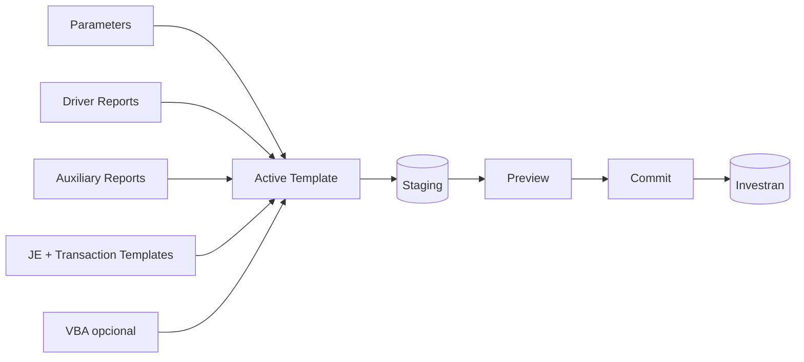

O ATM cria batches novos. Ele não é uma ferramenta para editar batches já existentes.

## Acessar e reconhecer a ferramenta

Ao iniciar o ATM, informe autenticação, servidor e database.


Antes de selecionar `OK`, confirme:

- ambiente e database;
- conta e entitlement;
- versão da ferramenta;
- ticket ou finalidade;
- ausência de dados/credenciais expostos em evidências.

Depois do login, a tela principal apresenta:

1. árvore do Active Template à esquerda;
2. ações de administração e refresh no centro;
3. atributos, conexão e status à direita;
4. barra de menus para AT, Parameters, Reports, Templates e VBA.


## Localizar e identificar o template correto

Selecione o template na lista e confira nome, Batch Type, creator, last modified, status, Notes e Description.


Não edite apenas porque o nome “parece correto”. Confirme:

- database;
- Batch Type;
- parâmetros e reports;
- árvore de Journal Entries/Transactions;
- agendamentos e consumidores;
- versão atualmente aprovada.

## Entender a árvore do Active Template

```text
Active Template
├── Parameters
├── Driver Reports (até 3)
├── Auxiliary Reports
├── Journal Entries
│   └── Transaction Templates
└── VBA Module
```

Cada parte resolve um problema diferente. Antes de alterar VBA, identifique se o defeito está realmente no código ou em parâmetro, report, mapping, template ou configuração.

## Para que serve cada componente

### Parameters

Parameters são entradas solicitadas em runtime, como Legal Entity, GL Date, Deal ou Transfer Date.


Um Parameter define:

- tipo e lookup;
- obrigatoriedade;
- default;
- nível Batch, Journal Entry ou Transaction;
- `Map To a Property`, quando o valor alimenta diretamente o Context.

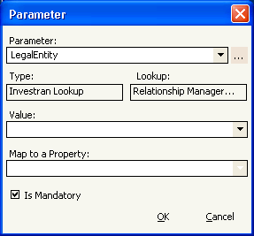

Se o Parameter alimenta um Driver Report, os nomes precisam coincidir. Se for renomeado, revise também Description, VBA, mappings, reports e schedules.

### Driver Reports

Driver Reports determinam o conjunto que o template processará. O ATM Engine os executa automaticamente. Um Active Template aceita até três.


Cada coluna visível precisa de mapping para uma property do Context e para um nível:

| Nível | Efeito quando o valor muda |
|---|---|
| Batch | inicia outro batch |
| Journal Entry | inicia outro Journal Entry |
| Transaction Template | cria ou preenche uma transaction |

O número de linhas, a ordem e a mudança dos valores de nível influenciam diretamente quantos batches, JEs e transactions serão criados.

### Auxiliary Reports

Auxiliary Reports fornecem dados complementares. Diferentemente dos drivers, são executados explicitamente pelo VBA.


Ao consumir um Auxiliary Report, trate zero, uma e múltiplas linhas. Depois de alterar qualquer report no Report Wizard, valide-o isoladamente e execute Refresh no ATM.

### Journal Entry Templates

Journal Entry Templates definem a estrutura dos lançamentos que serão gerados.


A ordem é funcional: ela define o `JEIndex` recebido pelos eventos VBA. Reordenar sem revisar o código pode fazer uma branch atuar sobre o lançamento errado.

### Transaction Templates

Transaction Templates definem as transactions dentro de cada Journal Entry.


Revise Transaction Type, Account, Deal, Position, datas, moedas, Amount, LEAmount, Quantity, Allocation Rule, UDFs e o papel dominant/non-dominant. A ordem define `TXIndex`.

### Atributos do Active Template

Use `Active Template > Add/Edit` para manter os atributos.


| Atributo | Uso prático |
|---|---|
| Batch Type | classifica os batches gerados |
| Use VBA | habilita o módulo de código |
| Locked | restringe alteração ao desenvolvedor que bloqueou |
| Ignore Errors | permite saída parcial; exige justificativa e reconciliação |
| Notes | registra contexto técnico e funcional |
| Description | alimenta comentários do batch e aceita parâmetros |
| Status | controla disponibilidade do template |

Mantenha `Ignore Errors` desmarcado, salvo requisito explícito. Uma execução pode terminar com transactions válidas no Staging e outras rejeitadas.

### VBA

VBA implementa validações, transformações, chamadas a Auxiliary Reports e lógica que depende de eventos.

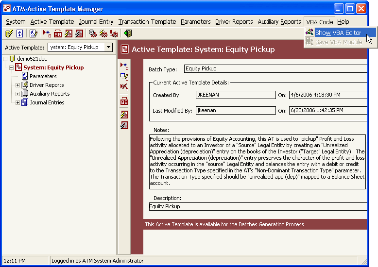

Eventos comuns:

| Evento | Uso típico |
|---|---|
| `BeforeAT` | inicialização e validações globais |
| `AfterDriver` | validar resultado do driver |
| `BeforeBatch` | preparar contexto do batch |
| `BeforeJournalEntry` | preencher/validar o JE |
| `BeforeTransaction` | definir valores e Allocation Rule |
| `AfterTransaction` | revisar ou preencher Investor allocations |
| `AfterJournalEntry` | validar balanceamento |
| `AfterBatch` | validações finais do batch |
| `AfterAT` | logging e limpeza |

Salve o código com `VBA Code > Save VBA Module`. Salvar atributos do AT não substitui essa operação.

## Criar um Active Template

### 1. Planejar o resultado

Antes da ferramenta, defina:

- processo funcional;
- Batch Type;
- quantidade esperada de batches/JEs/transactions;
- parâmetros de runtime;
- dados que dirigem o processo;
- estrutura contábil;
- regras de alocação;
- critérios de sucesso e rollback.

### 2. Criar em Draft

Use `Active Template > Add`, informe nome, Batch Type, Notes e Description e mantenha o status `Draft`.

Estados:

- `Draft`: desenvolvimento e Simulation;
- `Normal`: disponível para execução normal;
- `System`: reservado ao fornecedor.

### 3. Adicionar Parameters

Adicione apenas as entradas necessárias. Configure níveis e mappings com cuidado e use defaults somente quando forem seguros e compreendidos pelo operador.

### 4. Associar Reports

Associe Driver e Auxiliary Reports já validados e armazenados em pasta Public Read-only. Confirme columns, parameters, mappings e ordem.

### 5. Montar JEs e Transactions

Crie a árvore de saída e documente os índices. Para cada Transaction Template, defina os campos obrigatórios e a Allocation Rule correspondente.

### 6. Implementar VBA, se necessário

Habilite `Use VBA`, use `Option Explicit`, implemente apenas os eventos necessários e registre mensagens úteis com `Application.Log`.

### 7. Salvar cada componente

“Salvar” não é uma operação única:

| Alteração | Persistência |
|---|---|
| atributos | confirmar Add/Edit |
| Parameter | confirmar Add/Edit |
| JE/Transaction Template | confirmar diálogo |
| report/mapping | confirmar associação e executar Refresh |
| VBA | `Save VBA Module` |
| promoção | ARM & ATM Export-Import Console |

Reabra o componente depois de salvar para confirmar a persistência.

## Alterar um template existente

1. confirme ambiente, AT e comportamento esperado;
2. capture uma baseline com parâmetros, logs e Preview;
3. verifique lock e execução concorrente;
4. duplique ou exporte a versão aprovada;
5. mantenha a cópia de desenvolvimento em Draft;
6. altere um componente por vez;
7. salve e reabra;
8. execute reports isoladamente;
9. simule o cenário original e casos de borda;
10. compare resultados antes/depois;
11. teste via Scheduler com Preview;
12. obtenha aprovação antes de Normal.

Use o sintoma para escolher o primeiro ponto de investigação:

| Sintoma | Verificar primeiro |
|---|---|
| prompt/default incorreto | Parameter |
| linhas ou quantidade errada | Driver Report e mapping de nível |
| lookup complementar errado | Auxiliary Report |
| estrutura contábil errada | JE/Transaction Template |
| valor muda durante execução | Context e evento VBA |
| Investor allocation incorreta | Allocation Rule e AfterTransaction |
| funciona no ARM/Simulation, falha agendado | Scheduler, Staging, permissões e contexto |

## Simulation e debugging

Simulation executa em memória e não grava no Staging ou no Investran. É a primeira etapa obrigatória.

### Validar sintaxe

1. salve o módulo;
2. use Start/Resume ou Simulate;
3. informe os parâmetros;
4. corrija a linha indicada;
5. salve novamente.

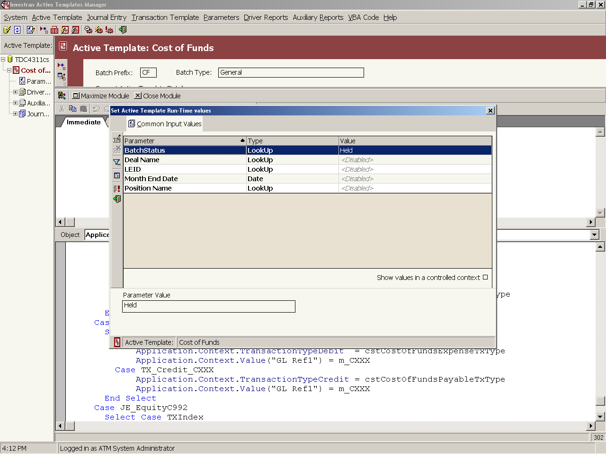

### Depurar lógica

Use breakpoints, Step Into, Step Over, Step Out, Watch, Immediate e Stack. Compare `JEIndex`, `TXIndex`, linha atual do driver e properties do Context.

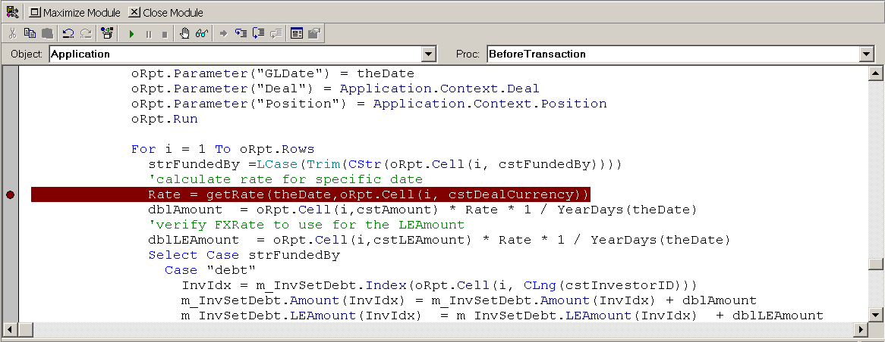

### Interpretar o Debug Log

O log de Simulation mostra etapas e dados que seriam gravados no Staging.

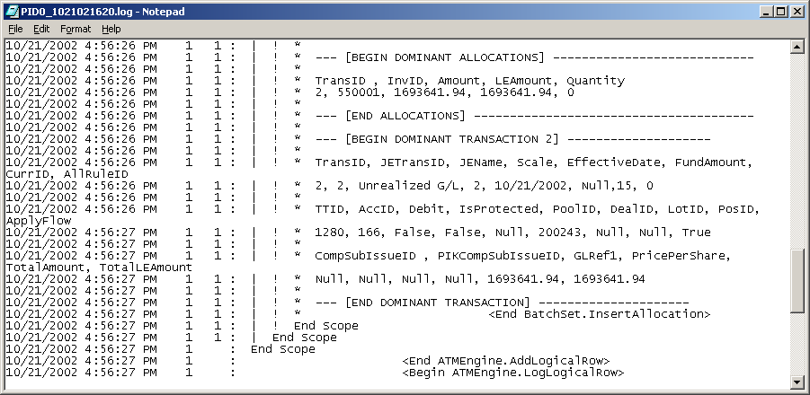

Valide quantidades, IDs, sinais, valores, moedas, Allocation Rule e distribuição por Investor. Não conclua o teste apenas porque não houve erro técnico.

## Executar pelo Scheduler

Simulation aprovada não substitui o fluxo assíncrono real.

### 1. Iniciar Batch Generation

Selecione o template e clique em **Batch Generation**.

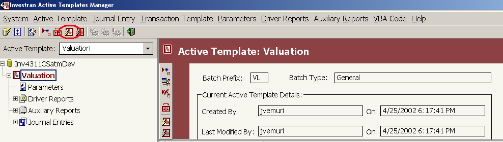

### 2. Informar parâmetros

Preencha os runtime parameters e use contexto controlado quando necessário.

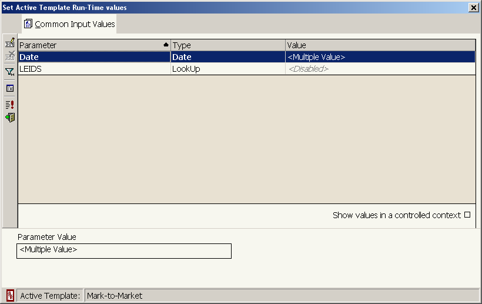

### 3. Agendar com Preview

Abra `Run AT Schedule`, escolha horário ou execução imediata e, em teste, selecione **Show temporary results Preview**.

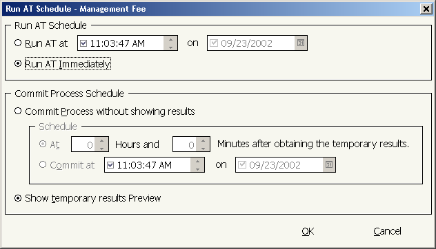

Evite `Commit process without showing results` durante desenvolvimento.

### 4. Monitorar

Use `Process Maintenance > Batch Generation` e Refresh para acompanhar Pending, Running, Cancelled e Generated.

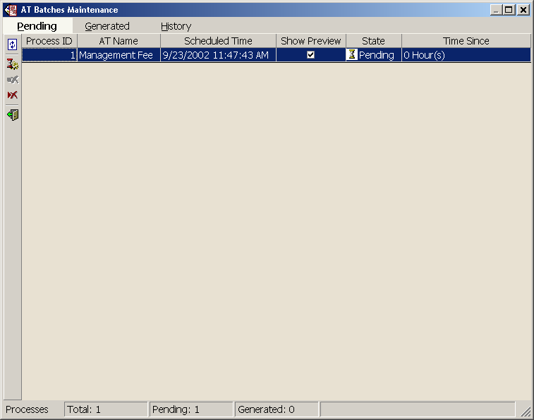

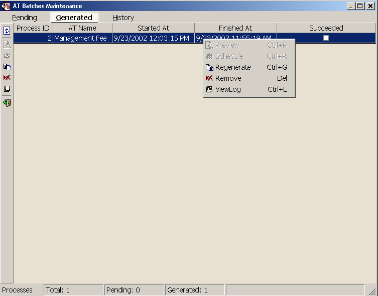

Um processo Generated/Succeeded pode não ter criado batch. Confirme parâmetros, driver rows e regra de negócio.

### 5. Revisar Log e Preview

Use View Log para erros e Preview para reconciliar o resultado temporário.

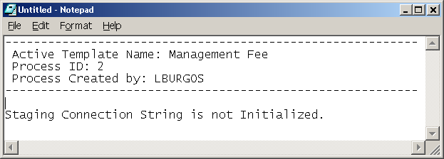

No Preview, confira:

- batches e Batch Type;
- GL Date e Description;
- JEs e balanceamento;
- Transaction Types e Accounts;
- Deal, Position, Lot e Pool;
- Amount, LEAmount e Quantity;
- moedas e escalas;
- Allocation Rule e Investors;
- dominant/non-dominant;
- zeros, sinais, comentários e UDFs.

### 6. Commit

Somente após aprovação do Preview, agende o Commit. Depois do Commit, corrigir o resultado deixa de ser limpeza de Staging e passa a exigir o processo contábil aprovado de reversão/rebook.

## Publicação e rollback

O guia confirma o **ARM & ATM Export-Import Console** para transferir Active Templates e reports relacionados.

Antes de promover:

- preserve a versão anterior;
- inclua reports e mappings coerentes;
- valide Allocation Rules, parameters, UDFs e referências;
- confirme IDs no destino;
- execute Refresh;
- faça Simulation e smoke test pelo Scheduler;
- reconcilie Preview antes de Commit.

O rollback deve restaurar o conjunto completo: AT, reports, mappings, JEs, Transaction Templates, VBA e dependências. Restaurar apenas o VBA não é suficiente.

## Checklist rápido de uso

- [ ] database, usuário e entitlement confirmados;
- [ ] Active Template e Batch Type confirmados;
- [ ] baseline e versão anterior preservadas;
- [ ] desenvolvimento mantido em Draft;
- [ ] Parameters, reports e mappings revisados;
- [ ] JEIndex/TXIndex documentados;
- [ ] VBA salvo explicitamente;
- [ ] Simulation e Debug Log reconciliados;
- [ ] teste Scheduler executado com Preview;
- [ ] resultado funcional/contábil aprovado;
- [ ] promoção e rollback documentados;
- [ ] Normal somente após aprovação.

## Fonte

- *Internal_Inv7_INV_ATM_Dev_Guide_7.pdf*, capítulos Getting Started in ATM, Navigation, Active Template Examples, Debugging Active Templates, Executing Active Templates e AT Execution Maintenance.
