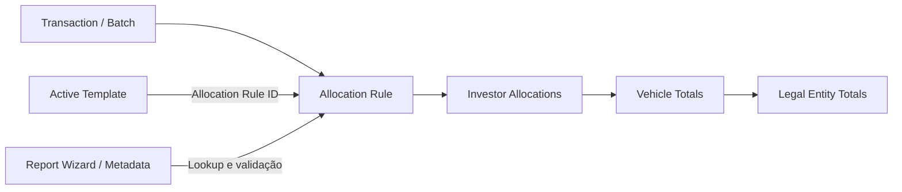

# Allocation Rules (AR) — Guia de Sustentação

> Base inicial construída a partir dos materiais de Investran enviados para este repositório. Procedimentos específicos do ambiente Goldman Sachs devem ser confirmados durante o KT antes de qualquer alteração em produção.

## Objetivo

Este conjunto de documentos orienta a análise e a sustentação de **Allocation Rules** no Investran. O foco não é catalogar todas as regras existentes, mas fornecer um método seguro para localizar, entender, testar e diagnosticar uma regra desconhecida.

## Conceito

Allocation Rules definem como um valor de transação, lucro, despesa, ganho, perda ou quantidade de ações é distribuído entre investidores associados a uma Legal Entity.

A regra pode produzir:

- percentuais por investidor;
- valores por investidor;
- quantidades por investidor;
- agregações resultantes nos níveis de Vehicle e Legal Entity.

## Classificações documentadas

### Static Allocation Rules

Usam percentuais fixos definidos em tabela para os investidores. O material conceitual informa que são mantidas pela ferramenta **Static Allocation Rules**, no Portfolio & Investor Manager.

### Dynamic Allocation Rules

Calculam os percentuais de acordo com os dados disponíveis no momento da execução. Exemplos documentados:

- By Average Cash Balance;
- By Commitment & Closing Date;
- By Commitment (No Date);
- By Specific Closing Date Commitment;
- By Unfunded Commitment;
- Investment Cost (As of GL Date);
- Management Fees — inside investment period;
- Management Fees — outside investment period.

### Top Down

O valor é informado no nível da Legal Entity e distribuído entre investidores com base em uma regra ou tabela de percentuais.

### Bottom Up

Os valores são definidos ou calculados no nível dos investidores e depois agregados para Vehicle e Legal Entity.

## Componentes relacionados

## Regras de sistema citadas no manual de Active Templates

| ID | Regra |
|---:|---|
| 0 | Non-Dominant |
| 1 | No Allocation |
| 2 | User Provided |

Esses IDs aparecem no guia do ATM como constantes de exemplo. Antes de usá-los em qualquer ambiente, valide se o comportamento e os identificadores permanecem iguais na versão instalada.

## Permissões

O material conceitual distingue:

- **ARM Admin:** criar, editar, executar e excluir Allocation Rules no Allocation Rule Manager;
- **ARM User:** executar Allocation Rules no Allocation Rule Manager.

Sem as permissões adequadas, uma falha de acesso pode ser confundida com defeito da regra.

## Documentos deste módulo

- [Interface do ARM e ciclo de vida](arm-interface-and-lifecycle.md)
- [Object model e contratos técnicos](object-model.md)
- [Arquitetura e fluxo](architecture.md)
- [Anatomia de uma regra](anatomy.md)
- [Tipos e métodos](types-and-methods.md)
- [Desenvolvimento e alteração](development.md)
- [Guia de manutenção](maintenance-guide.md)
- [Troubleshooting e playbooks](troubleshooting.md)
- [Pendências de KT](KT-PENDENCIAS.md)

## Princípio de sustentação

Ao receber um incidente, não comece alterando a regra. Primeiro confirme:

1. qual AR foi executada;
2. qual Legal Entity e quais investidores estavam no contexto;
3. quais datas e valores foram usados;
4. se o erro está na seleção dos investidores, no cálculo do ratio ou no consumo do resultado;
5. se a AR é realmente a causa ou apenas recebeu dados incorretos de um AT, Batch, Report Wizard ou configuração.

## Fontes utilizadas

- *Investran 7 Developer's Guide to Allocation Rule Manager* (17/10/2014).
- *Investran Conceptual Design Document*, seção 3.6 — Investor Allocation Rules.
- *Developer's Guide to Active Template Manager*, seções de VBA, desenvolvimento e troubleshooting.
- *Accounting Supplemental Training Materials*, seções de batch e investor allocations.

## O que o manual ARM confirma

O guia de ARM documenta a interface, atributos, properties, parameters, reports, estados, simulação, regras simples e complexas, VBA, objetos `RWReport`/`InvestorSet`/`AllocationRule` e o uso do Import-Export Console.

Ele não confirma o processo específico da Goldman Sachs para aprovação, promoção, rollback, regras customizadas, owners, baselines ou validação funcional. Esses pontos permanecem como KT obrigatório.
