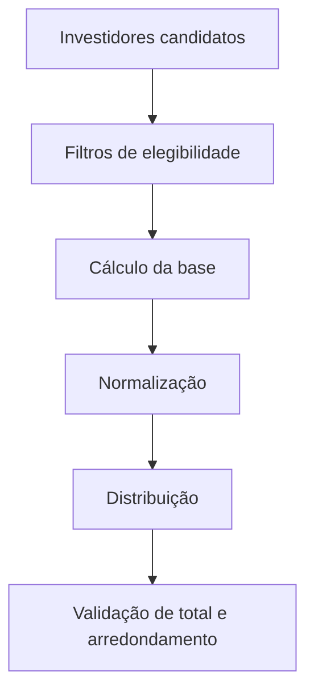

# Anatomia de uma Allocation Rule

> Este documento descreve os elementos que devem ser identificados durante a análise de uma Allocation Rule. Os nomes de telas, propriedades e procedimentos específicos do ambiente devem ser confirmados no KT.

## Visão funcional

Uma Allocation Rule recebe um contexto de transação e produz uma distribuição entre investidores.

## Entradas que devem ser levantadas

Ao analisar uma regra, registre no mínimo:

- Legal Entity;
- Vehicle;
- Investor Set elegível;
- GL Date;
- Effective Date;
- valor ou quantidade da transação;
- moeda e escalas de arredondamento;
- regra selecionada e respectivo identificador;
- origem da chamada: entrada manual, Active Template, Business Event ou outro processo;
- atributos adicionais usados no cálculo, como compromisso, closing date, saldo, custo ou período de investimento.

## Processamento lógico

A análise deve separar a regra em quatro etapas:

1. **Seleção de investidores** — define quem pode participar.
2. **Cálculo da base** — compromisso, saldo, custo, unfunded commitment ou outra métrica.
3. **Normalização** — converte bases em percentuais ou fatores de rateio.
4. **Distribuição** — aplica o rateio ao valor ou quantidade da transação.

## Saídas esperadas

Uma execução válida deve permitir confirmar:

- investidores incluídos e excluídos;
- percentual ou fator por investidor;
- valor ou quantidade alocada;
- total alocado;
- eventual diferença de arredondamento;
- tratamento da transação dominante e não dominante;
- mensagens de erro ou warning.

## Regras de sistema observadas no manual de Active Templates

O guia de Active Templates apresenta os seguintes identificadores em exemplos de VBA:

| ID | Nome | Uso observado |
|---:|---|---|
| 0 | Non-Dominant | Transação de balanceamento ou lado não dominante |
| 1 | No Allocation | Não executa alocação entre investidores |
| 2 | User Provided | A alocação é preenchida pelo código no `InvestorSet` |

Esses identificadores devem ser validados na versão instalada antes de qualquer uso em código.

## Relação com Active Templates

No fluxo documentado do ATM:

- a Allocation Rule pode ser definida antes da transação;
- a regra é executada entre os eventos `BeforeTransaction` e `AfterTransaction`;
- quando `User Provided` é usada, o código pode preencher o resultado de investidores no evento posterior;
- diferenças de arredondamento podem exigir ajuste da transação não dominante.

## Checklist de leitura de uma regra desconhecida

- [ ] Identificar nome, ID, tipo e status da regra.
- [ ] Confirmar se é estática ou dinâmica.
- [ ] Confirmar se o fluxo é Top Down ou Bottom Up.
- [ ] Identificar todas as fontes de dados utilizadas.
- [ ] Identificar filtros de Legal Entity, Vehicle e Investor.
- [ ] Identificar campos de data utilizados.
- [ ] Identificar regras de inclusão e exclusão.
- [ ] Identificar arredondamento e tratamento do residual.
- [ ] Identificar consumidores da regra.
- [ ] Executar cenário conhecido e reconciliar o total.

## Pontos que exigem KT

- Caminho e versão do Allocation Rule Manager em cada ambiente.
- Logs e recursos de debug disponíveis na versão instalada.
- Processo Goldman Sachs para exportação, importação, aprovação e rollback.
- Convenções de nomes e IDs usadas no ambiente Goldman Sachs.

Para os componentes confirmados pelo manual, consulte [Interface do ARM e ciclo de vida](arm-interface-and-lifecycle.md) e [Object model e contratos técnicos](object-model.md).
