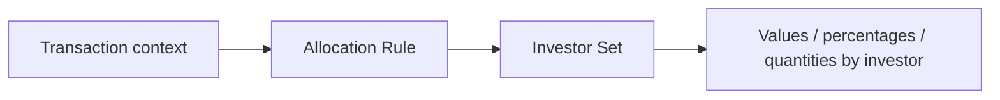
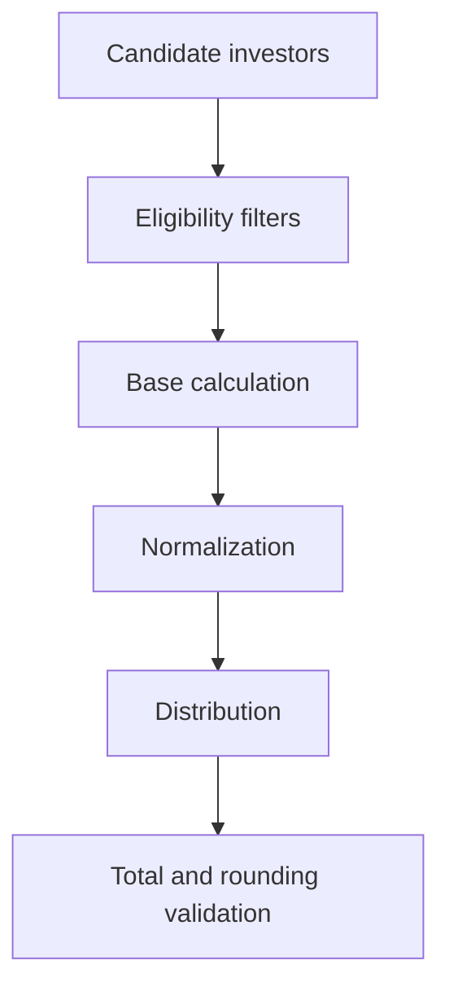

# Anatomy of an Allocation Rule

> This document describes elements that must be identified when analyzing an Allocation Rule. Confirm environment-specific screen names, properties, and procedures during KT.

## Functional view

An Allocation Rule receives a transaction context and produces a distribution across investors.

## Inputs to capture

Record at least Legal Entity, Vehicle, eligible Investor Set, GL Date, Effective Date, transaction value/quantity, currency and rounding scale, selected rule and identifier, call origin (manual entry, Active Template, Business Event, or other process), and additional calculation attributes such as commitment, closing date, balance, cost, or investment period.

## Logical processing

Analyze the rule in four stages:

1. **Investor selection** — defines who can participate.
2. **Base calculation** — commitment, balance, cost, unfunded commitment, or another metric.
3. **Normalization** — converts bases into percentages or allocation factors.
4. **Distribution** — applies allocation to the transaction value or quantity.

## Expected outputs

A valid execution must confirm included/excluded investors, percentage/factor per investor, allocated value/quantity, allocated total, rounding difference, dominant/non-dominant transaction treatment, and errors or warnings.

## System rules observed in the Active Templates manual

| ID | Name | Observed use |
|---:|---|---|
| 0 | Non-Dominant | Balancing transaction or non-dominant side |
| 1 | No Allocation | Does not allocate across investors |
| 2 | User Provided | Code fills allocation in `InvestorSet` |

Validate these identifiers in the installed version before using them in code.

## Relationship with Active Templates

In the documented ATM flow, an Allocation Rule can be set before a transaction; it runs between `BeforeTransaction` and `AfterTransaction`; `User Provided` lets code fill investor results in the later event; and rounding differences can require adjustment of the non-dominant transaction.

## Checklist for an unknown rule

- [ ] Identify rule name, ID, type, and status.
- [ ] Confirm whether it is static or dynamic.
- [ ] Confirm Top Down or Bottom Up flow.
- [ ] Identify every data source, filter, date, inclusion/exclusion rule, rounding rule, and consumer.
- [ ] Run a known case and reconcile the total.

## Items requiring KT

- Allocation Rule Manager path and version in each environment.
- Logs and debugging features in the installed version.
- Internal export, import, approval, and rollback process.
- Naming and ID conventions in the supported environment.

For manual-confirmed components, see [ARM interface and lifecycle](arm-interface-and-lifecycle.md) and [Object model and technical contracts](object-model.md).
