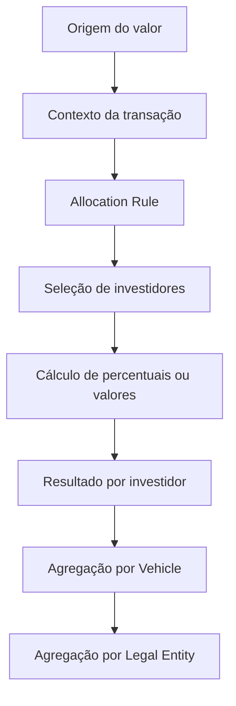
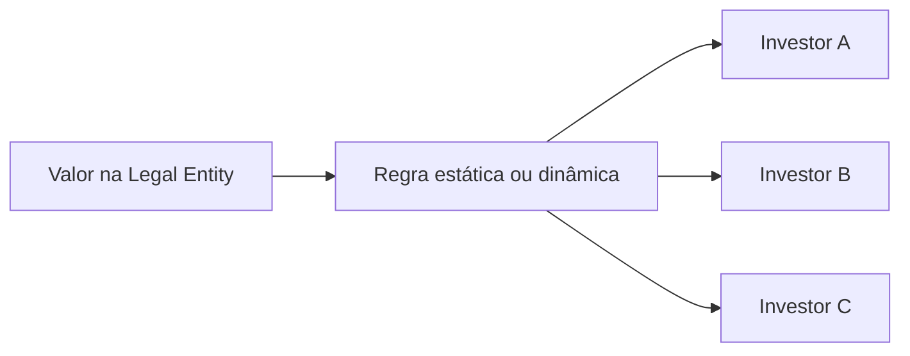
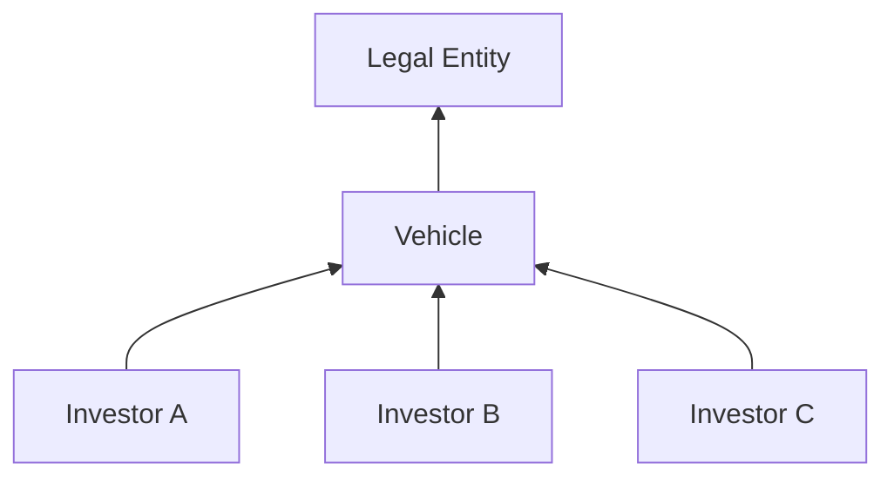

# Allocation Rules — Arquitetura e Fluxo

## Visão geral

Allocation Rules definem como valores ou quantidades associados a uma transação são distribuídos entre investidores de uma Legal Entity.

## Componentes envolvidos

| Componente | Papel |
|---|---|
| Batch / Transaction | Fornece o valor, quantidade, datas e contexto contábil. |
| Legal Entity | Define o universo principal da alocação. |
| Investor | Recebe o resultado da alocação. |
| Allocation Rule Manager | Ferramenta usada para administrar ou executar regras, conforme permissões. |
| Active Template | Pode selecionar uma Allocation Rule por identificador. |
| Report Wizard | Pode ser utilizado para consultar metadados, dados de suporte e identificadores de regras. |

O ARM Engine recebe properties e parameters do Accounting ou de outro consumidor, propaga valores com nomes correspondentes aos reports RW associados e devolve um `InvestorSet` com `Amount`, `LEAmount` e `Quantity` por Investor.

## Fluxo Top Down

No modelo Top Down, o valor nasce no nível da Legal Entity e é distribuído aos investidores.

## Fluxo Bottom Up

No modelo Bottom Up, os valores são informados ou calculados no nível dos investidores e posteriormente agregados.

## Integração com Active Templates

O guia do Active Template Manager documenta que uma transação pode receber uma Allocation Rule por ID durante a execução. Também documenta os identificadores de exemplo:

| ID | Regra de sistema |
|---:|---|
| 0 | Non-Dominant |
| 1 | No Allocation |
| 2 | User Provided |

Quando `User Provided` é utilizada, o código VBA pode preencher o conjunto de investidores após a transação. Os identificadores devem ser confirmados no ambiente instalado antes de qualquer implementação.

## Fronteiras de responsabilidade

Uma divergência de alocação não prova que a regra está defeituosa. A causa também pode estar em:

- Legal Entity incorreta;
- universo de investidores incompleto;
- commitment, closing date, saldo ou custo incorreto;
- data contábil ou efetiva incorreta;
- regra errada selecionada pelo Active Template;
- transação dominante ou não dominante configurada incorretamente;
- resultado produzido corretamente, mas consumido de forma incorreta por outro componente.

## Pontos obrigatórios de validação

1. Identidade da regra executada.
2. Tipo: estática ou dinâmica.
3. Direção: Top Down ou Bottom Up.
4. Legal Entity de contexto.
5. Data usada pelo cálculo.
6. Investidores elegíveis.
7. Base de cálculo.
8. Total alocado versus total de origem.
9. Tratamento de arredondamento.
10. Componente que invocou a regra.

## Limitações da fonte

O manual documenta a interface, o engine em nível funcional e o object model usado pelo VBA, mas não descreve tabelas físicas, stored procedures, processos internos do engine, formato do pacote de exportação nem a implantação específica de cada ambiente. Esses pontos permanecem dependentes de KT e validação local.

## Referências detalhadas

- [Interface do ARM e ciclo de vida](arm-interface-and-lifecycle.md)
- [Object model e contratos técnicos](object-model.md)
