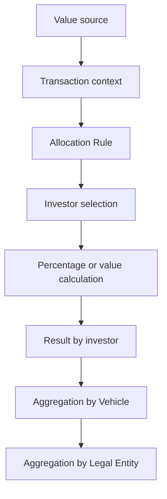
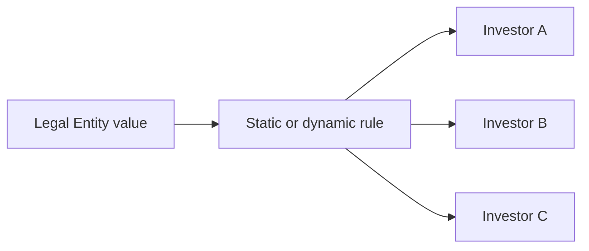
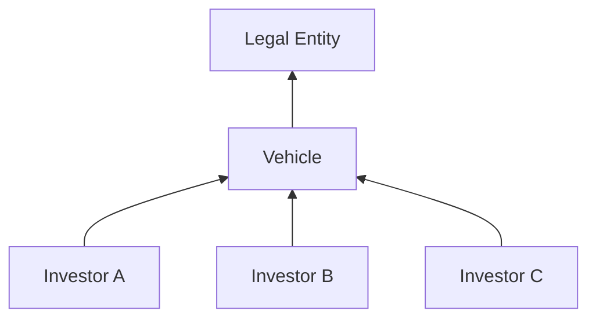

# Allocation Rules — Architecture and flow

## Overview

Allocation Rules define how values or quantities associated with a transaction are distributed across investors in a Legal Entity.

## Components involved

| Component | Role |
|---|---|
| Batch / Transaction | Provides value, quantity, dates, and accounting context. |
| Legal Entity | Defines the main allocation universe. |
| Investor | Receives the allocation result. |
| Allocation Rule Manager | Tool used to administer or run rules, according to permissions. |
| Active Template | Can select an Allocation Rule by identifier. |
| Report Wizard | Can query metadata, supporting data, and rule identifiers. |

The ARM Engine receives properties and parameters from Accounting or another consumer, propagates values whose names match associated RW reports, and returns an `InvestorSet` with `Amount`, `LEAmount`, and `Quantity` by Investor.

## Top Down flow

In Top Down, a value starts at Legal Entity level and is distributed to investors.

## Bottom Up flow

In Bottom Up, values are provided or calculated at investor level and then aggregated.

## Integration with Active Templates

The Active Template Manager guide documents that a transaction can receive an Allocation Rule by ID during execution:

| ID | System rule |
|---:|---|
| 0 | Non-Dominant |
| 1 | No Allocation |
| 2 | User Provided |

With `User Provided`, VBA can fill the investor set after the transaction. Confirm identifiers in the installed environment before implementation.

## Responsibility boundaries

An allocation discrepancy does not prove a defective rule. The cause can also be an incorrect Legal Entity, incomplete investor universe, incorrect commitment/closing date/balance/cost, incorrect accounting/effective date, wrong rule selected by Active Template, incorrect dominant/non-dominant transaction configuration, or correctly produced data consumed incorrectly by another component.

## Required validation points

1. Identity of the executed rule.
2. Static or dynamic type.
3. Top Down or Bottom Up direction.
4. Context Legal Entity.
5. Date used by the calculation.
6. Eligible investors.
7. Calculation base.
8. Allocated total versus source total.
9. Rounding treatment.
10. Component that invoked the rule.

## Source limitations

The manual documents interface, engine at a functional level, and the object model used by VBA, but not physical tables, stored procedures, internal engine processes, export-package format, or each environment's deployment. These items remain subject to KT and local validation.

## Detailed references

- [ARM interface and lifecycle](arm-interface-and-lifecycle.md)
- [Object model and technical contracts](object-model.md)
