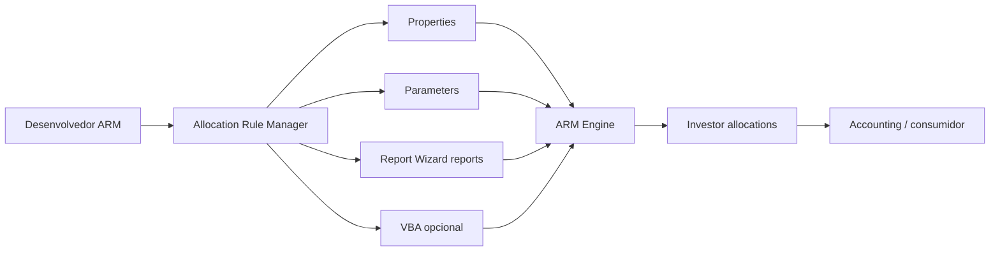
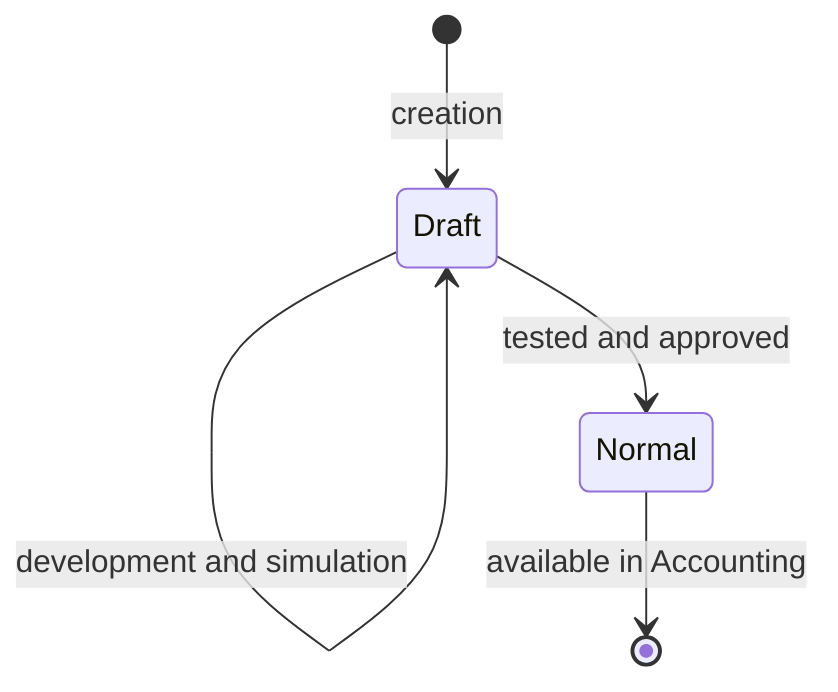

# Allocation Rule Manager - interface and lifecycle

## ARM purpose

Allocation Rule Manager (ARM) is the Investran tool used to create, organize, test, and maintain **Dynamic Allocation Rules**. Static rules remain percentage tables maintained through Static Allocation Rules; ARM provides the framework for simple or complex dynamic rules.

*ARM connection screen. Confirm authentication, server, and database before loading rules. Source: Investran 7 Developer's Guide to Allocation Rule Manager, p. 2.*

## Permissions

The user needs the appropriate Team Security entitlements. This knowledge base distinguishes:

- `ARM Admin`: create, edit, run, and delete rules;
- `ARM User`: run rules.

When investigating a disabled or missing option, first confirm the user, database, and entitlement.

## Navigation tree

After login, ARM loads Dynamic Allocation Rules from the database and displays them in a tree. Expanding a rule makes the following available:

*ARM main screen, with the rule tree on the left, central actions, and connection details on the right. Source: ARM guide, p. 6.*

- **Properties:** context received from the transaction;
- **Parameters:** additional values defined for execution;
- **Reports:** RW reports associated with the rule;
- columns and parameters for each report;
- VBA module, when `Use VBA` is enabled.

The rule panel shows creator, created date, last modified by/date, notes, type, and status. Capture this information before any change.

*Selected rule with expanded attributes and dependencies. Source: ARM guide, p. 7.*

## Menus and operations

### System

| Operation | Purpose |
|---|---|
| `Change Database` | Open login and change the connection |
| `Refresh Allocation Rules Tree` | Reload rules and database changes |
| `Exit ARM` | Close the application |

### Allocation Rule

| Operation | Purpose | Important restriction |
|---|---|---|
| `Find` | Search text in the tree | Confirm ID/attributes, not only name |
| `Add` | Create a rule | Normally starts as `Draft` |
| `Edit` | Change attributes | A rule in use cannot be edited |
| `Delete` | Delete a rule | A rule in use cannot be deleted |
| `Duplicate` | Copy a rule | Prefer as a controlled starting point/backup |
| `Run` | Run in a simulated environment | Does not change the database according to the manual |

A rule is **in use** when at least one Accounting transaction references it. In this state, ARM prevents editing and deletion. Do not bypass this restriction directly in the database.

### Parameters

| Operation | Purpose |
|---|---|
| `Define` | Create an Investran parameter reusable by AR, RW, or AT |
| `Add` | Associate a required/optional parameter with the rule, with optional default |
| `Edit` / `Delete` | Maintain association/configuration |
| Sorting | Sort by name, type, or required state |

### Reports

Allows adding/removing RW reports and sorting by book, name, creator, or dates. Only reports in a **Public Read-only** folder should be used by Allocation Rules.

### VBA Code

- `Show VBA Editor`: opens the associated module;
- `Save VBA Module`: saves changes;
- `References...`: adds references to registered components.

## Rule attributes

*Rule Add/Edit window, with name, Notes, Status, Type, Use VBA, Locked, and optimization. Source: ARM guide, p. 5.*

| Attribute | Operational meaning |
|---|---|
| `Allocation Rule Name` | Stable rule name |
| `Notes` | Description and maintenance information |
| `Status` | `Draft`, `Normal`, or `System` |
| `Type` | `Top Down` or `Bottom Up` |
| `Use VBA` | Enables complex VBA logic |
| `Locked` | Only the developer who locked it can change it |
| `Allow performance optimization` | Lets ATM reuse cached values obtained by the driver report |

### Estados

- `Draft`: unavailable to Accounting; correct state during development.
- `Normal`: available after tests are complete.
- `System`: reserved for supplier-developed rules.

*Top Down rule changed from Draft to Normal after testing, making it available for use. Source: ARM guide, p. 17.*

`Allow performance optimization` affects ATM cache use. The manual notes that the Accounting module does not use these cached values. Test both paths separately before attributing a difference to the rule.

## Properties and Parameters

### Properties

These represent fields from a transaction context. `Legal Entity` and `GL Date` are always required and sent whenever Accounting calls the rule. Others, such as Account, Deal, `Amount`, `LEAmount`, and `Quantity`, are optional and must be selected when the rule needs them.

*Rule Properties list. Legal Entity and GL Date are required; select the others according to the calculation. Source: ARM guide, p. 8.*

### Parameters

These represent runtime values that do not belong to predefined properties, such as `StartDate` or `EndDate`. A parameter can be required, optional, and have a default.

*Parameters associated with the rule, including type, required state, default, and description. Source: ARM guide, p. 8.*

### Propagation to Report Wizard

O ARM Engine envia properties e parameters para os reports associados quando os nomes coincidem. Portanto:

*Report Wizard reports associated with the rule. Source: ARM guide, p. 9.*

*Columns expanded from the report node. Use this view to check names, order, and types. Source: ARM guide, p. 9.*

*Parameters of the associated report, used for automatic propagation by name. Source: ARM guide, p. 10.*

- The name is part of the contract.
- Name changes break automatic propagation.
- Type and format must be compatible.
- Values supplied in simulation must reproduce the real context.

## Safe lifecycle

### Create

1. Define purpose, Top Down/Bottom Up, and simple/complex rule.
2. Create and validate RW reports in a Public Read-only folder.
3. Create the rule as `Draft`.

*Exemplo de criação de regra Top Down em Draft e sem VBA. Fonte: guia de ARM, p. 14.*

4. Associate properties, parameters, and reports.

*Report do Report Wizard associado à regra dinâmica simples. Fonte: guia de ARM, p. 14.*

*Properties exigidas pelo report e pelo cálculo da regra. Fonte: guia de ARM, p. 15.*
5. Enable `Use VBA` only when a single driver report cannot represent the calculation.
6. Implement `Sub Main` when VBA is used.
7. Run simulations with normal and edge cases.
8. Reconcile `Amount`, `LEAmount`, and `Quantity` by Investor.
9. After approval, change to `Normal`.

### Change

1. Confirm the rule is not in use and can be edited.
2. Record current attributes, dependencies, and results.
3. Duplicate/preserve the approved definition.
4. Return development to `Draft` when the process allows it.
5. Apply the smallest possible change.
6. Run `Refresh` in ARM after changing associated reports.
7. Test in ARM and in the real consumer.

### Simulate

`Run` opens the Properties and Parameters screen. Fill required values and use `Accept Values`. According to the manual, execution is simulated and does not change the database. Results by Investor are shown after execution.

*Input-values screen shown by Run. Source: ARM guide, p. 16.*

*Simulation result with Amount, LE Amount, Quantity by Investor, and totals. Source: ARM guide, p. 16.*

Even though it is non-mutating, run it only in approved environments with representative values.

### Promote

The manual confirms that **Import-Export Console** transfers Allocation Rules and related reports between databases. The specific procedure, dependency order, approvals, and rollback remain environment-specific and require KT.

## Confirmed operating rules

- Do not mix debits and credits between Investors in the same allocation.
- Do not mix real Investors and null Investor in the same result.
- null Investor receives unallocated values and uses index 1 in `InvestorSet`.
- Quantities cannot be negative.
- Store configurable values, such as Carry Percentage, in UDFs and retrieve them through RW instead of hard-coding in VBA.
- Run Refresh in ARM after changing a dependent report.
- Keep the rule in `Draft` until tests are complete.
- Do not edit or delete a rule in use.

## Support checklist

- [ ] Database and user confirmed.
- [ ] Entitlement confirmed.
- [ ] Name, status, type, owner, and last modified recorded.
- [ ] Lock and transaction usage checked.
- [ ] Properties, parameters, and reports inventoried.
- [ ] Cache/ATM considered.
- [ ] Simulation reproduces the real context.
- [ ] Result by Investor reconciled.
- [ ] Dependencies included in the promotion package.
- [ ] Rollback and post-deployment validation defined.

## Source

- *Internal_INV7_ARM_Dev_Guide.pdf*, capítulos Getting Started with ARM, Navigation, Simple/Complex Dynamic Allocation Rules e Allocation Rule Development.
