# Allocation Rule Manager - interface e ciclo de vida

## Objetivo do ARM

O Allocation Rule Manager (ARM) é a ferramenta do Investran usada para criar, organizar, testar e manter **Dynamic Allocation Rules**. Regras estáticas continuam sendo tabelas de percentuais mantidas pela funcionalidade de Static Allocation Rules; o ARM fornece o framework para regras dinâmicas simples ou complexas.

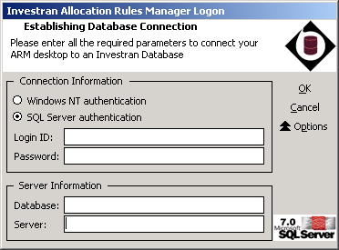

*Tela de conexão do ARM. Confirme autenticação, servidor e database antes de carregar as regras. Fonte: Investran 7 Developer's Guide to Allocation Rule Manager, p. 2.*

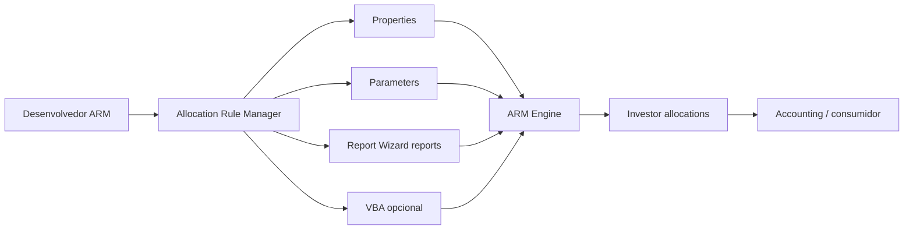

## Permissões

O usuário precisa dos entitlements apropriados no Team Security. A documentação da base distingue:

- `ARM Admin`: criar, editar, executar e excluir regras;
- `ARM User`: executar regras.

Ao investigar uma opção desabilitada ou ausente, confirme primeiro usuário, database e entitlement.

## Árvore de navegação

Após o login, o ARM carrega as Dynamic Allocation Rules do banco e as apresenta em uma árvore. Ao expandir uma regra, ficam disponíveis:

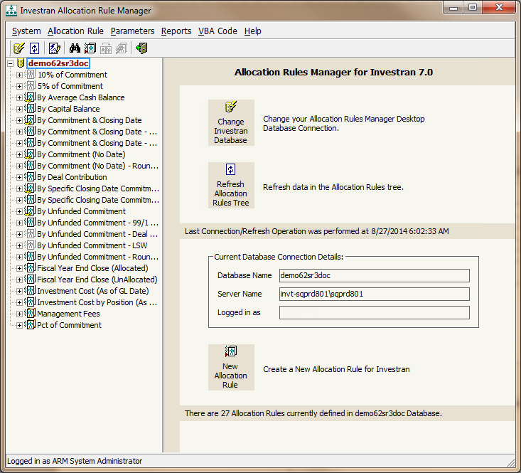

*Tela principal do ARM, com árvore de regras à esquerda, ações centrais e detalhes da conexão à direita. Fonte: guia de ARM, p. 6.*

- **Properties:** contexto recebido da transação;
- **Parameters:** valores adicionais definidos para execução;
- **Reports:** reports RW associados à regra;
- detalhes de columns e parameters de cada report;
- módulo VBA, quando `Use VBA` estiver habilitado.

O painel da regra mostra creator, created date, last modified by/date, notes, type e status. Essas informações devem ser capturadas antes de qualquer alteração.

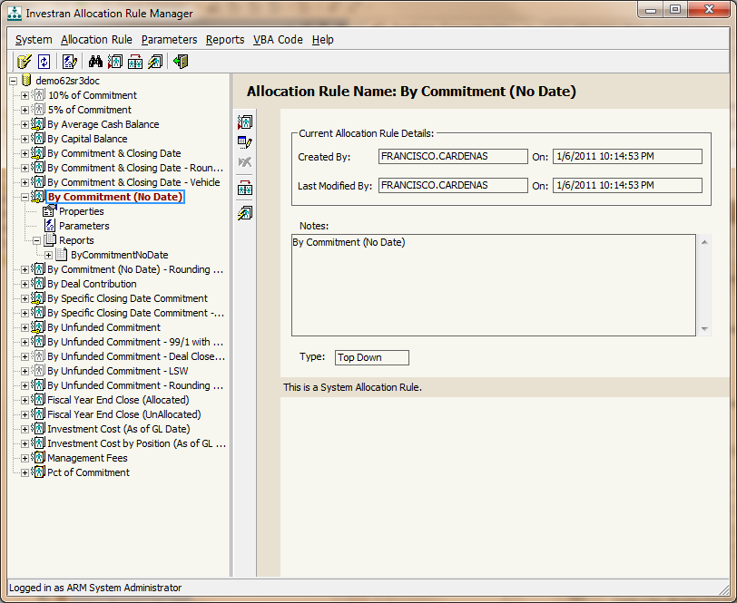

*Regra selecionada com seus atributos e dependências expandidas. Fonte: guia de ARM, p. 7.*

## Menus e operações

### System

| Operação | Finalidade |
|---|---|
| `Change Database` | abrir o login e trocar a conexão |
| `Refresh Allocation Rules Tree` | recarregar regras e mudanças do banco |
| `Exit ARM` | encerrar a aplicação |

### Allocation Rule

| Operação | Finalidade | Restrição importante |
|---|---|---|
| `Find` | pesquisar texto na árvore | confirme ID/atributos, não somente o nome |
| `Add` | criar regra | inicia normalmente em `Draft` |
| `Edit` | alterar atributos | regra em uso não pode ser editada |
| `Delete` | excluir regra | regra em uso não pode ser excluída |
| `Duplicate` | copiar uma regra | prefira como ponto de partida/backup controlado |
| `Run` | executar em ambiente simulado | não modifica o banco segundo o manual |

Uma regra é considerada **em uso** quando pelo menos uma transação do Accounting a referencia. Nesse estado, o ARM impede edição e exclusão. Não tente contornar a restrição diretamente no banco.

### Parameters

| Operação | Finalidade |
|---|---|
| `Define` | criar um parâmetro Investran reutilizável por AR, RW ou AT |
| `Add` | associar parâmetro à regra, obrigatório ou opcional, com default opcional |
| `Edit` / `Delete` | manter associação/configuração |
| ordenação | ordenar por nome, tipo ou obrigatoriedade |

### Reports

Permite adicionar e remover reports RW e ordenar por book, nome, creator ou datas. Somente reports em pasta **Public Read-only** devem ser usados por Allocation Rules.

### VBA Code

- `Show VBA Editor`: abre o módulo associado;
- `Save VBA Module`: salva as mudanças;
- `References...`: adiciona referências a componentes registrados.

## Atributos de uma regra

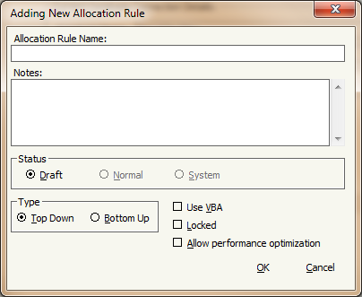

*Janela Add/Edit da regra, com nome, Notes, Status, Type, Use VBA, Locked e otimização. Fonte: guia de ARM, p. 5.*

| Atributo | Significado operacional |
|---|---|
| `Allocation Rule Name` | nome estável da regra |
| `Notes` | descrição e informações de manutenção |
| `Status` | `Draft`, `Normal` ou `System` |
| `Type` | `Top Down` ou `Bottom Up` |
| `Use VBA` | habilita lógica VBA complexa |
| `Locked` | somente o desenvolvedor que bloqueou pode alterar |
| `Allow performance optimization` | permite ao ATM reutilizar valores em cache obtidos pelo driver report |

### Estados

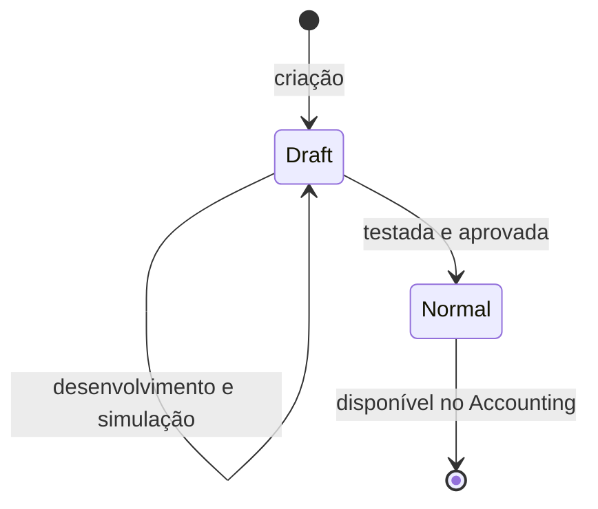

- `Draft`: indisponível para o Accounting; estado correto durante desenvolvimento.
- `Normal`: disponível para uso depois de testes concluídos.
- `System`: reservado às regras desenvolvidas pelo fornecedor.

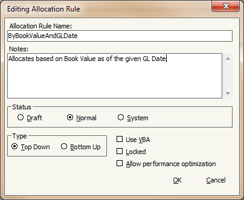

*Regra Top Down alterada de Draft para Normal depois dos testes, tornando-a disponível para uso. Fonte: guia de ARM, p. 17.*

`Allow performance optimization` afeta o uso de cache pelo ATM. O manual observa que o módulo Accounting não usa esses valores em cache. Teste os dois caminhos separadamente antes de atribuir uma diferença à regra.

## Properties e Parameters

### Properties

Representam campos do contexto de uma transação. `Legal Entity` e `GL Date` são sempre obrigatórios e sempre enviados quando a regra é chamada pelo Accounting. Outros, como Account, Deal, `Amount`, `LEAmount` e `Quantity`, são opcionais e devem ser marcados se a regra precisar deles.

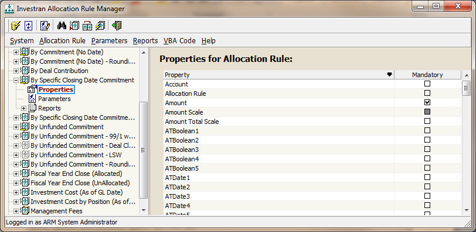

*Lista de Properties da regra. Legal Entity e GL Date são obrigatórias; as demais devem ser selecionadas conforme o cálculo. Fonte: guia de ARM, p. 8.*

### Parameters

Representam valores de runtime que não pertencem às properties predefinidas, como `StartDate` ou `EndDate`. Um parâmetro pode ser obrigatório, opcional e possuir default.

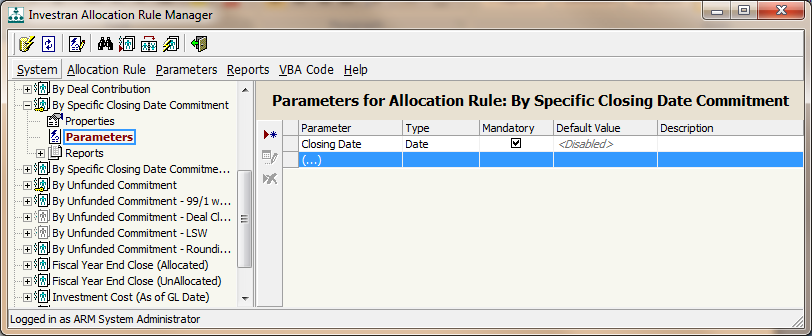

*Parameters associados à regra, incluindo tipo, obrigatoriedade, default e descrição. Fonte: guia de ARM, p. 8.*

### Propagação para Report Wizard

O ARM Engine envia properties e parameters para os reports associados quando os nomes coincidem. Portanto:

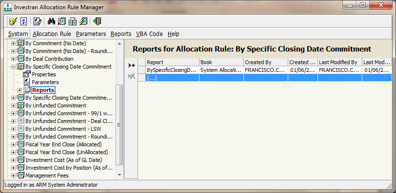

*Reports do Report Wizard associados à regra. Fonte: guia de ARM, p. 9.*

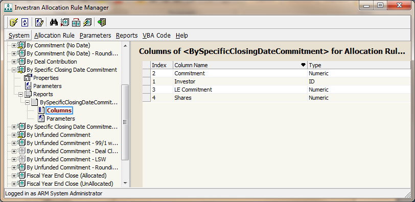

*Columns expandidas a partir do nó do report. Use esta visão para conferir nomes, ordem e tipos. Fonte: guia de ARM, p. 9.*

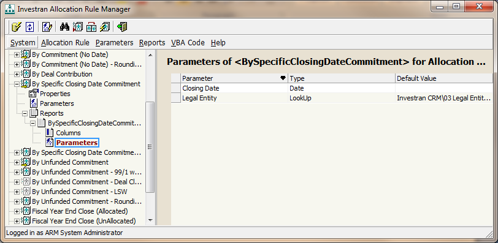

*Parameters do report associado, usados na propagação automática por nome. Fonte: guia de ARM, p. 10.*

- o nome é parte do contrato;
- alterações de nome quebram a propagação automática;
- tipo e formato precisam ser compatíveis;
- valores passados na simulação devem reproduzir o contexto real.

## Ciclo de vida seguro

### Criar

1. Definir finalidade, Top Down/Bottom Up e regra simples/complexa.
2. Criar e validar os reports RW em pasta Public Read-only.
3. Criar a regra em `Draft`.

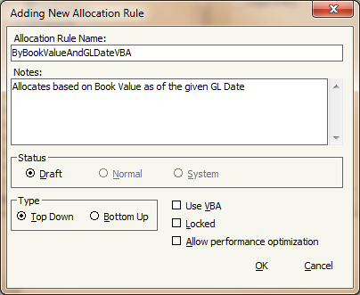

*Exemplo de criação de regra Top Down em Draft e sem VBA. Fonte: guia de ARM, p. 14.*

4. Associar properties, parameters e reports.

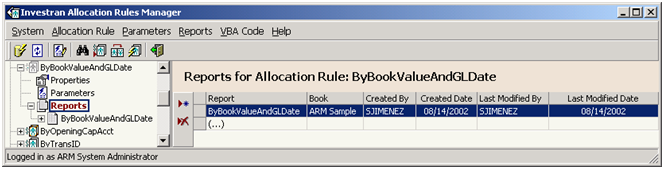

*Report do Report Wizard associado à regra dinâmica simples. Fonte: guia de ARM, p. 14.*

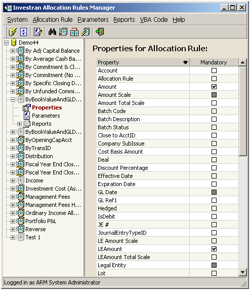

*Properties exigidas pelo report e pelo cálculo da regra. Fonte: guia de ARM, p. 15.*
5. Habilitar `Use VBA` apenas se o cálculo não puder ser representado por um único driver report.
6. Implementar `Sub Main` quando houver VBA.
7. Executar simulações com casos normais e de borda.
8. Reconciliar `Amount`, `LEAmount` e `Quantity` por Investor.
9. Após aprovação, mudar para `Normal`.

### Alterar

1. Confirmar se a regra está em uso e se pode ser editada.
2. Registrar atributos, dependências e resultados atuais.
3. Duplicar/preservar a definição aprovada.
4. Voltar o desenvolvimento para `Draft` quando o processo permitir.
5. Aplicar a menor mudança possível.
6. Executar `Refresh` no ARM após alterar reports associados.
7. Testar no ARM e no consumidor real.

### Simular

`Run` abre a tela de Properties and Parameters. Preencha os valores obrigatórios e use `Accept Values`. Segundo o manual, a execução é simulada e não modifica o banco. O resultado por Investor é exibido após a execução.

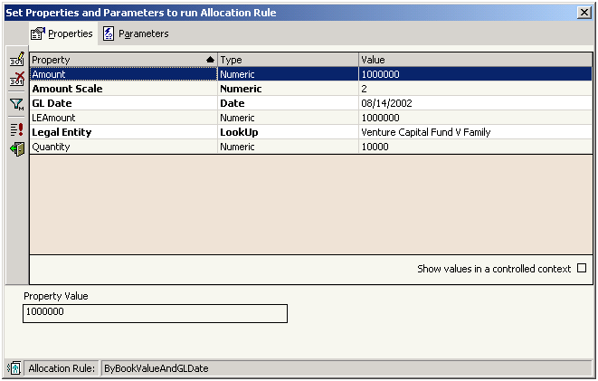

*Tela de valores de entrada apresentada por Run. Fonte: guia de ARM, p. 16.*

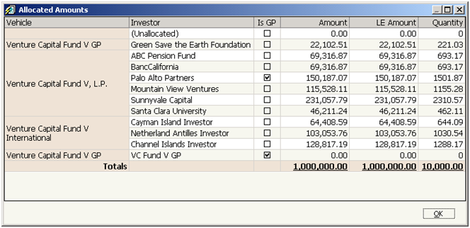

*Resultado da simulação com Amount, LE Amount e Quantity por Investor, além dos totais. Fonte: guia de ARM, p. 16.*

Mesmo sendo não mutável, execute somente em ambientes aprovados e com valores representativos.

### Promover

O manual confirma que o **Import-Export Console** transfere Allocation Rules e reports relacionados entre bancos. O procedimento específico, a ordem das dependências, as aprovações e o rollback continuam sendo particulares do ambiente e precisam de KT.

## Regras operacionais confirmadas

- não misturar débitos e créditos entre Investors dentro da mesma alocação;
- não misturar Investors reais e null Investor no mesmo resultado;
- o null Investor recebe valores não alocados e ocupa o índice 1 do `InvestorSet`;
- quantidades não podem ser negativas;
- armazenar valores configuráveis, como Carry Percentage, em UDFs e recuperá-los via RW em vez de hard-code no VBA;
- executar Refresh no ARM depois de alterar um report dependente;
- manter a regra em `Draft` até concluir os testes;
- não editar nem excluir regra em uso.

## Checklist de sustentação

- [ ] database e usuário confirmados;
- [ ] entitlement confirmado;
- [ ] nome, status, type, owner e last modified registrados;
- [ ] lock e uso por transações verificados;
- [ ] properties, parameters e reports inventariados;
- [ ] cache/ATM considerado;
- [ ] simulação reproduz o contexto real;
- [ ] resultado por Investor reconciliado;
- [ ] dependências incluídas no pacote de promoção;
- [ ] rollback e validação pós-deploy definidos.

## Fonte

- *Internal_INV7_ARM_Dev_Guide.pdf*, capítulos Getting Started with ARM, Navigation, Simple/Complex Dynamic Allocation Rules e Allocation Rule Development.
