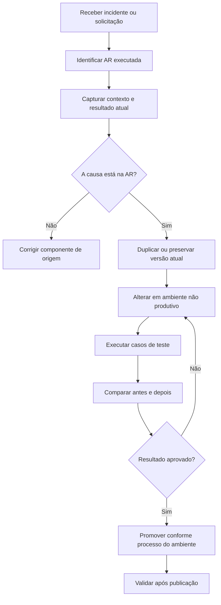

# Desenvolvimento e Alteração de Allocation Rules

> Este guia é orientado à sustentação. Ele consolida apenas o que os documentos recebidos suportam. Onde o material não descreve a interface exata do Allocation Rule Manager, o procedimento é marcado como **TODO (KT)**.

## Objetivo

Fornecer um roteiro seguro para criar ou alterar uma Allocation Rule sem perder rastreabilidade, sem misturar defeitos de origem e sem promover uma regra não validada.

## Quando uma alteração de AR é realmente necessária

Antes de alterar a regra, confirme se o defeito está nela. Em incidentes de alocação, a AR pode apenas estar recebendo um contexto incorreto de outro componente.

Verifique primeiro:

- Legal Entity incorreta;
- investidores fora do escopo esperado;
- datas contábeis ou efetivas incorretas;
- compromisso, closing date, saldo, custo ou unfunded commitment desatualizado;
- Allocation Rule ID incorreto informado por Active Template ou Batch;
- transação dominante/non-dominant configurada incorretamente;
- arredondamento ou rebalancing posterior ao cálculo;
- Report Wizard ou automação retornando dados diferentes do esperado.

## Fluxo recomendado

## 1. Preparação

Registre antes da mudança:

- nome e ID da Allocation Rule;
- tipo: static ou dynamic;
- direção: top-down ou bottom-up;
- Legal Entity ou conjunto de entidades impactado;
- componente que chama a regra;
- transação ou Batch de referência;
- parâmetros e datas usados;
- investidores esperados;
- percentuais, valores ou quantidades atuais;
- resultado esperado pelo cliente;
- evidência do erro;
- versão e ambiente onde o erro foi reproduzido.

## 2. Permissões

Os documentos distinguem dois níveis de acesso:

- **ARM Admin**: criar, editar, executar e excluir Allocation Rules;
- **ARM User**: executar Allocation Rules.

Confirme a permissão antes de diagnosticar uma falha de interface como defeito da aplicação.

## 3. Localização e inventário

### Informações confirmadas

- regras dinâmicas são administradas pelo Allocation Rule Manager;
- regras estáticas são mantidas pela utility **Static Allocation Rules**, no Portfolio & Investor Manager;
- o guia do ATM informa que existe metadata do Investran que pode ser consultada por Report Wizard para localizar IDs de Allocation Rules por nome;
- Active Templates podem definir a regra por ID no `Application.Context.AllocationRule`.

### TODO (KT)

Documentar no ambiente Goldman Sachs:

- caminho exato para abrir o ARM;
- filtros de pesquisa disponíveis;
- como identificar status, owner e data da última alteração;
- onde visualizar código, expressão, query ou definição interna;
- como duplicar uma regra existente;
- como exportar a definição atual para backup.

## 4. Entender a regra antes de editar

Classifique a regra usando as perguntas abaixo.

### Base de alocação

A regra usa:

- compromisso;
- compromisso e closing date;
- saldo médio de caixa;
- unfunded commitment;
- investment cost;
- capital account;
- management fee rate;
- valores fornecidos pelo usuário;
- outra base customizada.

### Universo de investidores

Confirme:

- quem pode participar;
- quais datas determinam elegibilidade;
- se existem investidores excluídos;
- se há side letters ou overrides;
- se a regra trabalha com GP, LP ou ambos;
- se investidores sem saldo ou compromisso devem receber zero;
- como novos closings entram no cálculo.

### Resultado

A saída deve representar:

- percentuais;
- valores;
- número de shares;
- um `InvestorSet` preenchido pelo código chamador;
- totais agregados para Vehicle e Legal Entity.

### Invariantes mínimas

Na maioria dos cenários, valide:

- soma dos percentuais esperada;
- soma dos valores alocados igual ao total de entrada;
- ausência de valores `NULL` para investidores válidos;
- tratamento consistente de zeros;
- comportamento de arredondamento;
- geração correta da parcela non-dominant ou de balancing.

> A soma esperada nem sempre será 100% em etapas intermediárias. Confirme o contrato funcional da regra antes de tratar qualquer diferença como erro.

## 5. Estratégia de alteração

### Prefira a menor mudança possível

Evite reescrever a regra durante uma correção emergencial. Altere apenas a condição, fonte ou cálculo comprovadamente defeituoso.

### Não use IDs desconhecidos sem validação

O manual de ATM cita como exemplo:

| ID | Regra de sistema |
|---:|---|
| 0 | Non-Dominant |
| 1 | No Allocation |
| 2 | User Provided |

Esses IDs devem ser validados na versão instalada antes do uso. Para regras customizadas, prefira resolver o ID por metadata ou configuração, em vez de espalhar números sem documentação.

### Evite valores de negócio hard-coded

O guia de desenvolvimento de Active Templates recomenda armazenar valores mutáveis em User Defined Fields e recuperá-los por Report Wizard, em vez de fixá-los no VBA. O mesmo princípio deve ser aplicado quando uma AR ou seu consumidor depende de percentuais, datas ou limites de negócio configuráveis.

### Preserve compatibilidade

Antes de remover campos, parâmetros ou dependências, identifique todos os consumidores:

- Active Templates;
- Batch templates;
- Business Events;
- processos de equalization/rebook;
- Report Wizard reports;
- jobs e integrações;
- processos manuais.

## 6. Alteração por tipo

### Static Allocation Rule

A documentação descreve regras estáticas como uma tabela de percentuais fixos por investidor.

Ao alterar:

1. valide a Legal Entity correta;
2. confirme a vigência ou data relevante, caso exista no ambiente;
3. compare a lista de investidores antes e depois;
4. confirme que os percentuais refletem o acordo de negócio;
5. verifique investidores adicionados, removidos ou inativos;
6. valide a soma;
7. execute uma transação de teste.

### Dynamic Allocation Rule

Regras dinâmicas recalculam os ratios conforme os dados mudam.

Ao alterar:

1. identifique a fonte de cada dado;
2. confirme datas de corte;
3. confirme filtros de investidores;
4. valide regras para zero, null e valores negativos;
5. teste com dados antigos e atuais;
6. teste investidores com closing dates diferentes;
7. verifique overrides e exceções;
8. compare o resultado por investidor.

### Top-Down

O valor nasce no nível da Legal Entity e é distribuído aos investidores.

Valide:

- total de entrada;
- população elegível;
- ratio por investidor;
- soma das alocações;
- diferença de arredondamento;
- balancing/non-dominant.

### Bottom-Up

O valor nasce ou é calculado no nível do investidor e depois agregado.

Valide:

- valor individual de cada investidor;
- total agregado por Vehicle;
- total agregado por Legal Entity;
- duplicidade de investidores;
- perda de precisão durante agregação.

## 7. Interação com Active Templates

O manual de ATM mostra que a Allocation Rule é definida no contexto da transação. A execução ocorre entre os eventos `BeforeTransaction` e `AfterTransaction`.

Dois padrões são relevantes:

### Regra executada pelo engine

O código define `Application.Context.AllocationRule` com o ID da regra. O engine calcula a alocação.

### User Provided

O código define a regra como User Provided e preenche o `InvestorSet` no evento `AfterTransaction`.

Ao alterar uma AR consumida por AT, valide também:

- onde o ID é atribuído;
- se a atribuição muda conforme `JEIndex` ou `TXIndex`;
- se o `AfterTransaction` substitui ou ajusta o resultado;
- se existe rebalancing por arredondamento;
- se a última transação é convertida em non-dominant;
- se o AT usa uma regra para dominant e outra para balancing.

## 8. Testes mínimos

Crie pelo menos estes cenários:

| Cenário | Objetivo |
|---|---|
| Caso nominal | Validar o fluxo mais comum |
| Um único investidor | Confirmar 100% ou comportamento equivalente |
| Vários investidores | Validar divisão e soma |
| Investidor sem compromisso/saldo | Confirmar exclusão ou zero |
| Closing dates diferentes | Validar elegibilidade temporal |
| Valor zero | Confirmar tratamento de zeros |
| Valor negativo | Validar reversões/ajustes |
| Arredondamento | Confirmar balancing |
| GP Legal Entity | Evitar alocações nulas ou inválidas |
| Reprocessamento | Confirmar determinismo |

Para cada teste, guarde:

- entrada;
- resultado anterior;
- resultado novo;
- diferença por investidor;
- soma total;
- evidência da aprovação.

## 9. Validação funcional

Não aprove apenas porque a execução terminou sem erro.

Confirme:

- investidores corretos;
- base de cálculo correta;
- percentuais corretos;
- valores corretos;
- datas corretas;
- tratamento de GP/LP;
- fechamento com o valor da transação;
- impacto em PCAP, management fees, equalization ou reporting, quando aplicável.

## 10. Publicação e rollback

Os documentos recebidos citam a aplicação **ARM & ATM Export-Import Console** para transferir Active Templates e related reports entre databases. Eles não fornecem um procedimento completo de promoção de Allocation Rules no ambiente Goldman Sachs.

### TODO (KT)

Documentar:

- se a mesma console exporta/importa as ARs customizadas;
- formato do pacote;
- ordem de promoção das dependências;
- aprovação necessária;
- backup anterior;
- validação pós-deploy;
- procedimento de rollback;
- possibilidade de restaurar versão anterior;
- impacto de cache ou restart.

Até isso ser confirmado, não trate alteração direta em produção como processo padrão.

## 11. Checklist antes de salvar

- [ ] Defeito reproduzido.
- [ ] AR correta identificada.
- [ ] Contexto de entrada registrado.
- [ ] Consumidores identificados.
- [ ] Versão atual preservada.
- [ ] Alteração mínima aplicada.
- [ ] Casos de borda testados.
- [ ] Totais conciliados.
- [ ] Resultado por investidor revisado.
- [ ] Evidências anexadas.

## 12. Checklist antes de publicar

- [ ] Aprovação funcional obtida.
- [ ] Processo de promoção confirmado.
- [ ] Dependências disponíveis no destino.
- [ ] Identificadores validados no destino.
- [ ] Plano de rollback preparado.
- [ ] Janela e comunicação confirmadas.
- [ ] Teste pós-deploy definido.

## 13. Erros a evitar

- alterar a primeira regra com nome semelhante sem confirmar o ID;
- assumir que o problema está na AR sem validar a entrada;
- testar apenas o total e ignorar a divisão por investidor;
- usar IDs hard-coded sem documentação;
- publicar sem guardar a versão anterior;
- ignorar arredondamento e balancing;
- testar no ARM, mas não no fluxo real que consome a regra;
- alterar static percentages sem aprovação de negócio;
- confundir falha de permissão com falha da regra.

## Pendências obrigatórias de KT

- [ ] Demonstração de criação de AR customizada.
- [ ] Demonstração de edição segura.
- [ ] Forma de visualizar a implementação interna.
- [ ] Forma de executar uma AR isoladamente.
- [ ] Forma de fornecer contexto e parâmetros de teste.
- [ ] Ferramenta e processo de debugging.
- [ ] Exportação/importação entre ambientes.
- [ ] Versionamento e rollback.
- [ ] Logs e tabelas de execução.
- [ ] Convenções de nomenclatura Goldman Sachs.
