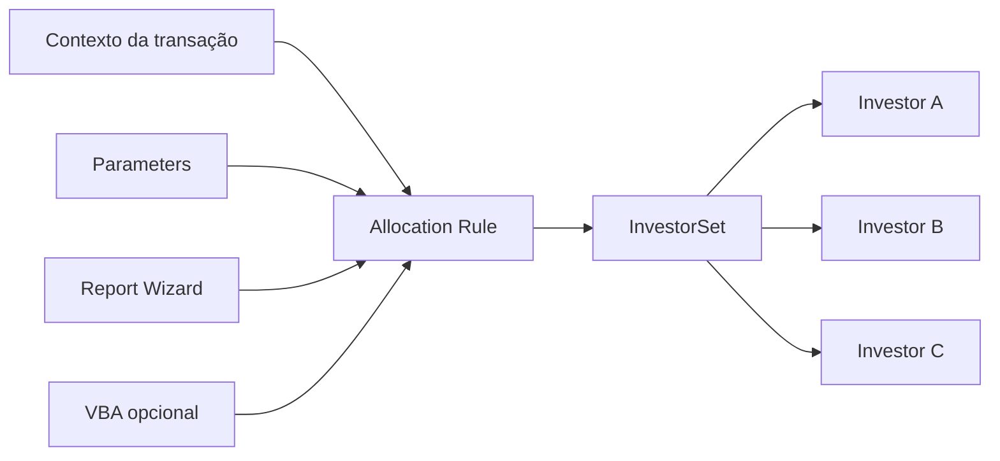
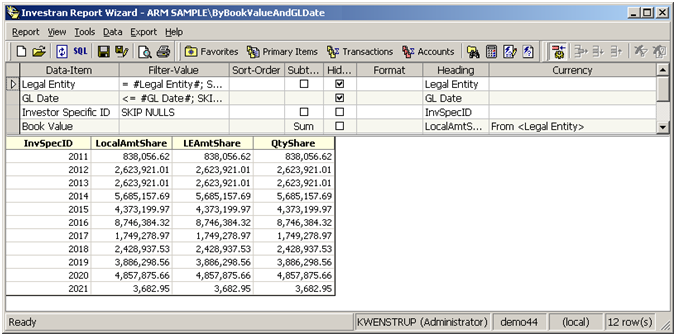
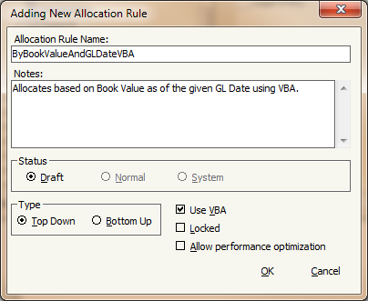

# Allocation Rule Manager - guia prático de uso

Este guia apresenta o ARM como ferramenta: o que ele resolve, como navegar, como montar uma regra e como validar o resultado antes de disponibilizá-la para o Accounting ou para um Active Template.

> As telas são do Investran 7 documentado no guia de 2014. Aparência, permissões e nomes podem variar conforme versão e configuração. Confirme o database e trabalhe em ambiente não produtivo.

## O que o ARM faz

O **Allocation Rule Manager** cria e mantém regras que distribuem `Amount`, `LEAmount` e `Quantity` entre Investors de uma Legal Entity.

O ARM mantém **Dynamic Allocation Rules**. Uma regra dinâmica pode buscar saldos, compromissos, custos ou outros dados com Report Wizard e calcular a participação de cada Investor no momento da execução.



O ARM não substitui a ferramenta **Static Allocation Rules**. Se os percentuais são cadastrados manualmente e permanecem fixos, investigue primeiro uma regra estática.

## Escolher o tipo correto

Antes de abrir a ferramenta, responda a três perguntas.

### 1. Static ou Dynamic?

| Necessidade | Escolha provável |
|---|---|
| percentuais fixos mantidos manualmente | Static Allocation Rule |
| cálculo muda por data, saldo, compromisso ou investimento | Dynamic Allocation Rule no ARM |

### 2. Simple ou Complex?

| Necessidade | Escolha provável |
|---|---|
| um report retorna todos os Investors e as três bases necessárias | Simple Dynamic Rule, sem VBA |
| múltiplos reports, condições, combinações ou tratamento especial | Complex Dynamic Rule, com VBA |

Comece por uma regra simples. VBA aumenta flexibilidade, mas também amplia dependências, testes e risco de manutenção.

### 3. Top Down ou Bottom Up?

- **Top Down:** o consumidor fornece totais da Legal Entity e a regra os distribui proporcionalmente.
- **Bottom Up:** o report ou código fornece valores individuais, e o engine agrega os Investors.

No Top Down, as colunas numéricas do report são bases de proporção. No Bottom Up, elas são os valores finais de cada Investor.

## Acessar e reconhecer a ferramenta

Ao iniciar o ARM, informe autenticação, servidor e database.


Antes de selecionar `OK`, confirme:

- ambiente correto;
- database correto;
- conta autorizada;
- versão esperada da ferramenta;
- ticket ou finalidade da sessão.

Depois do login, a tela principal possui três áreas:

1. árvore de Allocation Rules à esquerda;
2. ações de criação e refresh no centro;
3. conexão atual e metadados à direita.


## Entender a árvore de uma regra

Selecione uma regra e expanda o sinal `+`. A árvore funciona como inventário de dependências:

```text
Allocation Rule
├── Properties
├── Parameters
└── Reports
    ├── Columns
    └── Parameters
```


Ao assumir uma regra desconhecida, registre:

- nome, type e status;
- creator e last modified;
- Notes;
- Properties obrigatórias;
- Parameters e defaults;
- reports, books, columns e parameters;
- presença de VBA;
- consumidores conhecidos;
- resultado de uma execução baseline.

## Para que serve cada componente

### Properties

Properties são valores do contexto da transação, enviados pelo Accounting, ATM ou outro consumidor. `Legal Entity` e `GL Date` são sempre obrigatórias. Marque outras properties somente quando a regra realmente precisa delas.


Exemplos:

- `Amount`, `LEAmount` e `Quantity`: totais que uma Top Down Rule distribui;
- `Account`, `Deal` e Investment: contexto usado para filtrar ou calcular;
- escalas: precisão utilizada no arredondamento;
- datas: determinam a posição financeira usada no cálculo.

### Parameters

Parameters são entradas adicionais que não pertencem ao contexto padrão. Podem ser obrigatórios, opcionais ou possuir default.


Use Parameters para valores realmente fornecidos em runtime. Para configurações duráveis de negócio, avalie UDFs ou outra fonte governada em vez de hard-code.

### Reports

Reports consultam os dados que determinam o universo de Investors e as bases do cálculo.


O nome das Properties/Parameters da regra precisa coincidir com o nome dos parameters do report para que o ARM Engine propague os valores automaticamente.

Depois de alterar um report no Report Wizard:

1. valide o report isoladamente;
2. retorne ao ARM;
3. execute `Refresh Allocation Rules Tree`;
4. confira novamente Columns e Parameters;
5. execute a regra com os mesmos valores.

### VBA

VBA implementa regras complexas que não cabem em um único report. O módulo deve possuir `Sub Main` e devolver o resultado em `AllocationRule.Results`.


Use `VBA Code > Save VBA Module` explicitamente. Salvar atributos da regra não garante que o módulo aberto tenha sido persistido.

## Criar uma Simple Dynamic Allocation Rule

Uma regra simples usa exatamente um report e não precisa de VBA.

### 1. Preparar o Report Wizard

O report deve estar em pasta **Public Read-only** e possuir quatro colunas visíveis nesta ordem:

| Ordem | Conteúdo |
|---:|---|
| 1 | Investor Account ID |
| 2 | base ou valor de Amount |
| 3 | base ou valor de LEAmount |
| 4 | base ou valor de Quantity |



Execute o report isoladamente e confirme IDs válidos, ausência de duplicidades, tratamento de zero/Null e totais esperados.

### 2. Criar a regra

Use `Allocation Rule > Add`:

1. informe nome estável e Notes úteis;
2. mantenha Status `Draft`;
3. escolha Top Down ou Bottom Up;
4. deixe `Use VBA` desmarcado;
5. use `Locked` somente conforme a convenção da equipe;
6. não habilite otimização sem testar o comportamento do cache.


### 3. Associar o report

Selecione Reports e adicione o report preparado. Confira Book, nome, Columns e Parameters.


### 4. Selecionar Properties e Parameters

Marque todas as entradas exigidas pelo report e pelo cálculo. Não marque propriedades “por garantia”: isso amplia o contrato da regra e dificulta seu reuso.


### 5. Executar e reconciliar

Use `Allocation Rule > Run`, informe os valores e selecione `Accept Values`.


O ARM exibe o resultado por Investor:


Valide:

- Investor correto em cada linha;
- ausência de Investors duplicados ou inelegíveis;
- Amount, LE Amount e Quantity por Investor;
- totais iguais aos valores de origem no Top Down;
- soma individual correta no Bottom Up;
- sinal consistente;
- quantidade não negativa;
- diferenças de arredondamento explicadas.

### 6. Disponibilizar a regra

Somente depois da reconciliação e aprovação, use Edit e altere o status para `Normal`.


`Draft` não fica disponível no Accounting. `System` é reservado às regras do fornecedor.

## Criar uma Complex Dynamic Allocation Rule

Use regra complexa quando precisar combinar reports, aplicar condições ou manipular `InvestorSet` programaticamente.



Fluxo recomendado:

1. crie a regra em Draft e habilite `Use VBA`;
2. associe todas as Properties, Parameters e Reports;
3. abra o VBA Editor;
4. implemente `Sub Main` com `Option Explicit`;
5. leia entradas por `AllocationRule.Properties` e `AllocationRule.Parameters`;
6. execute reports por `AllocationRule.Reports`;
7. construa sets auxiliares com `NewInvestorSet`;
8. aplique cálculo e arredondamento;
9. copie o resultado final para `AllocationRule.Results`;
10. salve o módulo e execute a regra;
11. teste também pelo consumidor real.

Consulte [Object model e contratos técnicos](object-model.md) para `RWReport`, `InvestorSet` e o objeto `AllocationRule`.

## Encontrar e alterar uma regra existente

1. Use `Allocation Rule > Find` para localizar texto na árvore.
2. Confirme a regra por atributos e dependências, não apenas pelo nome.
3. Execute uma baseline e guarde as entradas/resultados.
4. Verifique se a regra está em uso; nesse caso o ARM bloqueia Edit/Delete.
5. Duplique ou exporte a versão aprovada conforme o processo interno.
6. Faça a menor mudança possível em report, entrada, atributo ou VBA.
7. Execute Refresh quando reports forem alterados.
8. Repita baseline, cenários de borda e teste integrado.

Não tente contornar bloqueios editando diretamente o banco.

## Refresh, cache e diferenças entre ARM e ATM

Três situações confundem frequentemente o diagnóstico:

- o report mudou, mas o ARM ainda exibe metadados anteriores: execute Refresh;
- a regra funciona no ARM, mas diverge no ATM: compare Properties, Parameters e contexto enviado pelo template;
- `Allow performance optimization` está ativo: o ATM pode reutilizar valores obtidos pelo driver, enquanto o Accounting não usa esse cache da mesma forma.

Teste o ARM isoladamente e depois o fluxo consumidor. Um resultado correto em `Run` não prova sozinho que a integração está correta.

## Publicação e rollback

O guia confirma o Import-Export Console para transferir regras e reports relacionados entre databases. Antes de promover:

- preserve a versão anterior;
- inventarie reports, parameters, UDFs e referências VBA;
- confirme IDs e conflitos no destino;
- importe na ordem aprovada;
- execute Refresh;
- rode smoke test com valores conhecidos;
- teste o consumidor;
- mantenha um procedimento de restauração coerente.

Restaurar somente o VBA pode não reverter uma mudança que também envolveu report, Properties ou Parameters.

## Checklist rápido de uso

- [ ] database, usuário e entitlement confirmados;
- [ ] tipo Static/Dynamic e direção Top Down/Bottom Up confirmados;
- [ ] regra mantida em Draft durante desenvolvimento;
- [ ] reports em Public Read-only e validados isoladamente;
- [ ] nomes de Properties/Parameters compatíveis com reports;
- [ ] VBA salvo explicitamente, quando aplicável;
- [ ] Run executado com contexto representativo;
- [ ] resultado reconciliado por Investor e por total;
- [ ] teste integrado executado;
- [ ] aprovação obtida antes de Normal;
- [ ] pacote e rollback documentados.

## Fonte

- *Internal_INV7_ARM_Dev_Guide.pdf*, capítulos Getting Started with ARM, Navigation, Simple Dynamic Allocation Rules, Complex Dynamic Allocation Rules e Allocation Rule Development.
