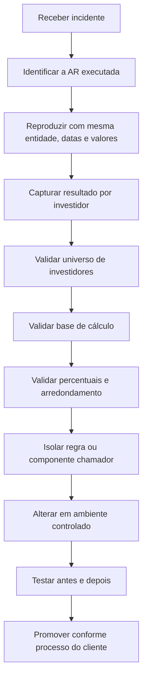

# Allocation Rules — Guia de Manutenção

## 1. Objetivo operacional

Este guia descreve como abordar uma Allocation Rule com comportamento incorreto sem depender de conhecer previamente todas as regras do ambiente.

O processo recomendado é:



## 2. Informações mínimas do chamado

Antes de investigar, registre:

- nome ou ID da Allocation Rule;
- ambiente;
- Legal Entity;
- Vehicle/Fund, quando aplicável;
- Batch, Journal Entry e Transaction envolvidos;
- Effective Date e GL Date;
- moeda local e moeda da Legal Entity;
- valor total esperado e valor total obtido;
- investidores esperados e investidores retornados;
- percentuais ou valores esperados por investidor;
- origem da execução: usuário, Batch, Active Template, Business Event ou outro processo;
- evidência: relatório, tela, arquivo ou log.

Sem essas informações, o risco de reproduzir um cenário diferente é alto.

## 3. Identificar qual regra foi executada

### Quando a chamada vem de Active Template

O guia de ATM mostra que a regra pode ser atribuída via VBA pela propriedade:

```vb
Application.Context.AllocationRule = <AllocationRuleID>
```

Também há casos em que o AT usa `User Provided` e preenche o `InvestorSet` no evento `Application_AfterTransaction`.

Ao analisar um AT:

1. pesquise por `AllocationRule` no módulo VBA;
2. localize constantes `cstAR_*`;
3. confirme se o código troca a regra em `BeforeTransaction` ou `AfterTransaction`;
4. verifique se a regra varia conforme `JEIndex`, `TXIndex`, última linha do Driver Report ou outra condição;
5. confirme o ID por metadata/report, e não apenas pelo nome da constante.

### Quando a chamada vem de Batch ou tela

Confirme no detalhe da transação qual regra foi selecionada e se a transação é dominante, não dominante ou sem alocação.

### Quando o ID é conhecido, mas o nome não

O manual de ATM informa que há metadata do Investran que permite criar relatórios para recuperar Allocation Rule IDs por nome. Mantenha um Report Wizard de lookup no projeto, se o cliente permitir.

## 4. Entender uma AR desconhecida

Use a sequência abaixo.

### 4.1 Propósito

- Qual item financeiro ela aloca?
- É usada para receitas, despesas, ganhos, perdas, management fee, investment cost ou rebook?
- É genérica ou específica de um fundo/processo?

### 4.2 Direção

- **Top Down:** recebe total no nível da Legal Entity e divide entre investidores.
- **Bottom Up:** recebe/calcula valores de investidores e agrega para níveis superiores.

### 4.3 Natureza

- **Static:** percentuais fixos cadastrados.
- **Dynamic:** percentuais recalculados a partir dos dados.
- **User Provided:** o componente chamador entrega os valores por investidor.
- **Non-Dominant:** usada para a transação de contrapartida/balanceamento.
- **No Allocation:** mantém o valor sem distribuição aos investidores.

### 4.4 Entradas

Identifique todas as entradas efetivas:

- Legal Entity;
- investor population;
- commitments;
- closing dates;
- cash balances;
- unfunded commitment;
- investment cost;
- invested capital;
- management fee rates e overrides;
- Effective Date/GL Date;
- Deal, Position, Transaction Type ou GL Account;
- parâmetros fornecidos pelo processo chamador.

### 4.5 Saídas e invariantes

Valide, conforme o tipo de regra:

- soma dos percentuais = 100%;
- soma dos valores alocados = valor total da transação;
- investidores não elegíveis = zero ou ausentes;
- nenhum valor `NULL` inesperado;
- sinais de débito/crédito preservados;
- local amount e LE amount coerentes;
- diferenças apenas dentro da tolerância de arredondamento;
- transação não dominante fecha o journal entry.

## 5. Diagnóstico por camada

### Camada 1 — Contexto

Confirme se a AR recebeu Legal Entity, datas, moeda, transaction type, deal e position corretos.

### Camada 2 — Universo de investidores

Confirme:

- investors ativos na data;
- commitments válidos;
- closing dates;
- ownership/participation;
- permissões e domínio dos investidores;
- investidores de GP versus LP.

### Camada 3 — Base de cálculo

Exemplos documentados de bases dinâmicas:

- average cash balance;
- commitment com ou sem closing date;
- unfunded commitment;
- investment cost na GL Date;
- invested capital;
- commitment durante investment period.

### Camada 4 — Cálculo e arredondamento

Registre os valores intermediários. Compare o ratio bruto, o ratio arredondado e o valor final alocado.

### Camada 5 — Consumidor

Mesmo que a AR esteja correta, o AT ou Batch pode:

- sobrescrever a Allocation Rule;
- alterar Amount/LEAmount após o cálculo;
- preencher manualmente o InvestorSet;
- usar a regra errada em apenas uma transaction template;
- executar uma regra de rebook diferente da regra original.

## 6. Alteração segura

Os PDFs recebidos não documentam o passo a passo da interface do ARM. Até que o KT confirme o processo, use este controle mínimo:

1. não altere diretamente em produção;
2. registre nome, ID e estado atual;
3. exporte ou documente a versão anterior;
4. identifique todos os consumidores conhecidos;
5. crie casos de teste com resultados esperados;
6. altere no ambiente de desenvolvimento;
7. execute casos positivos, negativos e de fronteira;
8. compare resultado antes/depois por investidor;
9. valide totais, rounding e non-dominant entry;
10. promova usando o mecanismo aprovado;
11. execute smoke test no ambiente de destino;
12. mantenha plano de rollback.

## 7. Matriz mínima de testes

| Cenário | Validação |
|---|---|
| Um único investidor | recebe 100% |
| Vários investidores iguais | divisão proporcional e total fechado |
| Investidor com zero base | não recebe alocação indevida |
| Closing dates diferentes | elegibilidade conforme data |
| Effective Date no limite | comportamento consistente |
| Valores negativos | sinal e total preservados |
| Duas moedas | local e LE amounts coerentes |
| Valor com muitas casas decimais | rounding e residual controlados |
| GP Legal Entity | investidores corretos, sem NULL inesperado |
| Rebook | reversão e nova alocação fecham o total |

## 8. Teste integrado com Active Template

Quando a AR é usada por AT:

1. execute o AT em Simulation Mode;
2. coloque breakpoint antes da atribuição de `Application.Context.AllocationRule`;
3. capture contexto, rule ID e valores;
4. avance até `AfterTransaction`;
5. inspecione o `InvestorSet` retornado;
6. confirme a transação dominante e a non-dominant;
7. execute pelo Scheduler Engine em ambiente de teste;
8. use Preview antes do Commit;
9. compare o batch gerado com o esperado.

## 9. Publicação e rollback

O manual de ATM cita o utilitário **ARM & ATM Export-Import Console** para transferência de Active Templates e itens relacionados entre bancos. O procedimento específico de promoção de Allocation Rules precisa ser confirmado no ambiente.

Até confirmação, documente para cada release:

- origem e destino;
- regra, ID e versão;
- dependências;
- export/backup anterior;
- evidências de teste;
- responsável pela aprovação;
- horário da promoção;
- validação pós-deploy;
- procedimento exato de rollback.

## 10. Critério de conclusão

Uma correção só deve ser considerada concluída quando:

- a causa raiz estiver identificada;
- o cenário original for reproduzido;
- o teste falhar antes e passar depois;
- a soma por investidor fechar com o total;
- consumidores impactados forem testados;
- o processo de publicação tiver evidência;
- o rollback estiver disponível;
- a documentação da regra for atualizada.