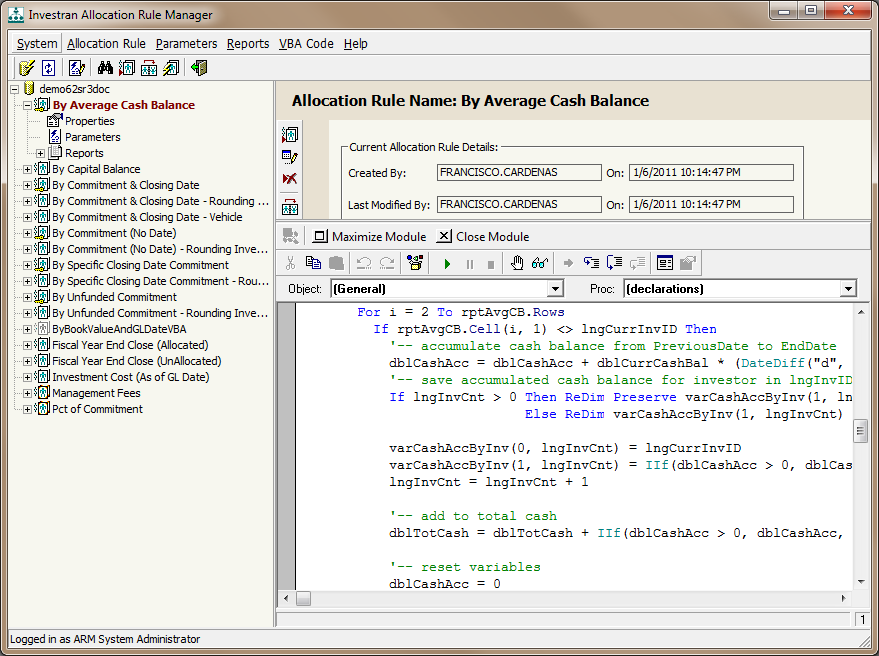
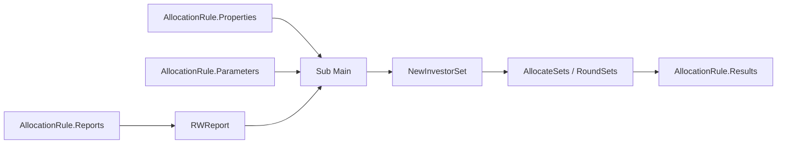

# Allocation Rule Manager - object model e contratos técnicos

## Visão geral

Regras dinâmicas complexas usam VBA para combinar dados de Report Wizard, properties e parameters e preencher o `InvestorSet` devolvido ao consumidor.



*VBA Editor do ARM aberto abaixo dos atributos da regra. O módulo implementa a lógica adicional das Complex Dynamic Allocation Rules. Fonte: guia de ARM, p. 11.*



O entry point obrigatório do módulo é:

```vb
Sub Main
    ' lógica da Allocation Rule
End Sub
```

Use `Option Explicit`, tratamento de erro e liberação dos objetos. Ao relançar uma falha, inclua contexto da regra sem ocultar a descrição original.

## `RWReport`

Encapsula um report do Report Wizard associado à regra.

### Propriedades principais

| Membro | Uso |
|---|---|
| `Rows` / `Cols` | quantidade de linhas e colunas |
| `Cell(row, col)` | valor de uma célula |
| `ColIndex(name)` | localizar coluna pelo nome |
| `ColName(index)` | obter nome pelo índice |
| `ColType(index)` | obter tipo da coluna |
| `ColTotal(index)` | obter total da coluna |
| `ParameterCount` | quantidade de parâmetros |
| `ParameterName(index)` | nome do parâmetro |
| `ParameterType(index)` | tipo do parâmetro |
| `ParameterDefaultValue(index)` | valor default |
| `ParameterDefaultLookUpText(index)` | texto de lookup default |
| `Parameter(name) = value` | atribuir valor por nome |

### Método

`Run(Optional ForceRefresh As Boolean = False)` executa o report e mantém internamente o resultado. `ForceRefresh=True` força nova execução mesmo quando há resultado em cache.

Use `ForceRefresh` deliberadamente: ele pode ser necessário para validar uma alteração, mas também aumenta custo e não substitui uma estratégia de cache correta.

## `InvestorSet`

Representa os Investors válidos de uma Legal Entity e seus valores de alocação local, em moeda da Legal Entity e em quantidade.

### Identificação e contexto

| Membro | Uso |
|---|---|
| `Count` | quantidade de Investors válidos |
| `GPCount` | quantidade classificada como General Partner |
| `Index(investorID)` | localizar o índice pelo Investor Account ID |
| `InvestorID(index)` | obter o Investor Account ID |
| `InvestorName(index)` | obter o nome |
| `IsGP(index)` | identificar GP |
| `IsParticipant(index)` | identificar participant vehicle |
| `VehicleName(index)` | obter o Vehicle relacionado |

### Valores

| Membro | Uso |
|---|---|
| `Amount(index)` | valor em moeda local |
| `LEAmount(index)` | valor na moeda da Legal Entity |
| `Quantity(index)` | quantidade |
| `TotalAmount(scale)` | total local arredondado |
| `TotalLEAmount(scale)` | total da Legal Entity arredondado |
| `TotalQuantity(scale)` | quantidade total arredondada |

### Métodos suportados relevantes

| Método | Comportamento |
|---|---|
| `AllocateSets(amount, leAmount, quantity)` | distribui os totais proporcionalmente às bases existentes no set |
| `RoundSets(...)` | arredonda valores e totais usando escalas separadas |
| `CopySet(source)` | copia Amount, LEAmount e Quantity de outro set |
| `Add(source)` | soma outro set por Investor |
| `Subtract(source)` | subtrai outro set por Investor |

### Membros obsoletos

O manual marca como obsoletos e mantidos apenas por compatibilidade:

- `RoundScale`;
- `Value` e `Total`;
- `Split`;
- `SplitGPLP`;
- `Accumulate`;
- `CopyColumn`;
- `ApplyPercentage`;
- `ToPercentage`.

Não introduza novos usos desses membros. Ao encontrar código legado, registre dependência e planeje migração antes de upgrades.

## Objeto `AllocationRule`

Disponível diretamente no VBA da regra.

| Membro | Uso |
|---|---|
| `Properties(name)` | ler property recebida do Accounting/consumidor |
| `Parameters(name)` | ler parâmetro de runtime |
| `Reports.Item(...)` | obter report associado por índice ou por book/nome |
| `Results` | `InvestorSet` especial devolvido ao chamador |
| `NewInvestorSet()` | criar set auxiliar vazio para cálculo |

> O texto do manual apresenta uma inversão nas descrições de `Parameters()` e `Properties()`, mas os exemplos e o uso no código deixam claro: properties são lidas por `AllocationRule.Properties(...)` e parâmetros por `AllocationRule.Parameters(...)`.

## Padrão de implementação

```vb
Option Explicit

Sub Main
    On Error GoTo ErrorHandler

    Dim report As RWReport
    Dim workSet As InvestorSet
    Dim i As Long
    Dim investorIndex As Long
    Dim errorNumber As Long
    Dim errorSource As String
    Dim errorDescription As String

    Set report = AllocationRule.Reports.Item(, "ARM Reports", "Driver Report")
    report.Parameter("Legal Entity") = AllocationRule.Properties("Legal Entity")
    report.Parameter("GL Date") = AllocationRule.Properties("GL Date")
    report.Run

    Set workSet = AllocationRule.NewInvestorSet

    For i = 1 To report.Rows
        investorIndex = workSet.Index(report.Cell(i, 1))
        workSet.Amount(investorIndex) = report.Cell(i, 2)
        workSet.LEAmount(investorIndex) = report.Cell(i, 3)
        workSet.Quantity(investorIndex) = report.Cell(i, 4)
    Next i

    workSet.AllocateSets _
        AllocationRule.Properties("Amount"), _
        AllocationRule.Properties("LEAmount"), _
        AllocationRule.Properties("Quantity")

    AllocationRule.Results.CopySet workSet

Cleanup:
    Set report = Nothing
    Set workSet = Nothing
    Exit Sub

ErrorHandler:
    errorNumber = Err.Number
    errorSource = Err.Source
    errorDescription = Err.Description
    Set report = Nothing
    Set workSet = Nothing
    Err.Raise errorNumber, errorSource, _
        "Erro na Allocation Rule: " & errorDescription
End Sub
```

O exemplo é estrutural. Ajuste nomes de book/report, colunas, escalas e propriedades ao contrato real.

## Contrato de uma Simple Dynamic Allocation Rule

Uma regra simples usa exatamente um report RW e não precisa de VBA. O report deve possuir quatro colunas **visíveis**, nesta ordem:

| Posição | Conteúdo | Finalidade |
|---:|---|---|
| 1 | `Investor Account ID` | correlacionar cada linha ao Investor correto |
| 2 | valor numérico/base | proporção ou valor de `Amount` |
| 3 | valor numérico/base | proporção ou valor de `LEAmount` |
| 4 | valor numérico/base | proporção ou valor de `Quantity` |

Outras colunas podem ser usadas para filtros, mas devem permanecer ocultas.

### Top Down

As colunas 2, 3 e 4 representam bases proporcionais. O engine distribui as properties `Amount`, `LEAmount` e `Quantity` segundo essas proporções.

### Bottom Up

As colunas 2, 3 e 4 já representam os valores efetivos de cada Investor. O engine usa esses valores e soma para obter os totais.

## Invariantes técnicas

Antes de copiar para `AllocationRule.Results`, valide:

- todo ID do report existe no `InvestorSet`;
- nenhuma quantidade é negativa;
- não há mistura de débitos e créditos entre Investors;
- não há mistura de Investors reais com null Investor;
- totais locais, LE e quantity fecham nas escalas esperadas;
- zero e `Null` possuem tratamento explícito;
- reports possuem ao menos as colunas esperadas;
- erro parcial não deixa `Results` inconsistente.

## Debugging prático

1. Mantenha a regra em `Draft`.
2. Execute o driver report isoladamente com as mesmas properties/parameters.
3. No ARM, use `Run` e informe o mesmo contexto.
4. Inspecione row count, IDs e bases do report.
5. Compare o set antes e depois de `AllocateSets`.
6. Valide totals antes e depois de `RoundSets`.
7. Confirme que `Results.CopySet` foi executado.
8. Se o ATM divergir do ARM, investigue cache e contexto fornecido pelo template.

## Fonte

- *Internal_INV7_ARM_Dev_Guide.pdf*, capítulos Commonly Used VBA Classes, Complex Dynamic Allocation Rules e Allocation Rule Development.
