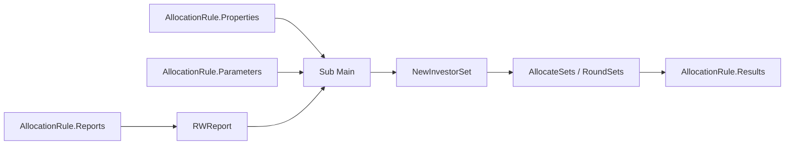

# Allocation Rule Manager - object model and technical contracts

## Overview

Complex dynamic rules use VBA to combine Report Wizard data, properties, and parameters and fill the `InvestorSet` returned to the consumer.


*ARM VBA Editor opened below rule attributes. The module implements additional Complex Dynamic Allocation Rule logic. Source: ARM guide, p. 11.*



The required module entry point is:

```vb
Sub Main
    ' Allocation Rule logic
End Sub
```

Use `Option Explicit`, error handling, and object cleanup. When rethrowing a failure, include rule context without hiding the original description.

## `RWReport`

Encapsulates a Report Wizard report associated with the rule.

### Main properties

| Member | Use |
|---|---|
| `Rows` / `Cols` | Number of rows and columns |
| `Cell(row, col)` | Cell value |
| `ColIndex(name)` | Find a column by name |
| `ColName(index)` | Get name by index |
| `ColType(index)` | Get column type |
| `ColTotal(index)` | Get column total |
| `ParameterCount` | Number of parameters |
| `ParameterName(index)` | Parameter name |
| `ParameterType(index)` | Parameter type |
| `ParameterDefaultValue(index)` | Default value |
| `ParameterDefaultLookUpText(index)` | Default lookup text |
| `Parameter(name) = value` | Set value by name |

### Method

`Run(Optional ForceRefresh As Boolean = False)` runs the report and keeps its result internally. `ForceRefresh=True` forces a new run even when a cached result exists.

Use `ForceRefresh` deliberately: it may be needed to validate a change, but it also increases cost and does not replace a correct cache strategy.

## `InvestorSet`

Represents valid Investors in a Legal Entity and their local-allocation, Legal Entity-currency, and quantity values.

### Identity and context

| Membro | Uso |
|---|---|
| `Count` | Number of valid Investors |
| `GPCount` | quantidade classificada como General Partner |
| `Index(investorID)` | Find the index by Investor Account ID |
| `InvestorID(index)` | obter o Investor Account ID |
| `InvestorName(index)` | obter o nome |
| `IsGP(index)` | identificar GP |
| `IsParticipant(index)` | identificar participant vehicle |
| `VehicleName(index)` | obter o Vehicle relacionado |

### Values

| Membro | Uso |
|---|---|
| `Amount(index)` | valor em moeda local |
| `LEAmount(index)` | valor na moeda da Legal Entity |
| `Quantity(index)` | quantidade |
| `TotalAmount(scale)` | total local arredondado |
| `TotalLEAmount(scale)` | total da Legal Entity arredondado |
| `TotalQuantity(scale)` | quantidade total arredondada |

### Relevant supported methods

| Method | Behavior |
|---|---|
| `AllocateSets(amount, leAmount, quantity)` | Distributes totals proportionally to bases in the set |
| `RoundSets(...)` | arredonda valores e totais usando escalas separadas |
| `CopySet(source)` | copia Amount, LEAmount e Quantity de outro set |
| `Add(source)` | soma outro set por Investor |
| `Subtract(source)` | subtrai outro set por Investor |

### Obsolete members

O manual marca como obsoletos e mantidos apenas por compatibilidade:

- `RoundScale`;
- `Value` e `Total`;
- `Split`;
- `SplitGPLP`;
- `Accumulate`;
- `CopyColumn`;
- `ApplyPercentage`;
- `ToPercentage`.

Do not introduce new uses of these members. When finding legacy code, record the dependency and plan migration before upgrades.

## `AllocationRule` object

Available directly in the rule VBA.

| Membro | Uso |
|---|---|
| `Properties(name)` | ler property recebida do Accounting/consumidor |
| `Parameters(name)` | Read runtime parameter |
| `Reports.Item(...)` | Get associated report by index or book/name |
| `Results` | `InvestorSet` especial devolvido ao chamador |
| `NewInvestorSet()` | Create an empty auxiliary set for calculation |

> The manual text reverses the descriptions of `Parameters()` and `Properties()`, but examples and code use make this clear: properties are read through `AllocationRule.Properties(...)` and parameters through `AllocationRule.Parameters(...)`.

## Implementation pattern

```vb
Option Explicit

Sub Main
    On Error GoTo ErrorHandler

    Dim report As RWReport
    Dim workSet As InvestorSet
    Dim i As Long
    Dim investorIndex As Long
    Dim errorNumber As Long
    Dim errorSource As String
    Dim errorDescription As String

    Set report = AllocationRule.Reports.Item(, "ARM Reports", "Driver Report")
    report.Parameter("Legal Entity") = AllocationRule.Properties("Legal Entity")
    report.Parameter("GL Date") = AllocationRule.Properties("GL Date")
    report.Run

    Set workSet = AllocationRule.NewInvestorSet

    For i = 1 To report.Rows
        investorIndex = workSet.Index(report.Cell(i, 1))
        workSet.Amount(investorIndex) = report.Cell(i, 2)
        workSet.LEAmount(investorIndex) = report.Cell(i, 3)
        workSet.Quantity(investorIndex) = report.Cell(i, 4)
    Next i

    workSet.AllocateSets _
        AllocationRule.Properties("Amount"), _
        AllocationRule.Properties("LEAmount"), _
        AllocationRule.Properties("Quantity")

    AllocationRule.Results.CopySet workSet

Cleanup:
    Set report = Nothing
    Set workSet = Nothing
    Exit Sub

ErrorHandler:
    errorNumber = Err.Number
    errorSource = Err.Source
    errorDescription = Err.Description
    Set report = Nothing
    Set workSet = Nothing
    Err.Raise errorNumber, errorSource, _
        "Erro na Allocation Rule: " & errorDescription
End Sub
```

The example is structural. Adjust book/report names, columns, scales, and properties to the real contract.

## Simple Dynamic Allocation Rule contract

A simple rule uses exactly one RW report and does not need VBA. The report must have four **visible** columns in this order:

| Position | Content | Purpose |
|---:|---|---|
| 1 | `Investor Account ID` | Match each row to the correct Investor |
| 2 | Numeric value/base | Proportion or value for `Amount` |
| 3 | Numeric value/base | Proportion or value for `LEAmount` |
| 4 | Numeric value/base | Proportion or value for `Quantity` |

Other columns can be used for filters, but must remain hidden.

### Top Down

Columns 2, 3, and 4 represent proportional bases. The engine distributes `Amount`, `LEAmount`, and `Quantity` properties according to those proportions.

### Bottom Up

Columns 2, 3, and 4 already represent actual values for each Investor. The engine uses them and sums them to obtain totals.

## Technical invariants

Before copying to `AllocationRule.Results`, validate:

- Every report ID exists in `InvestorSet`.
- No quantity is negative.
- Debits and credits are not mixed between Investors.
- Real Investors and null Investor are not mixed.
- Local, LE, and quantity totals close at expected scales.
- Zero and `Null` have explicit handling.
- Reports have at least expected columns.
- A partial error does not leave `Results` inconsistent.

## Practical debugging

1. Keep the rule in `Draft`.
2. Run the driver report separately with the same properties/parameters.
3. In ARM, use `Run` with the same context.
4. Inspect report row count, IDs, and bases.
5. Compare the set before and after `AllocateSets`.
6. Validate totals before and after `RoundSets`.
7. Confirm `Results.CopySet` ran.
8. If ATM differs from ARM, investigate cache and the context supplied by the template.

## Source

- *Internal_INV7_ARM_Dev_Guide.pdf*, Commonly Used VBA Classes, Complex Dynamic Allocation Rules, and Allocation Rule Development chapters.
