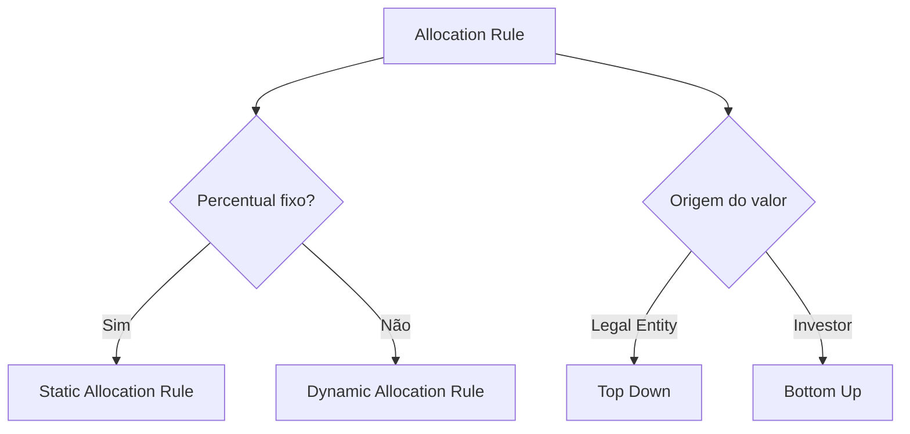
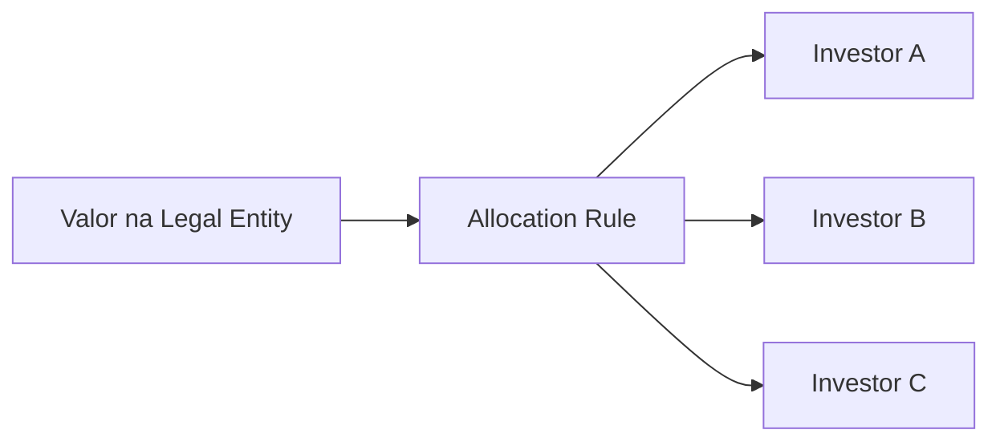
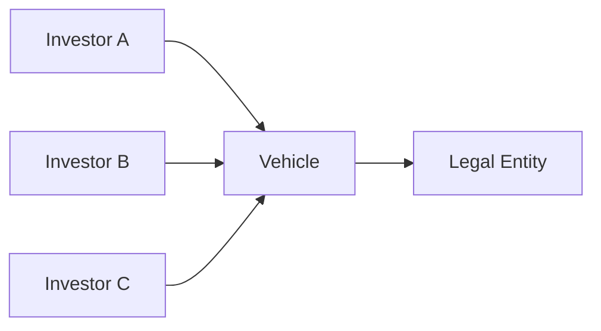

# Allocation Rules — Tipos e Métodos

> Baseado nos materiais enviados. Procedimentos e nomes específicos do ambiente devem ser confirmados no KT.

## 1. Classificação principal

As Allocation Rules documentadas podem ser analisadas por dois eixos independentes:

1. **Static vs. Dynamic** — define como os percentuais são obtidos.
2. **Simple vs. Complex** — define se uma Dynamic Rule usa somente um report ou também VBA.
3. **Top Down vs. Bottom Up** — define em qual nível o valor nasce e como ele é distribuído ou agregado.

## 2. Static Allocation Rules

Static Allocation Rules usam uma tabela de percentuais fixos por investidor.

### Características

- percentuais previamente definidos;
- manutenção pela ferramenta **Static Allocation Rules**;
- adequadas quando a divisão não deve variar conforme data, saldo ou compromisso;
- exigem validação de totalização e vigência antes do uso.

### Riscos de sustentação

- percentuais não totalizam 100%;
- investidor ausente da tabela;
- investidor incorreto ou inativo;
- regra aplicada à Legal Entity errada;
- manutenção realizada sem considerar vigência ou dependências.

## 3. Dynamic Allocation Rules

Dynamic Allocation Rules calculam os percentuais no momento da execução com base nos dados disponíveis.

### Regras padrão citadas no material

| Regra | Base conceitual documentada |
|---|---|
| By Average Cash Balance | saldo médio de caixa |
| By Commitment & Closing Date | compromisso e data de fechamento |
| By Commitment (No Date) | compromisso sem considerar data |
| By Specific Closing Date Commitment | compromisso associado a data específica de fechamento |
| By Unfunded Commitment | compromisso ainda não integralizado |
| Investment Cost (As of GL Date) | custo do investimento na GL Date |
| Management Fees — inside investment period | compromisso do investidor durante o período de investimento |
| Management Fees — outside investment period | capital investido, conforme definição do material |

### Pontos que alteram o resultado

- GL Date;
- Effective Date;
- Closing Date;
- compromisso do investidor;
- compromisso não integralizado;
- saldos e custos usados como base;
- overrides específicos de investidor;
- escopo da Legal Entity;
- investidores elegíveis na data de execução.

## 4. Simple e Complex Dynamic Allocation Rules

### Simple Dynamic Allocation Rule

Usa um único report RW e não utiliza VBA. O report deve ter quatro colunas visíveis, nesta ordem: Investor Account ID, base/valor para Amount, base/valor para LEAmount e base/valor para Quantity. Colunas adicionais usadas apenas para filtro devem ficar ocultas.

No Top Down, as três colunas numéricas funcionam como bases proporcionais. No Bottom Up, elas representam os valores efetivos por Investor.

### Complex Dynamic Allocation Rule

Combina um ou mais reports RW com código VBA. O módulo deve expor `Sub Main`, ler `AllocationRule.Properties` e `AllocationRule.Parameters`, executar reports por `AllocationRule.Reports`, calcular com objetos `InvestorSet` e copiar o resultado final para `AllocationRule.Results`.

Consulte [Object model e contratos técnicos](object-model.md) para os membros suportados e obsoletos.

## 5. Top Down Allocation

No modelo Top Down, o valor é informado no nível da **Legal Entity** e depois distribuído entre os investidores.

### Validações essenciais

- soma dos valores alocados igual ao valor de origem;
- soma dos percentuais igual a 100%, salvo comportamento explicitamente previsto;
- investidores corretos e elegíveis;
- arredondamento sem diferença material;
- regra correta para a data e contexto da transação.

## 6. Bottom Up Allocation

No modelo Bottom Up, valores ou percentuais são definidos ou calculados no nível do investidor e depois agregados para Vehicle e Legal Entity.

### Validações essenciais

- todos os investidores esperados estão presentes;
- valores individuais estão corretos;
- agregação por Vehicle está correta;
- total da Legal Entity fecha com a soma dos níveis inferiores;
- não existem duplicidades ou investidores fora do escopo.

## 7. Regras de sistema usadas por Active Templates

O guia de Active Template Manager apresenta os seguintes IDs de sistema:

| ID | Regra | Uso técnico |
|---:|---|---|
| 0 | Non-Dominant | transação de contrapartida ou balanceamento |
| 1 | No Allocation | transação sem alocação para investidores |
| 2 | User Provided | alocação preenchida pelo código ou processo consumidor |

### Atenção

Esses IDs aparecem como constantes no manual do ATM. Antes de utilizá-los diretamente:

1. confirme a versão do Investran;
2. confirme o ID no ambiente;
3. prefira lookup por metadata quando disponível;
4. evite espalhar números mágicos em código;
5. documente a dependência no Active Template.

## 8. Escolha do método para análise de incidente

| Sintoma | Método a investigar primeiro |
|---|---|
| Percentual sempre igual, mas incorreto | Static Allocation Rule |
| Resultado muda conforme data | Dynamic Allocation Rule e datas de referência |
| Total da Legal Entity correto, investidores errados | Top Down e elegibilidade dos investidores |
| Valores individuais corretos, total consolidado errado | Bottom Up e agregação |
| Transação não deveria ser alocada | No Allocation |
| Contrapartida não fecha | Non-Dominant e arredondamento |
| Active Template calcula investidores manualmente | User Provided e evento `AfterTransaction` |

## 9. Regras de segurança

- Não altere uma regra antes de identificar todos os consumidores.
- Não conclua que o defeito está na Allocation Rule sem validar os dados de entrada.
- Não reutilize uma regra por nome apenas; valide ID, tipo, vigência e comportamento.
- Não promova alterações sem evidência de teste com cenários positivos, negativos e de arredondamento.
- Quando o comportamento não estiver suportado pelos materiais, registre como **TODO (KT)** em vez de assumir.
