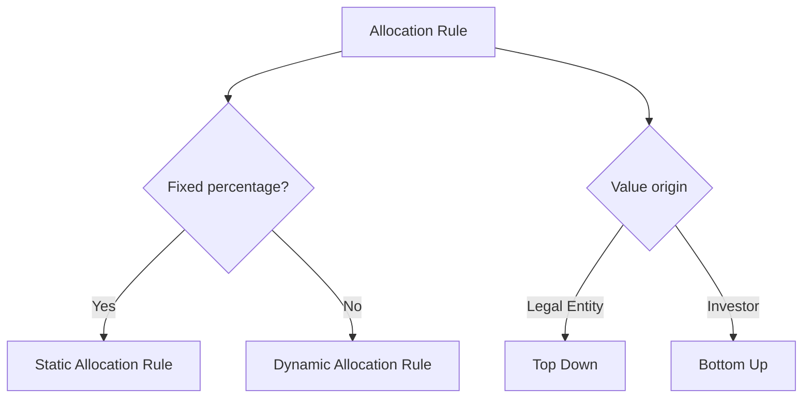
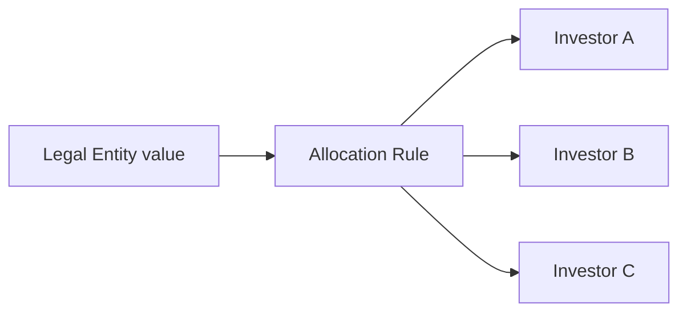
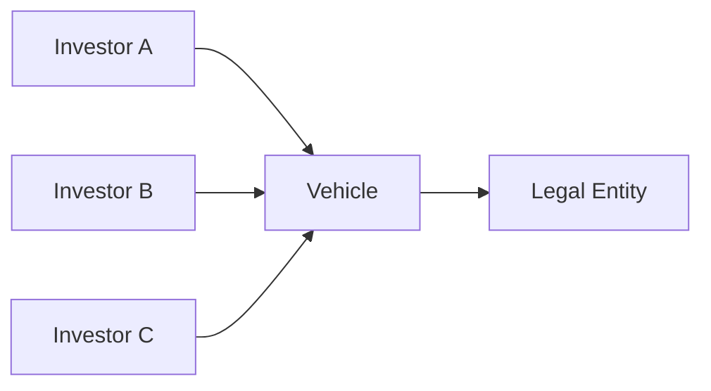

# Allocation Rules — Types and methods

> Based on the supplied materials. Confirm environment-specific procedures and names during KT.

## 1. Main classification

Documented Allocation Rules can be analyzed by three independent axes:

1. **Static vs. Dynamic** — defines how percentages are obtained.
2. **Simple vs. Complex** — defines whether a Dynamic Rule uses only a report or also VBA.
3. **Top Down vs. Bottom Up** — defines where a value starts and how it is distributed or aggregated.

## 2. Static Allocation Rules

Static Allocation Rules use a table of fixed percentages by investor.

### Characteristics

- Previously defined percentages.
- Maintained through **Static Allocation Rules**.
- Suitable when the split should not vary by date, balance, or commitment.
- Require total and effective-date validation before use.

### Support risks

- Percentages do not total 100%.
- Investor is missing from the table.
- Incorrect or inactive Investor.
- Rule applied to the wrong Legal Entity.
- Maintenance performed without considering effective dates or dependencies.

## 3. Dynamic Allocation Rules

Dynamic Allocation Rules calculate percentages at execution time from available data.

### Standard rules cited in the material

| Rule | Documented conceptual basis |
|---|---|
| By Average Cash Balance | Average cash balance |
| By Commitment & Closing Date | Commitment and closing date |
| By Commitment (No Date) | Commitment without considering date |
| By Specific Closing Date Commitment | Commitment associated with a specific closing date |
| By Unfunded Commitment | Commitment not yet funded |
| Investment Cost (As of GL Date) | Investment cost on GL Date |
| Management Fees — inside investment period | Investor commitment during investment period |
| Management Fees — outside investment period | Invested capital, as defined by the material |

### Inputs that change the result

- GL Date;
- Effective Date;
- Closing Date;
- Investor commitment.
- Unfunded commitment.
- Balances and costs used as bases.
- Investor-specific overrides.
- Legal Entity scope.
- Investors eligible on execution date.

## 4. Simple and Complex Dynamic Allocation Rules

### Simple Dynamic Allocation Rule

Uses one RW report and no VBA. The report must have four visible columns in this order: Investor Account ID, base/value for Amount, base/value for LEAmount, and base/value for Quantity. Additional columns used only for filtering must remain hidden.

*Example of a report used as the basis for a Book Value Top Down rule. The four visible columns form the contract consumed by ARM. Source: ARM guide, p. 13.*

In Top Down rules, the three numeric columns work as proportional bases. In Bottom Up rules, they represent the actual values for each Investor.

### Complex Dynamic Allocation Rule

Combines one or more RW reports with VBA code. The module must expose `Sub Main`, read `AllocationRule.Properties` and `AllocationRule.Parameters`, run reports through `AllocationRule.Reports`, calculate with `InvestorSet` objects, and copy the final result to `AllocationRule.Results`.

*Complex dynamic rule with Use VBA enabled. Source: ARM guide, p. 25.*

See [Object model and technical contracts](object-model.md) for supported and obsolete members.

## 5. Top Down Allocation

In the Top Down model, the value is entered at the **Legal Entity** level and then distributed among investors.

### Essential validations

- allocated values add up to the source value;
- percentages add up to 100%, unless a different behavior is explicitly expected;
- investors are correct and eligible;
- rounding has no material difference;
- the rule is correct for the transaction date and context.

## 6. Bottom Up Allocation

In the Bottom Up model, values or percentages are defined or calculated at the investor level and then aggregated to the Vehicle and Legal Entity.

### Essential validations

- all expected investors are present;
- individual values are correct;
- aggregation by Vehicle is correct;
- the Legal Entity total equals the sum of lower levels;
- there are no duplicates or out-of-scope investors.

## 7. System rules used by Active Templates

The Active Template Manager guide lists the following system IDs:

| ID | Rule | Technical use |
|---:|---|---|
| 0 | Non-Dominant | offsetting or balancing transaction |
| 1 | No Allocation | transaction without investor allocation |
| 2 | User Provided | allocation populated by the consuming code or process |

### Important

These IDs appear as constants in the ATM manual. Before using them directly:

1. confirm the Investran version;
2. confirm the ID in the environment;
3. prefer a metadata lookup when available;
4. avoid spreading magic numbers through code;
5. document the dependency in the Active Template.

## 8. Choosing a method for incident analysis

| Symptom | Method to investigate first |
|---|---|
| Percentual sempre igual, mas incorreto | Static Allocation Rule |
| Result changes by date | Dynamic Allocation Rule and reference dates |
| Legal Entity total is correct, investors are wrong | Top Down and investor eligibility |
| Individual values are correct, consolidated total is wrong | Bottom Up and aggregation |
| Transaction should not be allocated | No Allocation |
| Offset does not balance | Non-Dominant and rounding |
| Active Template calculates investors manually | User Provided and the `AfterTransaction` event |

## 9. Safety rules

- Do not change a rule before identifying every consumer.
- Do not conclude that the defect is in the Allocation Rule before validating input data.
- Do not reuse a rule by name alone; validate its ID, type, effective period, and behavior.
- Do not promote changes without test evidence for positive, negative, and rounding scenarios.
- When the behavior is not supported by the available materials, record it as **TODO (KT)** instead of making assumptions.
