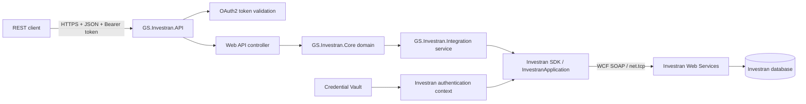
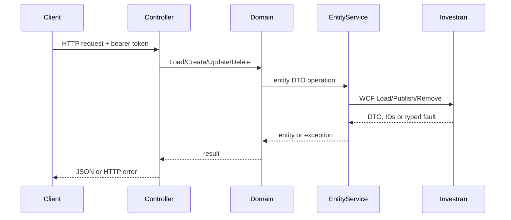

# Architecture and request flow

## Purpose

The native Investran interface is based on SDK assemblies and WCF service contracts. This API adds a simpler REST/JSON boundary so consumers do not need to reference the proprietary SDK, configure WCF bindings or manipulate Investran DTOs directly for every use case.

## Two authentication boundaries

The service has two separate identities:

1. **REST client identity:** OAuth2 bearer token with scope `investran-api`.
2. **Investran service identity:** credentials loaded from vault (or development bypass configuration), validated by `ApplicationScope.ValidateUser` and assigned to `Thread.CurrentPrincipal`.

The bearer token protects the REST facade. The internal Investran principal determines what the downstream SDK/Web Services call can access.

## Layer responsibilities

### API layer

Controllers define routes, authorize callers, map request models to SDK DTOs and return JSON. A global exception filter logs unexpected exceptions and responds with HTTP 500.

### Core layer

Domain classes provide operations such as `Load`, `Find`, `Create`, `Update` and `Delete`. Specialized domains handle batches, transactions, UDFs, security and contextual entities.

### Integration layer

Service implementations resolve the native contracts from `InvestranApplication.Current`, including:

- `IEntityWebService` for portfolio entities;
- `IGeneralLedgerWebService` for batches;
- lookup, UDF, security and allocation services.

They translate `FaultException<ResultFaultDto>` into .NET exceptions and wrap writes in a `TransactionScope` with a 60-second timeout.

### Extensions layer

Allocation extensions decide whether a batch requires allocation processing and apply system/custom allocation behavior before publishing the batch.

## Entity request flow

## Batch request flow

For `POST /api/batch`, the API:

1. loads the Legal Entity;
2. builds a held `BatchDto`;
3. creates sequential Journal Entry and Transaction indexes;
4. resolves batch, journal-entry and transaction types;
5. resolves accounts, deals, positions, currencies and allocation rules;
6. maps UDFs and optional explicit investor allocations;
7. applies the allocation extension;
8. publishes the batch through `IGeneralLedgerWebService`;
9. returns the created DTO including its assigned ID.

## Data contracts

Request bodies use API-owned models such as `LegalEntityModel`, `InvestorModel`, `DealModel`, `PositionModel` and `BatchModel`. Several responses are native Investran DTOs. Consumers should therefore treat response schemas as coupled to the installed SDK version unless the API introduces dedicated response contracts.
