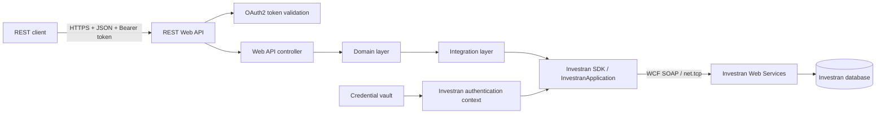
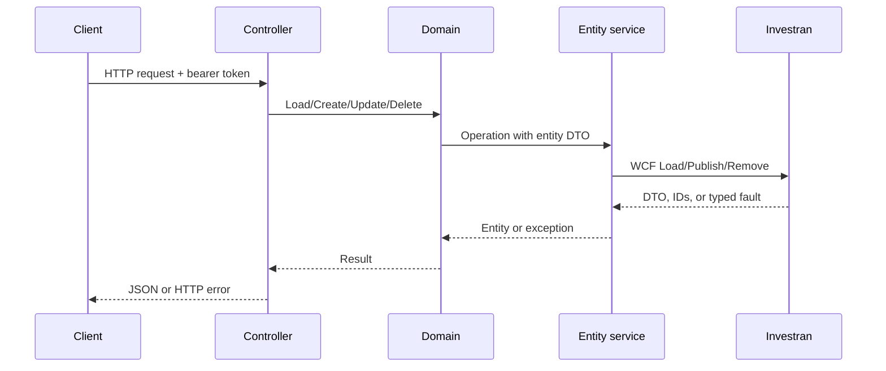

# Architecture and request flow

## Purpose

Investran's native interface is based on SDK assemblies and WCF service contracts. This API adds a simpler REST/JSON layer, so consumers do not need to reference the proprietary SDK, configure WCF bindings, or handle Investran DTOs directly for every use case.

## Two authentication boundaries

The service uses two separate identities:

1. **REST client identity:** OAuth2 bearer token with the `investran-api` scope.
2. **Investran service identity:** credentials loaded from the vault — or from bypass configuration in development — validated by `ApplicationScope.ValidateUser` and assigned to `Thread.CurrentPrincipal`.

The bearer token protects the REST facade. The internal Investran principal determines what the downstream SDK/Web Services call can access.

## Layer responsibilities

### API layer

Controllers define routes, authorize consumers, convert request models into SDK DTOs, and return JSON. A global exception filter logs unexpected failures and returns HTTP 500.

### Core layer

Domain classes provide operations such as `Load`, `Find`, `Create`, `Update`, and `Delete`. Specialized domains handle batches, transactions, UDFs, security, and contextual entities.

### Integration layer

Service implementations resolve native contracts through `InvestranApplication.Current`, including:

- `IEntityWebService` for portfolio entities;
- `IGeneralLedgerWebService` for batches;
- lookup, UDF, security, and allocation services.

They convert `FaultException<ResultFaultDto>` into .NET exceptions and wrap writes in a `TransactionScope` with a 60-second timeout.

### Extension layer

Allocation extensions determine whether a batch requires allocation processing and apply system or custom allocation behavior before publishing.

## Entity request flow

## Batch request flow

For `POST /api/batch`, the API:

1. loads the Legal Entity;
2. builds a `BatchDto` with Held status;
3. creates sequential indexes for Journal Entries and Transactions;
4. resolves batch, journal entry, and transaction types;
5. resolves accounts, deals, positions, currencies, and allocation rules;
6. maps UDFs and optional explicit investor allocations;
7. applies the allocation extension;
8. publishes the batch through `IGeneralLedgerWebService`;
9. returns the created DTO, including its assigned ID.

## Data contracts

Request bodies use API-owned models such as `LegalEntityModel`, `InvestorModel`, `DealModel`, `PositionModel`, and `BatchModel`. Several responses use native Investran DTOs. Consumers should therefore treat those response schemas as coupled to the installed SDK version unless the API introduces its own response contracts.
