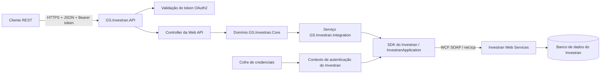
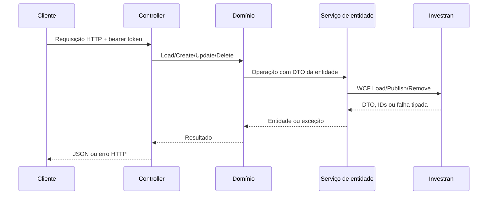

# Arquitetura e fluxo das requisições

## Objetivo

A interface nativa do Investran é baseada nos assemblies do SDK e em contratos de serviço WCF. Esta API adiciona uma camada REST/JSON mais simples, evitando que os consumidores precisem referenciar o SDK proprietário, configurar bindings WCF ou manipular diretamente os DTOs do Investran em cada caso de uso.

## Duas fronteiras de autenticação

O serviço utiliza duas identidades distintas:

1. **Identidade do cliente REST:** token bearer OAuth2 com o escopo `investran-api`.
2. **Identidade de serviço do Investran:** credenciais carregadas do cofre — ou da configuração de bypass em desenvolvimento —, validadas por `ApplicationScope.ValidateUser` e atribuídas a `Thread.CurrentPrincipal`.

O token bearer protege a fachada REST. O principal interno do Investran determina o que a chamada subsequente ao SDK/Web Services pode acessar.

## Responsabilidades das camadas

### Camada de API

Os controllers definem as rotas, autorizam os consumidores, convertem os modelos de requisição em DTOs do SDK e devolvem JSON. Um filtro global de exceções registra falhas inesperadas e responde com HTTP 500.

### Camada Core

As classes de domínio oferecem operações como `Load`, `Find`, `Create`, `Update` e `Delete`. Domínios especializados tratam batches, transações, UDFs, segurança e entidades contextuais.

### Camada de integração

As implementações dos serviços resolvem os contratos nativos por meio de `InvestranApplication.Current`, incluindo:

- `IEntityWebService`, para entidades de portfólio;
- `IGeneralLedgerWebService`, para batches;
- serviços de lookup, UDF, segurança e alocação.

Elas convertem `FaultException<ResultFaultDto>` em exceções .NET e envolvem as gravações em um `TransactionScope` com timeout de 60 segundos.

### Camada de extensões

As extensões de alocação determinam se um batch exige processamento de alocação e aplicam o comportamento de alocação de sistema ou customizado antes da publicação.

## Fluxo de requisição de entidade

## Fluxo de requisição de batch

Para `POST /api/batch`, a API:

1. carrega a Legal Entity;
2. monta um `BatchDto` com status Held;
3. cria índices sequenciais para Journal Entries e Transactions;
4. resolve os tipos de batch, journal entry e transaction;
5. resolve contas, deals, positions, moedas e regras de alocação;
6. mapeia UDFs e alocações explícitas opcionais por investidor;
7. aplica a extensão de alocação;
8. publica o batch por meio de `IGeneralLedgerWebService`;
9. devolve o DTO criado, incluindo o ID atribuído.

## Contratos de dados

Os corpos das requisições usam modelos pertencentes à API, como `LegalEntityModel`, `InvestorModel`, `DealModel`, `PositionModel` e `BatchModel`. Diversas respostas utilizam DTOs nativos do Investran. Portanto, os consumidores devem considerar que o schema dessas respostas está acoplado à versão instalada do SDK, a menos que a API introduza contratos de resposta próprios.
