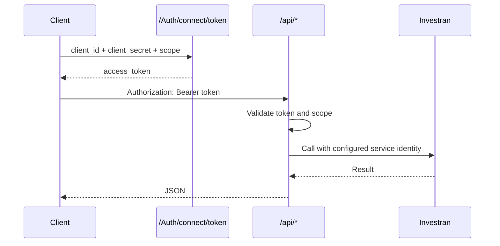

# Authentication

## OAuth2 with Client Credentials

The source code configures a machine-to-machine client using the Client Credentials flow and the `investran-api` API scope.



## Requesting a token

```http
POST /Auth/connect/token HTTP/1.1
Host: api.example.internal
Content-Type: application/x-www-form-urlencoded

grant_type=client_credentials&client_id=<client-id>&client_secret=<client-secret>&scope=investran-api
```

Example response:

```json
{
  "access_token": "<redacted>",
  "expires_in": 3600,
  "token_type": "Bearer"
}
```

Use the token as follows:

```http
Authorization: Bearer <access-token>
```

## Authorization behavior

In general, controllers use the `[Authorize]` attribute, and Web API configuration also adds a global authorization filter. The code explicitly marks `GET /api/investor/search/{vehicleId}` with `[AllowAnonymous]`.

Important notes:

- Swagger globally marks operations as requiring OAuth2, including those that may allow anonymous access;
- `GET /api/lookups/reviewstatus` has no `[Authorize]` on the method, but should still be protected by the global filter;
- validate both cases in the deployed environment, because OWIN/Web API registration order can change the effective behavior.

## Internal Investran identity

After REST authentication, the API retrieves two configurable identities:

- the standard Investran service account;
- an impersonation identity used in specific batch status transitions.

The `Authentication` class creates an Investran application scope using `WebServicesUri`, `EndPointIdentity`, `ServicePrincipalName`, `Server`, and `Database`. It validates the service account and assigns the resulting `InvestranSuitePrincipal` to the current thread.

## Security requirements

- Deploy behind HTTPS, even if current IdentityServer options do not require SSL.
- Store client secrets, certificates, and downstream service credentials in an approved vault.
- Never use the bypass user and password outside an isolated development environment.
- Rotate any secret that has already been versioned in Git.
- Restrict CORS to approved origins.
- Use separate service identities and least-privilege Team Security permissions.
- Monitor token failures separately from Investran authentication failures.

## Common authentication failures

| Symptom | Likely boundary | What to check |
|---|---|---|
| token endpoint rejects the client | OAuth client | client ID, secret/certificate, grant, and scope |
| API returns 401 | Bearer-token validation | issuer/authority, token expiry, and scope |
| API returns 500 with validation error | Investran identity | vault lookup, account status, and Investran permissions |
| only some entities fail | Team Security | domain/entity permissions of the service identity |
| identity error at the WCF endpoint | transport identity | SPN, endpoint DNS identity, and service URI |
