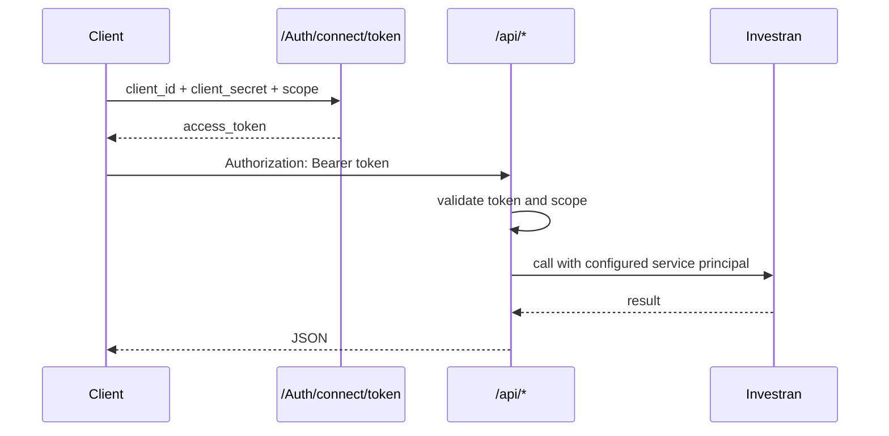

# Authentication

## OAuth2 client credentials

The source configures a machine-to-machine client using the client-credentials grant and the API scope `investran-api`.



## Token request

```http
POST /Auth/connect/token HTTP/1.1
Host: api.example.internal
Content-Type: application/x-www-form-urlencoded

grant_type=client_credentials&client_id=<client-id>&client_secret=<client-secret>&scope=investran-api
```

Example response:

```json
{
  "access_token": "<redacted>",
  "expires_in": 3600,
  "token_type": "Bearer"
}
```

Use the token as follows:

```http
Authorization: Bearer <access-token>
```

## Authorization behavior

Controllers are generally decorated with `[Authorize]`, and the Web API configuration also adds a global authorization filter. The code explicitly marks `GET /api/investor/search/{vehicleId}` with `[AllowAnonymous]`.

Important observations:

- Swagger marks operations with the OAuth2 requirement globally, including operations that may allow anonymous access.
- `GET /api/lookups/reviewstatus` has no method-level `[Authorize]`, but should still be covered by the global filter.
- Verify both cases in the deployed runtime because OWIN/Web API registration order can affect the effective behavior.

## Internal Investran identity

After REST authentication, the API retrieves two configurable identities:

- the normal Investran service account;
- an impersonation identity used by selected batch status transitions.

`Authentication` creates an Investran application scope using `WebServicesUri`, `EndPointIdentity`, `ServicePrincipalName`, `Server` and `Database`. It validates the service account and sets the resulting `InvestranSuitePrincipal` on the current thread.

## Security requirements

- deploy behind HTTPS even though the current IdentityServer options do not require SSL;
- store client secrets, certificates and downstream credentials in an approved vault;
- never use the bypass username/password settings outside isolated development;
- rotate any secret that has ever been committed to Git;
- restrict CORS to approved origins;
- use distinct service identities and least-privilege Team Security entitlements;
- monitor token failures and downstream authentication failures separately.

## Common authentication failures

| Symptom | Likely boundary | Check |
|---|---|---|
| token endpoint rejects client | OAuth client | client ID, secret/certificate, grant and scope |
| API returns 401 | bearer validation | issuer/authority, token expiry and scope |
| API returns 500 with validation error | Investran identity | vault lookup, account status and Investran permissions |
| only some entities fail | Team Security | domain/entity entitlements of service identity |
| WCF endpoint identity error | transport identity | SPN, endpoint DNS identity and service URI |
