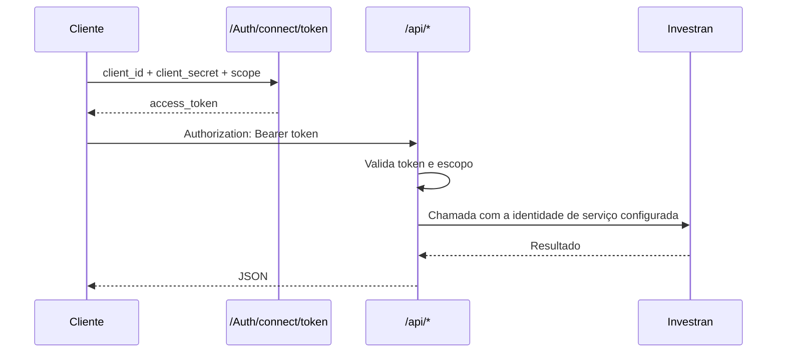

# Autenticação

## OAuth2 com Client Credentials

O código-fonte configura um cliente máquina a máquina usando o fluxo Client Credentials e o escopo da API `investran-api`.



## Solicitação do token

```http
POST /Auth/connect/token HTTP/1.1
Host: api.example.internal
Content-Type: application/x-www-form-urlencoded

grant_type=client_credentials&client_id=<client-id>&client_secret=<client-secret>&scope=investran-api
```

Exemplo de resposta:

```json
{
  "access_token": "<redacted>",
  "expires_in": 3600,
  "token_type": "Bearer"
}
```

Use o token da seguinte forma:

```http
Authorization: Bearer <access-token>
```

## Comportamento da autorização

Em geral, os controllers possuem o atributo `[Authorize]`, e a configuração da Web API também adiciona um filtro global de autorização. O código marca explicitamente `GET /api/investor/search/{vehicleId}` com `[AllowAnonymous]`.

Observações importantes:

- o Swagger marca globalmente as operações com a exigência de OAuth2, inclusive as que podem aceitar acesso anônimo;
- `GET /api/lookups/reviewstatus` não possui `[Authorize]` no método, mas ainda deve ser protegido pelo filtro global;
- valide os dois casos no ambiente implantado, pois a ordem de registro do OWIN/Web API pode alterar o comportamento efetivo.

## Identidade interna do Investran

Depois da autenticação REST, a API recupera duas identidades configuráveis:

- a conta normal de serviço do Investran;
- uma identidade de impersonation usada em determinadas transições de status de batch.

A classe `Authentication` cria um escopo de aplicação do Investran usando `WebServicesUri`, `EndPointIdentity`, `ServicePrincipalName`, `Server` e `Database`. Ela valida a conta de serviço e atribui o `InvestranSuitePrincipal` resultante à thread atual.

## Requisitos de segurança

- implantar atrás de HTTPS, mesmo que as opções atuais do IdentityServer não exijam SSL;
- armazenar client secrets, certificados e credenciais do serviço subsequente em um cofre aprovado;
- nunca usar usuário e senha de bypass fora de um ambiente isolado de desenvolvimento;
- rotacionar qualquer segredo que já tenha sido versionado no Git;
- restringir o CORS às origens aprovadas;
- usar identidades de serviço distintas e permissões mínimas no Team Security;
- monitorar separadamente falhas de token e falhas de autenticação no Investran.

## Falhas comuns de autenticação

| Sintoma | Fronteira provável | O que verificar |
|---|---|---|
| endpoint de token rejeita o cliente | cliente OAuth | client ID, secret/certificado, grant e escopo |
| API retorna 401 | validação do bearer token | issuer/authority, expiração do token e escopo |
| API retorna 500 com erro de validação | identidade do Investran | consulta ao cofre, estado da conta e permissões no Investran |
| apenas algumas entidades falham | Team Security | permissões de domínio/entidade da identidade de serviço |
| erro de identidade no endpoint WCF | identidade de transporte | SPN, identidade DNS do endpoint e URI do serviço |
