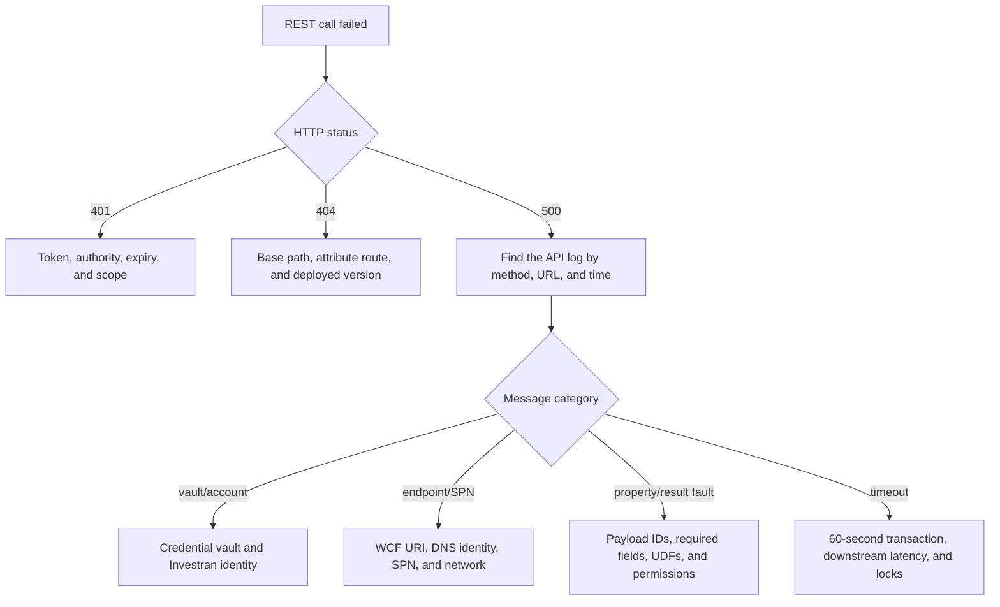

# Errors and troubleshooting

## HTTP behavior

Successful controller operations normally return `200 OK`, including creates and status changes. The API does not consistently use `201 Created`, `204 No Content`, `404 Not Found`, or a shared validation-error contract.

Unexpected exceptions are handled by `ExceptionHandlerFilterAttribute`:

- the method, absolute URL, and exception message are logged;
- the client receives HTTP 500;
- the response body contains the exception message;
- the reason phrase instructs the consumer to contact an administrator.

Integration services combine native `ResultFaultDto` messages into one comma-separated exception message.

## Diagnostic flow

## Information to collect

- environment and base URL;
- date and time in UTC;
- method and route;
- response status and body, with sensitive data removed;
- caller/client ID, never a client secret or token;
- entity, batch, or queue-request ID;
- sanitized payload schema and reference IDs;
- matching API log;
- downstream Investran/WCF failure and service availability.

## Common failures

### 401 Unauthorized

- Token expired or issued by another authority.
- Missing `investran-api` scope.
- Incorrect `BaseUrl`/Authority behind a proxy.
- Malformed Bearer header.

### Missing WebConfig Parameters

One or more required Investran connection settings were not supplied to the `Authentication` class.

### Vault credential failure

The configured reference cannot be resolved, or the process identity cannot access the vault.

### User validation or permission failure

The service account is invalid, locked, or expired, or it lacks Team Security access to the requested domain/entity.

### Endpoint identity or SPN failure

The WCF endpoint, DNS identity, SPN, or authentication method does not match the deployed Investran Web Services endpoint.

### Investran property failure

Check required fields, lookup IDs, entity version, UDF IDs/types, and relationships. The API currently forwards consolidated native messages as HTTP 500.

### Batch failed or appears incomplete

Do not retry immediately. Search by the returned ID/reference and reconcile journal entries, transactions, and allocations. A client timeout does not prove that `Publish` failed.

### Queue request accepted but no batch appears

The queue endpoint returns only a request ID, and this repository has no status-query endpoint. Using the correlation ID, check RabbitMQ producer/consumer logs, dead-letter queue handling, and subsequent batch creation.

## Logging limitations

Current logging records exception messages but does not establish a consistent correlation ID across REST, queue, WCF, and Investran. Do not log bearer tokens, credentials, or complete sensitive payloads. A future improvement should add structured fields for request ID, entity type/ID, batch reference, and downstream operation.
