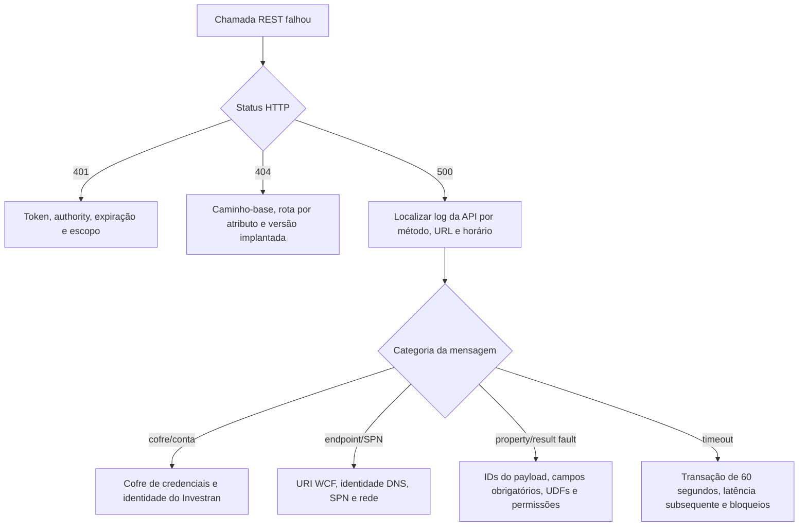

# Erros e troubleshooting

## Comportamento HTTP

As operações bem-sucedidas dos controllers normalmente retornam `200 OK`, inclusive criações e alterações de status. A API não usa de forma consistente `201 Created`, `204 No Content`, `404 Not Found` nem um contrato compartilhado para erros de validação.

Exceções inesperadas são tratadas por `ExceptionHandlerFilterAttribute`:

- o método, a URL absoluta e a mensagem da exceção são registrados no log;
- o cliente recebe HTTP 500;
- o corpo da resposta contém a mensagem da exceção;
- a reason phrase orienta o consumidor a procurar um administrador.

Os serviços de integração consolidam as mensagens nativas de `ResultFaultDto` em uma única mensagem de exceção separada por vírgulas.

## Fluxo de diagnóstico

## Informações que devem ser coletadas

- ambiente e URL-base;
- data e hora em UTC;
- método e rota;
- status e corpo da resposta, removendo dados sensíveis;
- caller/client ID, nunca client secret ou token;
- ID da entidade, do batch ou da solicitação na fila;
- schema do payload e IDs de referência, sanitizados;
- log correspondente da API;
- falha subsequente do Investran/WCF e disponibilidade do serviço.

## Falhas comuns

### 401 Unauthorized

- token expirado ou emitido por outra authority;
- ausência do escopo `investran-api`;
- `BaseUrl`/Authority incorreta atrás de proxy;
- cabeçalho Bearer malformado.

### Missing WebConfig Parameters

Uma ou mais configurações obrigatórias de conexão com o Investran não foram fornecidas à classe `Authentication`.

### Falha nas credenciais do cofre

A referência configurada não pode ser resolvida ou a identidade do processo não tem acesso ao cofre.

### Falha de validação do usuário ou de permissão

A conta de serviço é inválida, está bloqueada ou expirada, ou não possui acesso no Team Security ao domínio/entidade solicitado.

### Falha de identidade do endpoint ou SPN

O endpoint WCF, a identidade DNS, o SPN ou o método de autenticação não corresponde ao endpoint implantado do Investran Web Services.

### Falha de propriedade do Investran

Verifique campos obrigatórios, IDs de lookup, versão da entidade, IDs/tipos de UDF e relacionamentos. Atualmente, a API encaminha as mensagens nativas consolidadas como HTTP 500.

### Batch falhou ou parece incompleto

Não repita a operação imediatamente. Pesquise pelo ID/referência retornado e reconcilie journal entries, transactions e alocações. Um timeout no cliente não comprova que o `Publish` falhou.

### Solicitação aceita na fila, mas nenhum batch aparece

O endpoint da fila retorna somente um ID de solicitação, e este repositório não expõe endpoint de consulta de status. Usando o correlation ID, verifique logs do produtor/consumidor RabbitMQ, tratamento da dead-letter queue e criação subsequente do batch.

## Limitações de logging

O logging atual registra mensagens de exceção, mas não estabelece um correlation ID consistente entre REST, fila, WCF e Investran. Evite registrar bearer tokens, credenciais ou payloads sensíveis completos. Uma melhoria futura deve adicionar campos estruturados para request ID, tipo/ID da entidade, referência do batch e operação subsequente.
