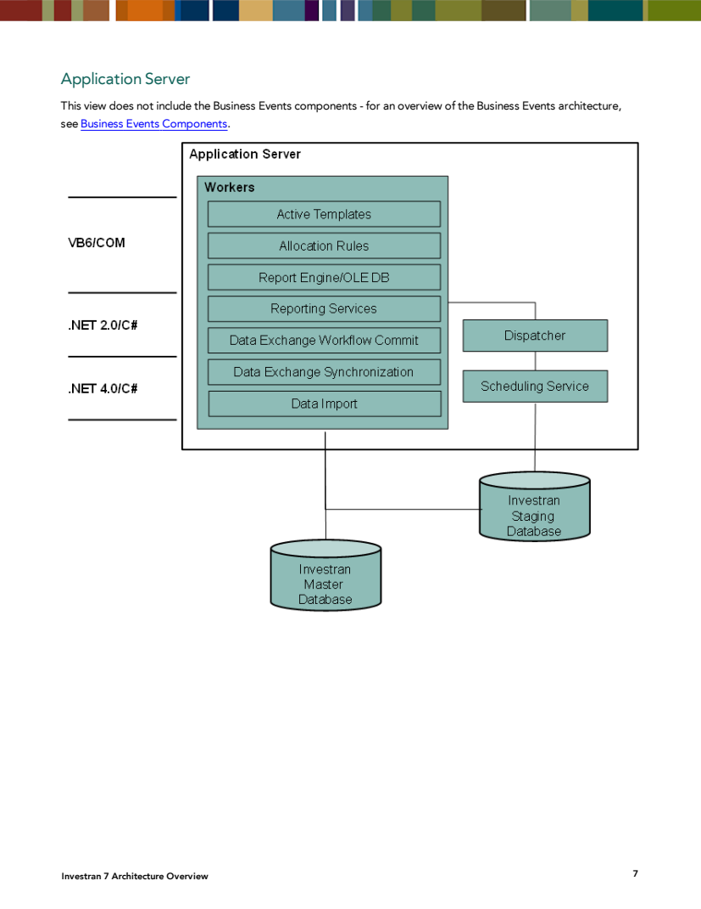
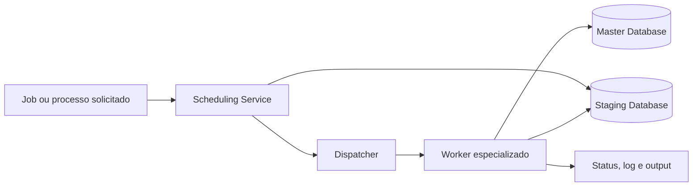
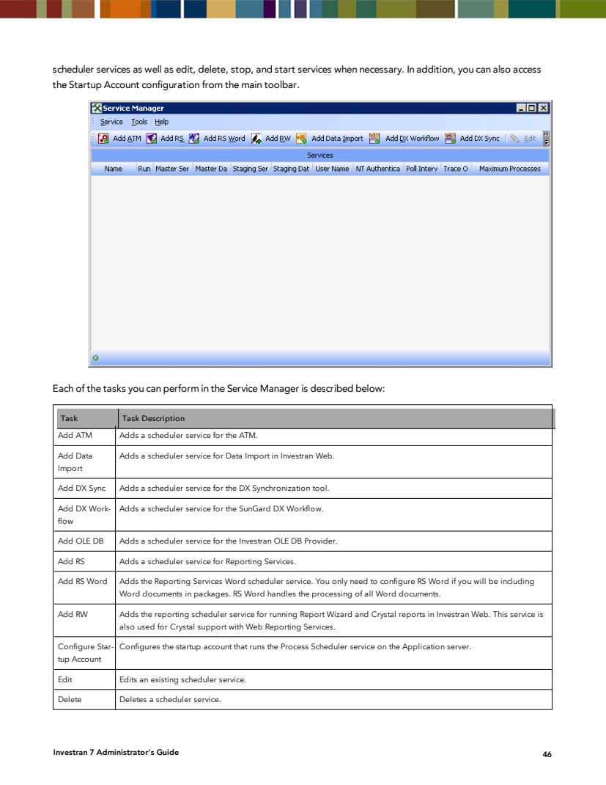
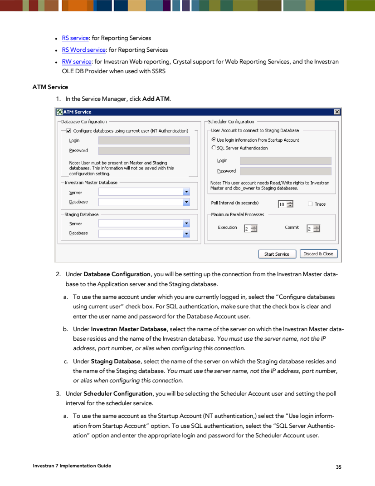
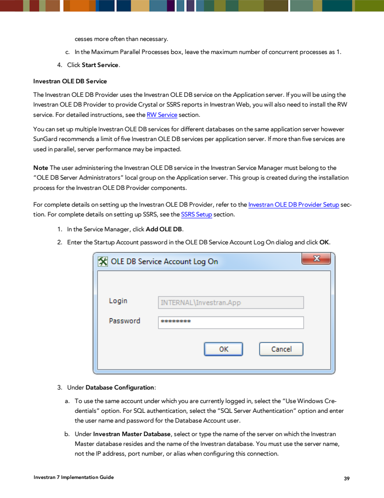
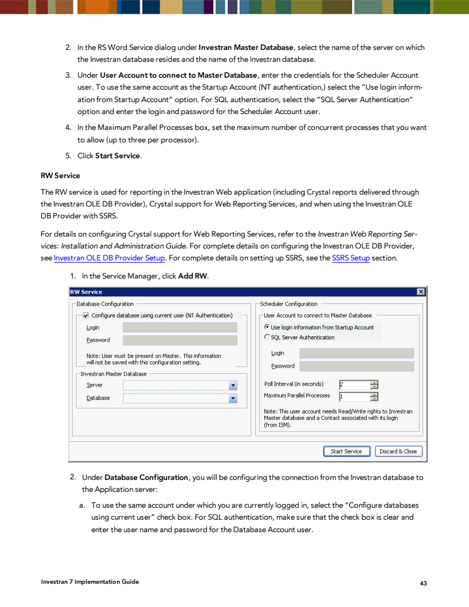

# Application Server - arquitetura e catálogo de services

## 1. Papel do Application Server

O Application Server centraliza scheduling e execução de processos para vários módulos. O manual informa que podem existir múltiplos Application Servers apontando para o mesmo banco, permitindo arquitetura distribuída.



*Fonte: Internal_Inv7_INV_Architecture_7.pdf, Application Server, página impressa 7.*

O desenho apresenta:

- `Scheduling Service`, ligado ao Staging;
- `Dispatcher`, que recebe o trabalho agendado;
- workers de Active Templates, Allocation Rules, Report Engine/OLE DB, Reporting Services, DX Workflow Commit, DX Synchronization e Data Import;
- acesso ao Investran Master Database e, para os fluxos aplicáveis, ao Staging Database;
- tecnologias diferentes por geração do componente, como VB6/COM e .NET.

Business Events usa arquitetura complementar e não está incluído nesse diagrama.



## 2. Service Manager

O caminho documentado é **Windows Programs > Investran > Servers > Service Manager**, no servidor onde o Application Server foi instalado.



*Fonte: Internal_Inv7_INV_Administrators_7.pdf, Service Manager, página impressa 46.*

Ele permite:

- configurar a Startup Account;
- adicionar instâncias por módulo;
- editar configuração;
- iniciar e parar;
- excluir a definição de um scheduler service.

Excluir no Service Manager é uma alteração destrutiva de configuração e não deve ser confundido com parar temporariamente o Windows service.

## 3. Componentes compartilhados

### Process Scheduler / Scheduling Service

Consulta periodicamente trabalhos pendentes e inicia o fluxo de processamento. O manual cita o Windows service `SunGard Investran Scheduling Service` e, em diagnóstico, `FTI Process Scheduler`.

Funções e parâmetros comuns:

- Startup/Scheduler Account;
- conexão com Master e, quando aplicável, Staging;
- polling interval;
- máximo de processos paralelos;
- trace de performance;
- mapeamento da instância para ambiente/database.

### FTI Process Dispatcher

Recebe a solicitação do scheduler e inicia/coordena executors e workers. Problema no dispatcher pode deixar jobs em estado pendente mesmo quando a instância de scheduler aparenta estar iniciada.

### Executor e Worker

Os guias citam processos como `FTI.SchedulingFramework.Executor.exe` e `FTI.SchedulingFramework.Worker.exe`. Eles são processos filhos usados na execução, não necessariamente services independentes para administrar manualmente em `services.msc`.

Não finalize executors/workers pelo Task Manager sem procedimento específico: eles também podem atender ATM, DX Workflow e Reporting Services, e pode existir saída parcial.

## 4. Catálogo dos services de módulo

### ATM Service

Finalidade: executar Active Templates fora da simulação local, incluindo geração e commit conforme a configuração.



*Fonte: Internal_Inv7_INV_Implementation.pdf, ATM Service, página impressa 35.*

Dependências principais:

- Master Database;
- Staging Database;
- Scheduler Account;
- polling interval;
- limites separados para Execution e Commit;
- sincronização de horário entre servidores.

Sintomas associados: AT permanece agendado, geração não começa, Preview não aparece, commit não ocorre ou job fica preso.

### Data Import Service

Finalidade: validar e carregar Import Jobs criados no Investran Web.


*Fonte: Internal_Inv7_INV_Implementation.pdf, Data Import Service, página impressa 36.*

Dependências principais:

- Master e Staging;
- conta do scheduler;
- polling interval;
- paralelismo de Validation e Commit;
- licença e entitlements do usuário solicitante.

Sintomas associados: jobs ficam Scheduled/Validating/Loading, validações não são consumidas ou loads não começam.

### DX Synchronization Service

Finalidade: executar processos de sincronização do Data Exchange com o Investran Web.

O Service Manager usa `Add DX Sync`. A configuração documentada inclui Master Database, conta, polling interval e concorrência. Confirme origem, destino e comportamento da sincronização usada no ambiente.

### DX Workflow Service

Finalidade: processar commits do Data Exchange Workflow.

O manual orienta `Add DX Workflow`, autenticação Windows na versão descrita e máximo de processos paralelos igual a 1. Esse limite evita concorrência indevida no workflow, mas deve ser confirmado na release atual.

### Investran OLE DB Service

Finalidade: atender o Investran OLE DB Provider, usado por consumidores como Excel, Crystal Reports e SSRS conforme a arquitetura.



*Fonte: Internal_Inv7_INV_Implementation.pdf, Investran OLE DB Service, página impressa 39.*

Características documentadas:

- ação `Add OLE DB`;
- conta administradora pertencente ao grupo local `OLEDBServerAdministrators`;
- uma instância por datasource/database;
- porta inicial padrão 19996 e portas seguintes para novas instâncias;
- liberação inbound no firewall;
- autenticação Windows ou Kerberos;
- SPN para Kerberos;
- shared folder em caminho UNC;
- recomendação antiga de até cinco OLE DB services por Application Server.

O manual alerta que o modelo de autenticação pode afetar os data entitlements do usuário. Esse ponto é crítico em revisão de segurança.

### RS Service

Finalidade: geração e delivery de pacotes do Investran Reporting Services.

Configuração documentada:

- ação `Add RS`;
- Master Database;
- Scheduler Account;
- polling interval;
- máximo de generation/delivery processes;
- Processing Location e destinos configurados pelo módulo.

Não confundir este RS com o Windows service do Microsoft SQL Server Reporting Services. Neste contexto, `RS Service` é o scheduler do Reporting Services do Investran.

### RS Word Service

Finalidade: processar documentos Microsoft Word incluídos nos pacotes do Investran Reporting Services. Só é necessário quando esses pacotes contêm documentos Word.

O manual também cita o display name `Investran RS Word Processing Service`.

Dependências: Master Database, conta de serviço, Microsoft Word/Office instalado quando exigido pela versão, perfil inicializado e limite de processos paralelos.

### RW Service

Finalidade:

- reporting no Investran Web;
- execução de Report Wizard e Crystal Reports no web;
- Crystal support para Web Reporting Services;
- uso do Investran OLE DB Provider com SSRS.



*Fonte: Internal_Inv7_INV_Implementation.pdf, RS Word Service e RW Service, páginas impressas 42-43.*

Dependências: Master Database, Scheduler Account, polling interval, concorrência, Report Wizard Engine, Crystal/OLE DB conforme o tipo de relatório.

### Business Events Services

Business Events utiliza extensões web, BE API, serviços no servidor, Domain Object Model, Enterprise Service Bus e engines de Investran/AR/RW. A documentação requer uma Business Event service account, que pode coincidir com a Scheduler Account.

Como BE não aparece entre as ações `Add` do Service Manager documentado, inventarie seus Windows services, application pools e componentes separadamente. Consulte a seção [Business Events](../business-events/README.md).

## 5. Dependências de plataforma

Estes services não são necessariamente “services do Investran”, mas podem ser necessários para os fluxos:

| Dependência | Papel |
|---|---|
| SQL Server | Master, Staging, jobs e persistência |
| IIS / WAS | Investran Web e aplicações web |
| MSMQ / service bus | mensageria de fluxos distribuídos, especialmente BE |
| MSDTC | transações distribuídas quando usadas pela topologia |
| Windows Event Log | Application/System events de scheduler e dispatcher |
| Microsoft Office/Word | composição Word em Reporting Services legado |
| Print Spooler | impressão de pacotes, quando configurada |
| File server/UNC | processing locations, datasource e outputs |

## 6. Nomes no Windows

Para cada instância, capture ambos:

```powershell
Get-CimInstance Win32_Service |
  Where-Object { $_.DisplayName -match 'Investran|FTI|SunGard' } |
  Select-Object Name, DisplayName, State, StartMode, StartName, PathName
```

Esse comando é somente leitura. Não publique `PathName` ou parâmetros se contiverem credenciais ou informação sensível.

## 7. Matriz mínima de inventário

| Campo | Exemplo de conteúdo esperado |
|---|---|
| Ambiente/servidor | PROD / APP01 |
| Módulo | ATM, RW, RS, Data Import etc. |
| Service Name | nome interno do Windows |
| Display Name | nome exibido no services.msc |
| Executável | caminho e versão, sem segredos |
| Log On As | conta técnica |
| Startup Type | Automatic/Manual/Disabled |
| Estado esperado | Running/Stopped conforme uso |
| Master/Staging | databases do ambiente |
| Polling/concorrência | valores aprovados |
| Porta/UNC | quando aplicável |
| Logs | caminhos e retenção |
| Dependências | SQL, fila, filesystem, Office etc. |
| Owner e criticidade | responsável, SLA e janela |
