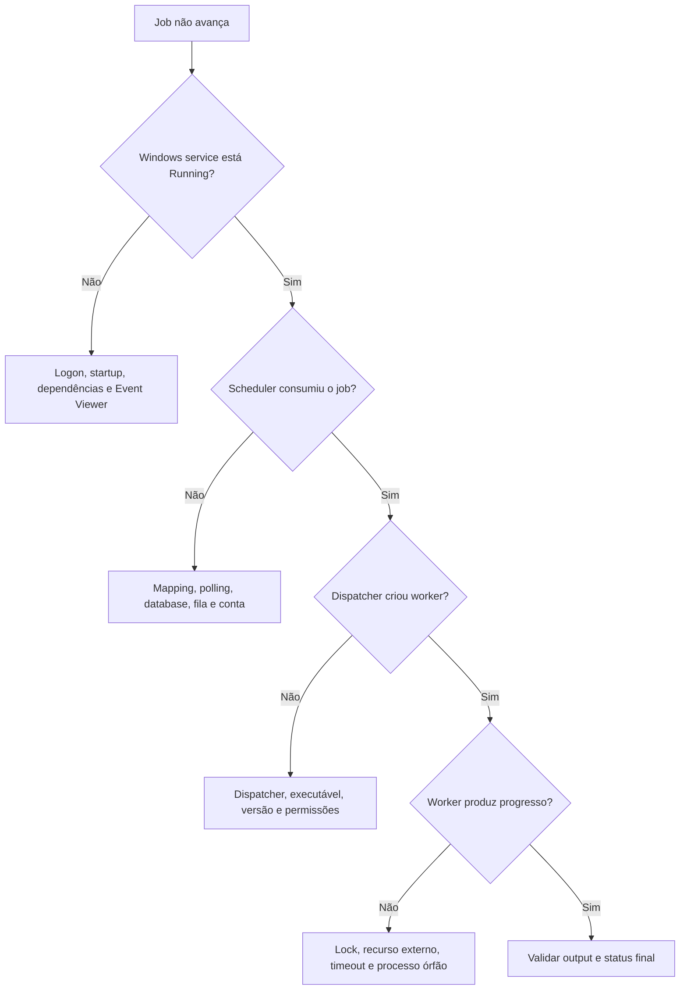

# Application Services - troubleshooting e restart seguro

## Não comece pelo restart

Restart pode apagar evidências, interromper jobs e criar duplicidade se o solicitante repetir a operação. Primeiro determine se o problema está no scheduler, dispatcher, worker, banco, fila ou recurso externo.

## Coleta inicial

- ambiente e Application Server;
- Service Name e Display Name;
- módulo e database configurada;
- state, start mode e conta de logon;
- Job/Process/Execution ID;
- status e horário da última transição;
- processos Worker/Executor ativos;
- jobs concorrentes;
- Event Viewer Application/System;
- logs do módulo;
- Master/Staging, fila, porta e share envolvidos;
- mudança recente de senha, certificado, DNS, firewall, banco ou deploy.

## Árvore de diagnóstico



## Sintomas comuns

| Sintoma | Hipóteses iniciais |
|---|---|
| Service não inicia | senha, Log on as a service, dependência, porta, config ou binário |
| Inicia e para | exceção na inicialização, database/share inacessível ou config inválida |
| Running sem consumir | Master/Staging incorreto, polling, mapping, fila, conta ou dispatcher |
| Jobs presos em todos os módulos | componente compartilhado, SQL, fila ou Startup Account |
| Só um módulo falha | configuração/worker/dependência específica do service |
| Só commit falha | Staging/Master, permissão, lock ou business validation |
| OLE DB não inicia | porta ocupada, grupo local, conta, SPN ou share |
| RS Word trava | perfil da conta, Word/Office, popup, arquivo, printer ou worker órfão |
| RW/Crystal falha | RW Service, OLE DB, Crystal runtime, report ou datasource |
| Depois de restore aponta errado | Service Manager/Config.xml ainda mapeado para ambiente anterior |

## Conta e senha

Quando houver `logon failure`:

1. identifique todas as instâncias que usam a conta;
2. verifique bloqueio/expiração sem testar senha repetidamente;
3. atualize a credencial pelo processo aprovado;
4. confirme `Log on as a service` e permissões de banco/share;
5. reinicie em ordem controlada;
6. execute smoke tests em todos os módulos que compartilham a conta.

Uma mesma Startup/Scheduler Account pode afetar vários services simultaneamente.

## Restart seguro

### Pré-check

- [ ] Incidente e hipótese registrados.
- [ ] Service e servidor exatos confirmados.
- [ ] Jobs ativos, scheduled e loading/commit identificados.
- [ ] Output parcial pesquisado.
- [ ] Dependências e impacto avaliados.
- [ ] Aprovação/janela obtida quando necessária.
- [ ] Logs e Event Viewer preservados.
- [ ] Critério de sucesso e rollback definidos.

### Sequência genérica

1. bloqueie novas submissões apenas se o procedimento permitir;
2. aguarde jobs seguros terminarem ou documente a decisão de interromper;
3. pare a instância específica pelo Service Manager;
4. confirme no Windows que o processo realmente encerrou;
5. não finalize Worker/Executor residual sem identificar o Job ID;
6. corrija a causa ou configuração;
7. inicie dependências antes do scheduler consumidor;
8. inicie a instância;
9. confirme Event Viewer e logs sem erro;
10. observe backlog sendo consumido;
11. execute smoke test funcional;
12. reconcilie jobs interrompidos.

### Pós-check

- [ ] Service permanece Running.
- [ ] Scheduler volta a consumir.
- [ ] Dispatcher/worker são criados normalmente.
- [ ] Backlog reduz sem duplicidade.
- [ ] Output funcional validado.
- [ ] Jobs interrompidos reconciliados.
- [ ] Causa e prevenção documentadas.

## Processo órfão ou stalled

O Administrator's Guide possui procedimento específico para Reporting Services stalled e cita executors/workers compartilhados. Não generalize esse procedimento para ATM, DX ou outros módulos.

Antes de encerrar processo:

- relacione PID a Job/Process ID;
- confirme owner e módulo;
- verifique gravação parcial;
- preserve dump/log se aplicável;
- confirme que não atende outro job;
- use o runbook oficial da versão;
- reconcilie após a recuperação.

## Start/stop por linha de comando

Os exemplos documentados são:

```powershell
net start "Scheduler Service Name"
net stop "Scheduler Service Name"
```

Prefira comandos que consultem o alvo antes de mudar estado. Nunca use filtro amplo para parar todos os services Investran de uma vez.

Exemplo read-only:

```powershell
Get-Service -Name "NOME_EXATO" | Select-Object Name, DisplayName, Status, StartType
```

## Quando escalar

- jobs financeiros com output parcial;
- worker órfão sem correlação confiável;
- backlog crescente após restart;
- service inicia e para repetidamente;
- necessidade de editar database/configuração interna;
- suspeita de incompatibilidade de binários;
- OLE DB/Kerberos/SPN com risco de exposição indevida;
- falha após restore/upgrade;
- múltiplos Application Servers disputando ou não consumindo os mesmos jobs.

## Evidências para escalonamento

- inventário da instância;
- timeline e IDs;
- Event Viewer exportado;
- logs do módulo;
- configuração sanitizada;
- estado de processos/filas;
- Master/Staging e versão/MR;
- mudança recente;
- smoke test executado;
- outputs encontrados e reconciliação.

## Fontes

- *Internal_Inv7_INV_Architecture_7.pdf*, Application Server.
- *Internal_Inv7_INV_Implementation.pdf*, Application Server Setup e configuração dos scheduler services.
- *Internal_Inv7_INV_Administrators_7.pdf*, Application Server Management, Service Manager e troubleshooting.
