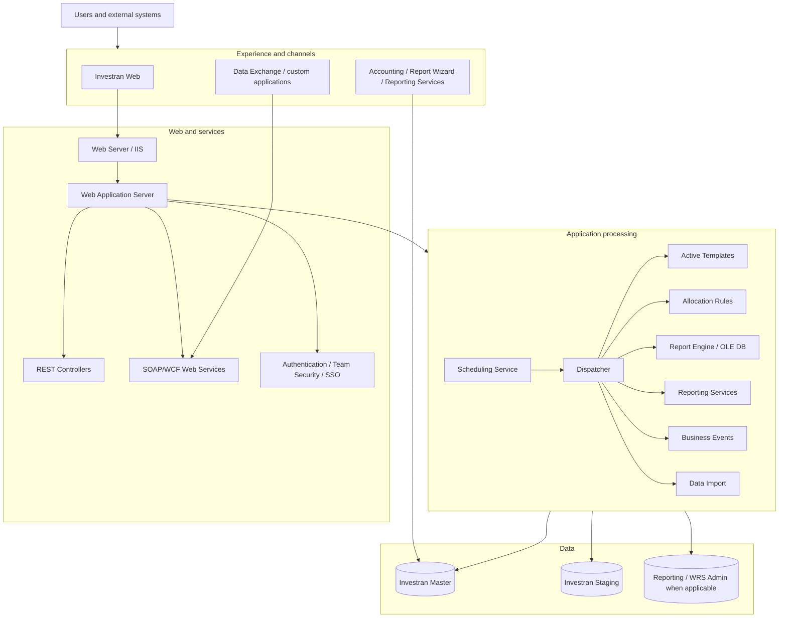
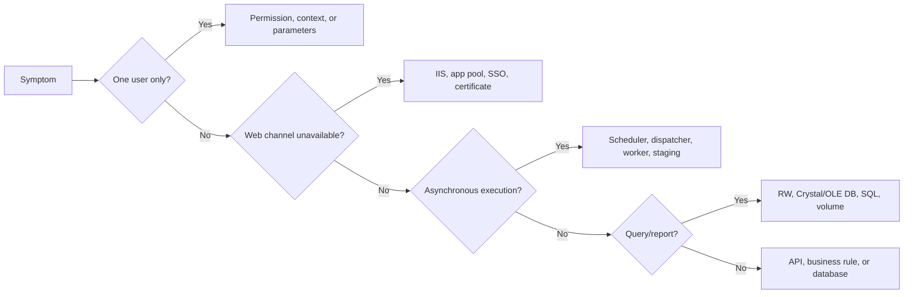

# Logical architecture and components

## Layered view

## Responsibility by layer

| Layer | Responsibility | Support evidence |
|---|---|---|
| Channels | Interaction and execution | User, URL, parameters, screenshot |
| Web/IIS | Hosting, authentication, and APIs | IIS/app pool, HTTP, certificate, web logs |
| Web Application | Rules and service contracts | Application logs, fault, correlation |
| Application Server | Heavy/asynchronous processing | Scheduler, dispatcher, worker, execution ID |
| Reporting | Queries and outputs | Report, parameters, engine/provider, duration |
| Data | Persistence and staging | IDs, status, blocking, jobs, integrity |

## How to locate a failure

## Limitation

The diagram combines FIS-documented components. Physical topology may combine the Web Server and Web Application Server or distribute components across several instances. The environment inventory must map each block to its real hostname, service, URL, account, and monitoring.

## Sources

- *Internal_Inv7_INV_Architecture_7.pdf*, Deployment, Web Components, Application Server, and Reporting.
- *Internal_Inv7_INV_Implementation.pdf*, server setup and scheduler services.
