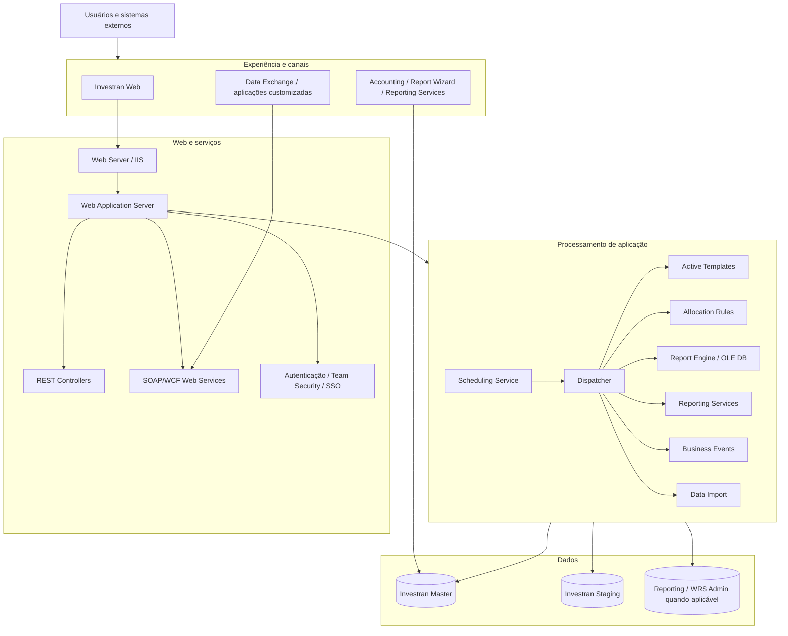
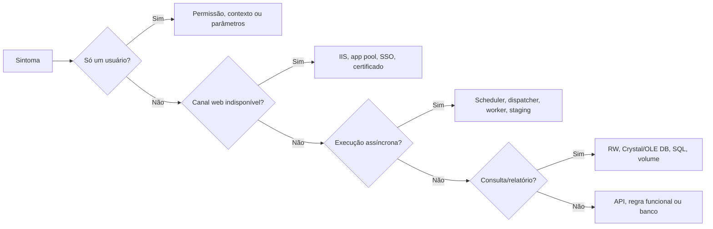

# Arquitetura lógica e componentes

## Visão em camadas

## Responsabilidade por camada

| Camada | Responsabilidade | Evidência de suporte |
|---|---|---|
| Canais | interação e execução | usuário, URL, parâmetros, screenshot |
| Web/IIS | hosting, autenticação e APIs | IIS/app pool, HTTP, certificado, web logs |
| Web Application | regras e service contracts | application logs, fault, correlation |
| Application Server | processamento assíncrono/pesado | scheduler, dispatcher, worker e execution ID |
| Reporting | consultas e saídas | report, parâmetros, engine/provider e duração |
| Dados | persistência e staging | IDs, status, blocking, jobs e integridade |

## Como localizar uma falha

## Limitação

O desenho combina os componentes documentados pela FIS. A topologia física pode consolidar Web Server e Web Application Server ou distribuir componentes em várias instâncias. O inventário do ambiente deve mapear cada bloco para hostname, serviço, URL, conta e monitoramento reais.

## Fontes

- *Internal_Inv7_INV_Architecture_7.pdf*, Deployment, Web Components, Application Server e Reporting.
- *Internal_Inv7_INV_Implementation.pdf*, server setup e scheduler services.
