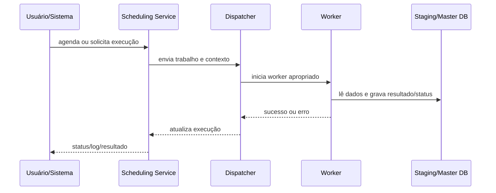

# Application Server, workers e scheduler

## Papel do Application Server

O Application Server concentra processamentos que não devem depender da sessão interativa do usuário. O diagrama FIS mostra Scheduling Service e Dispatcher acionando workers para Active Templates, Allocation Rules, Report Engine/OLE DB, Reporting Services, Data Exchange e Data Import. Business Events também dependem de componentes de aplicação, embora tenham arquitetura própria.

## Serviços documentados

- ATM;
- Data Import;
- DX Synchronization;
- DX Workflow;
- Investran OLE DB;
- Reporting Services;
- RS Word;
- Report Wizard.

O ambiente pode usar apenas um subconjunto ou serviços com nomes diferentes.

## Correlação mínima

Para rastrear uma execução, registre:

- processo/template/report;
- Process ID, execution ID, GUID ou job ID;
- usuário/conta de serviço;
- horário e timezone;
- worker/service;
- Master/Staging database;
- arquivo de log;
- output criado, como batch/report/import result.

## Falhas típicas

- serviço parado ou conta/senha inválida;
- mapping de scheduler incorreto;
- worker incompatível com a versão do artefato;
- fila/dispatcher sem consumir trabalho;
- conectividade/permissão com Master ou Staging;
- execução concluída tecnicamente, mas output não commitado;
- restart durante trabalho ativo.

## KT pendente

- instâncias e nomes de serviço do ambiente;
- mapeamento do `Config.xml` ou equivalente atual;
- concorrência, timeout e capacidade por worker;
- sequência segura de restart;
- dashboards e alertas;
- procedimentos de recuperação de fila/trabalho órfão.
