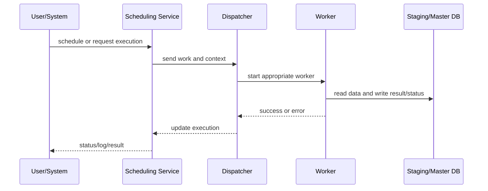

# Application Server, workers, and scheduler

> For the full Windows-service catalog, purpose, configuration, accounts, monitoring, and safe restart, see [Application Server and Services](../application-services/README.md), the [service catalog](../application-services/catalogo-services.md), [operations and monitoring](../application-services/operacao-monitoramento.md), and [troubleshooting and restart](../application-services/troubleshooting-restart.md).

## Application Server role

The Application Server handles processing that should not depend on an interactive user session. The FIS diagram shows Scheduling Service and Dispatcher starting workers for Active Templates, Allocation Rules, Report Engine/OLE DB, Reporting Services, Data Exchange, and Data Import. Business Events also depend on application components, although they have their own architecture.

## Documented services

- Active Template
- Allocation Rule
- Data Import
- DX Synchronization
- DX Workflow
- Investran OLE DB
- Reporting Services
- RS Word
- Report Wizard

The environment may use only a subset of these services, distributed across several servers. Other Windows services can support specific Investran flows.

## Minimum correlation data

Record the process/template/report, Process ID, execution ID, GUID or job ID, user/service account, time and timezone, worker/service, Master/Staging database, log file, and created output such as a batch, report, or import result.

## Typical failures

- Stopped service or invalid account/password.
- Incorrect scheduler mapping.
- Worker incompatible with the artifact version.
- Queue/dispatcher not consuming work.
- Master or Staging connectivity/permission problem.
- Technically complete execution with uncommitted output.
- Restart while work is active.
- Invalid/expired certificates.
- Database outage.
- Service-account password change.
- Server restart with services not set to start automatically.

## KT pending

- Environment instances and service names.
- Current mapping for `Web.config`, `Config.xml`, `app.config`, `app-nlog.config`, or equivalent.
- Worker concurrency, timeout, and capacity.
- Safe restart sequence.
- Dashboards and alerts.
- Queue/orphan-work recovery procedures.
- Certificate installation procedures.
- Service-account password-change procedures.
