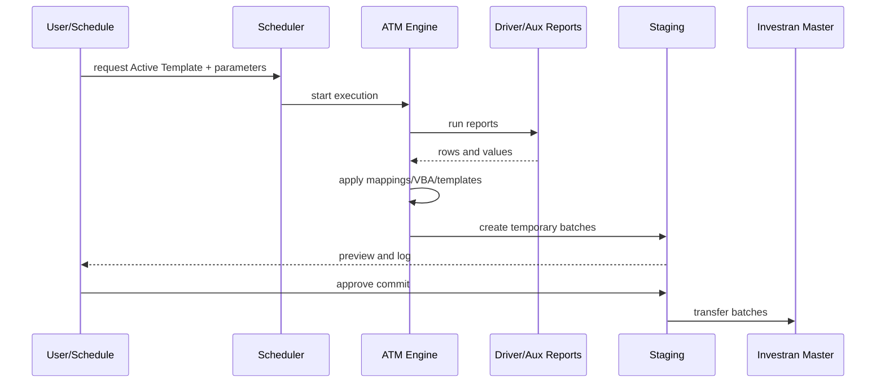
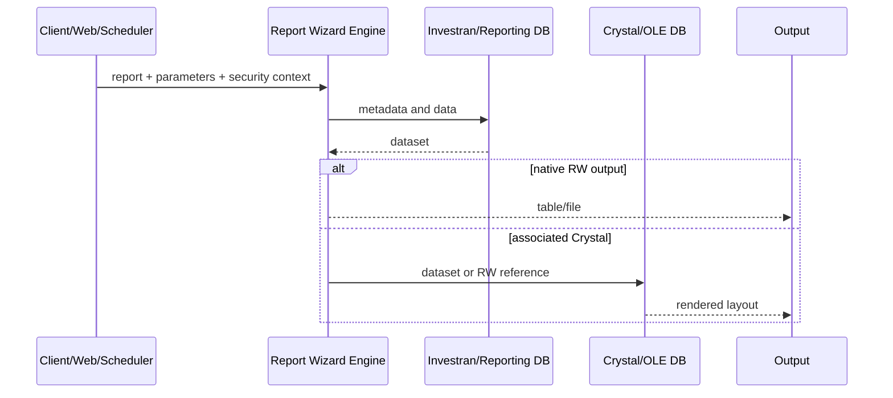
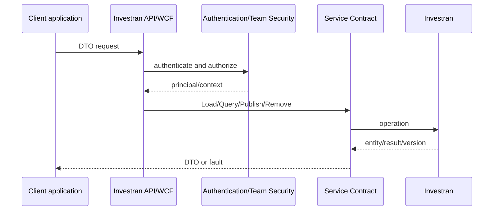

# End-to-end flows

## Active Template to batch

## Interactive or scheduled report

## Read/write API

## Support use

For every organizational process, copy the closest flow and add real names, IDs, validations, logs, and owners. The goal is to identify the exact arrow where execution stopped or produced incorrect data.
