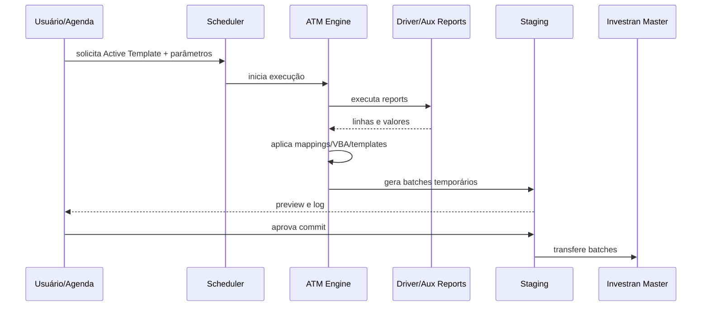
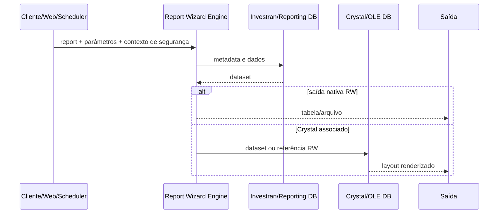
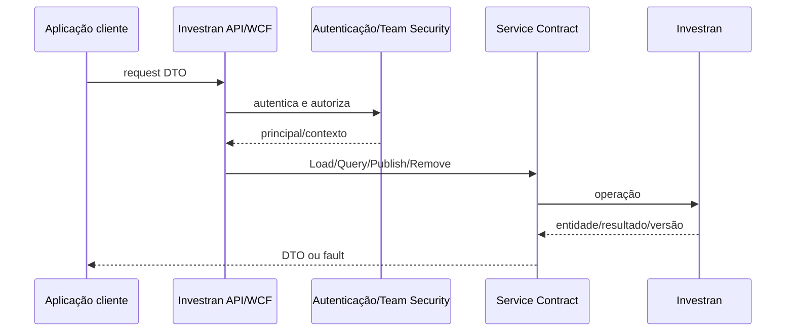

# Fluxos ponta a ponta

## Active Template até o batch

## Report interativo ou agendado

## API de leitura/escrita

## Uso no suporte

Para cada processo Goldman, copie o fluxo mais próximo e acrescente nomes reais, IDs, validações, logs e owners. O objetivo é conseguir apontar exatamente em qual seta a execução parou ou produziu dado incorreto.
