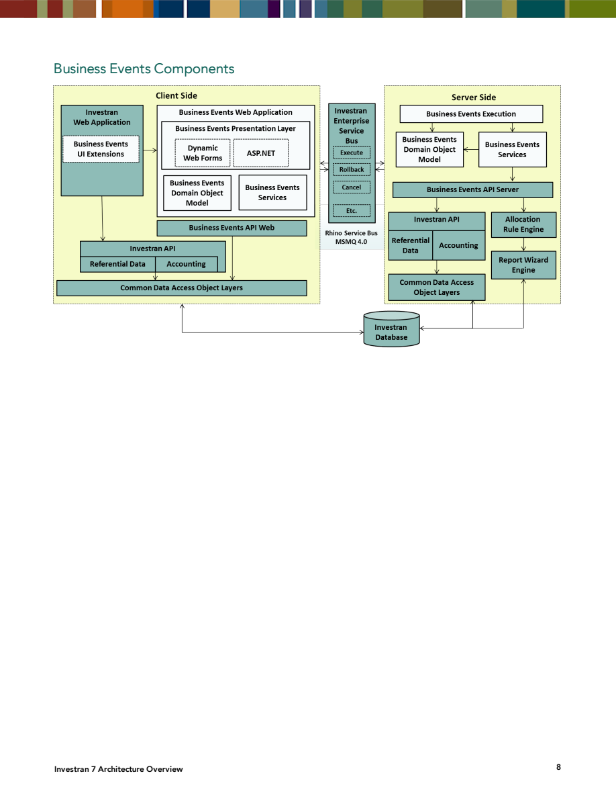
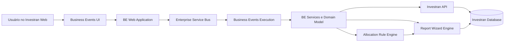
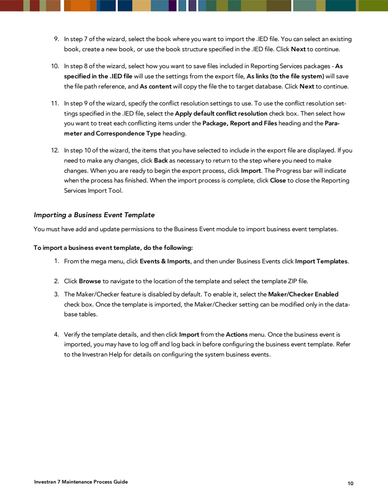
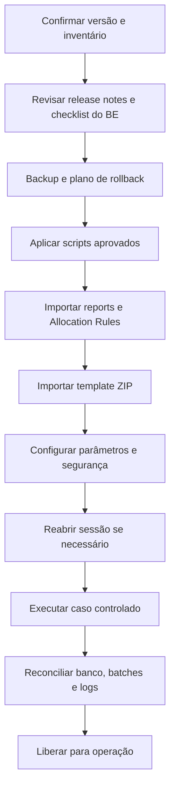

# Guia prático de Business Events

## 1. O que é um Business Event

Um Business Event (BE) encapsula um processo funcional que pode consultar dados, aplicar regras e produzir alterações no Investran. A interface fica no Investran Web, enquanto a execução pode atravessar componentes web, serviços de aplicação e motores especializados.

Exemplos documentados para a versão consultada:

| Business Event | Finalidade indicada pelo nome e pelo pacote | Dependências documentadas para deploy |
|---|---|---|
| Equity Pickup | processamento de equity pickup | script de Transaction UDF, report `.IED` e template `.ZIP` |
| Fund Valuation | processamento de valuation de fundo | template `.ZIP` |
| LP Capital Event | processamento de evento de capital de LP | script de Bank Account UDF e template `.ZIP` |
| Partner Transfer | transferência de participação entre investidores | reports `.CAB` e template `.ZIP` |

> A tabela reproduz o checklist de deployment do manual de manutenção. A lógica funcional, os parâmetros e a disponibilidade de cada evento precisam ser confirmados na versão instalada.

## 2. Arquitetura

*Fonte: Internal_Inv7_INV_Architecture_7.pdf, Business Events Components, página impressa 8.*

O diagrama separa os componentes em dois lados:

### Cliente e Web

- **Investran Web Application:** hospeda extensões de interface dos BEs;
- **Business Events Web Application:** contém presentation layer, WebForms/ASP.NET, domain object model e serviços;
- **Business Events API Web:** fornece a camada de acesso usada pelo componente web;
- **Investran API:** entrega dados referenciais e contábeis;
- **Common Data Access Object Layers:** concentra o acesso ao banco.

### Servidor

- **Business Events Execution:** coordena a execução;
- **Business Events Services:** aplica a lógica do serviço;
- **Business Events Domain Object Model:** representa objetos e regras do domínio;
- **Business Events API Server:** integra a execução aos demais componentes;
- **Investran API:** acessa dados referenciais e contábeis;
- **Allocation Rule Engine:** executa regras de alocação quando o BE depende delas;
- **Report Wizard Engine:** fornece dados de reports usados pelo processo;
- **Common Data Access Object Layers:** persiste e consulta dados no Investran Database.

Os lados se comunicam pelo **Investran Enterprise Service Bus**, representado no manual com operações como `Execute`, `Rollback` e `Cancel`, sobre Rhino Service Bus/MSMQ 4.0. A tecnologia exata deve ser validada no ambiente atual, pois o material é antigo.

## 3. Onde encontrar

O caminho documentado para importação é:

1. acessar o Investran Web;
2. abrir o mega menu;
3. selecionar **Events & Imports**;
4. em **Business Events**, escolher **Import Templates**.

Depois de importado, o evento deve aparecer na área de Business Events para configuração e execução, conforme permissões e versão. Os nomes exatos de telas e ações podem variar.

## 4. Como um BE é entregue

O pacote de release contém uma pasta `SystemPackages`. O manual indica que `SystemPackages\BusinessEvents` contém o conjunto de BEs daquela versão, distribuído em `.ZIP`.

O `.ZIP` não deve ser tratado isoladamente. Monte uma matriz por evento:

| Dependência | Pergunta de controle |
|---|---|
| Template `.ZIP` | corresponde à versão/MR do ambiente? |
| Script SQL | foi revisado, aprovado, aplicado e registrado? |
| Report `.CAB` | foi importado pela ARM & ATM Export Import Console? |
| Report `.IED` | foi importado pela Reporting Services Import Tool? |
| Allocation Rule | existe, está na versão correta e retorna o resultado esperado? |
| Configuração | parâmetros, hierarquias, UDFs e tipos transacionais existem? |
| Segurança | usuário e conta de serviço possuem somente as permissões necessárias? |

## 5. Importação do template

*Fonte: Internal_Inv7_INV_Maint_Process.pdf, Importing a Business Event Template, página impressa 10.*

Procedimento consolidado:

1. confirme a compatibilidade do pacote com a versão e maintenance release;
2. valide backup, janela e plano de retorno;
3. importe primeiro scripts, reports e regras exigidos pelo checklist do evento;
4. acesse **Events & Imports > Business Events > Import Templates**;
5. clique em **Browse** e selecione o `.ZIP`;
6. decida se o evento usará **Maker/Checker**;
7. revise os detalhes apresentados;
8. no menu **Actions**, execute **Import**;
9. encerre e abra novamente a sessão se o evento não aparecer para configuração;
10. configure e valide o BE com um caso controlado.

### Atenção ao Maker/Checker

O manual afirma que o Maker/Checker vem desabilitado por padrão e pode ser habilitado durante a importação. Depois disso, a configuração só poderia ser alterada diretamente em tabelas de banco na versão documentada.

Isso torna a escolha uma decisão de deploy. Não altere tabelas diretamente com base apenas no manual antigo. Se houver necessidade de mudança, use procedimento oficial da versão, aprovação e suporte FIS/DBA.

## 6. Ordem recomendada de deployment

Se uma dependência falhar, pare antes de importar ou ativar as etapas seguintes. Registrar a ordem real é essencial para reproduzir o deploy e fazer rollback.

## 7. Como configurar e usar

Os campos variam por tipo de BE. Para cada evento, documente:

- nome técnico e nome exibido;
- versão do template e MR compatível;
- entidade, fund family, vehicle ou investor em escopo;
- data contábil, effective date e período processado;
- reports e parâmetros usados como entrada;
- Allocation Rules e hierarquias consultadas;
- tipos de batch, journal entry, account e transaction type usados;
- opções que alteram a abrangência do processamento;
- usuário executor e conta de serviço;
- saída esperada e método de reconciliação.

### Antes de executar

- confirme que o template está ativo e corretamente configurado;
- confirme que reports e regras retornam dados coerentes;
- verifique se não existe execução concorrente para o mesmo escopo;
- registre os parâmetros e a data/hora;
- gere evidência dos saldos ou objetos antes da execução;
- identifique se a ação cria batches, altera dados ou apenas calcula resultados.

### Durante a execução

- acompanhe o status no Investran Web;
- correlacione horário, usuário, nome do BE e identificador/GUID;
- monitore os serviços e filas utilizados pelo ambiente;
- não inicie uma segunda execução apenas porque a primeira parece demorada.

### Depois da execução

- confira status funcional, não apenas a mensagem de sucesso;
- identifique todos os batches, lançamentos e arquivos criados;
- reconcilie totais, entidades, datas, moedas e quantidades;
- valide o efeito nos reports dependentes;
- preserve logs e evidências da execução;
- obtenha aprovação funcional quando houver impacto contábil.

## 8. Alteração e versionamento

Os manuais fornecidos ensinam importação e deployment, mas não descrevem um editor genérico para modificar a lógica interna de todos os BEs. Portanto:

- trate o `.ZIP` como artefato versionado e imutável;
- não edite o conteúdo diretamente sem ferramenta, fonte e processo oficialmente suportados;
- registre checksum, nome do arquivo, versão, origem e data de importação;
- mantenha as versões de reports, regras e scripts alinhadas ao template;
- compare parâmetros e configurações entre ambientes;
- nunca substitua em produção sem validação anterior e rollback definido.

Para uma customização, o KT precisa identificar onde fica o código-fonte, como é compilado/empacotado, quais ferramentas são usadas, como se depura e quem aprova a publicação.

## 9. Logs e observabilidade

As notas internas existentes indicam dois grupos de logs:

- **Web Server:** diretório de logs da instalação, normalmente correlacionado por BE e data;
- **Application Server:** perfil da conta que executa o serviço, sob `AppData\Local\Business Events\Logs`, com identificação por GUID/nome/data.

Os caminhos devem ser inventariados por ambiente. Além deles, correlacione:

- logs do IIS/Investran Web;
- logs do Business Events service;
- filas e mensagens pendentes, se a arquitetura usar MSMQ;
- logs do Report Wizard Engine e Allocation Rule Engine;
- registros do batch e mensagens da aplicação;
- SQL Server apenas para diagnóstico aprovado e preferencialmente read-only.

## 10. Checklist operacional resumido

### Pré-execução

- [ ] BE, versão e owner identificados.
- [ ] Parâmetros registrados e aprovados.
- [ ] Reports, regras, scripts e configurações validados.
- [ ] Escopo e concorrência verificados.
- [ ] Evidência prévia e critério de sucesso definidos.

### Pós-execução

- [ ] Status e GUID registrados.
- [ ] Outputs e batches identificados.
- [ ] Totais e entidades reconciliados.
- [ ] Logs preservados.
- [ ] Aprovação funcional registrada.

## 11. O que pedir no Knowledge Transfer

Peça uma demonstração real, gravada ou acompanhada, para cada BE crítico:

1. onde o evento é encontrado;
2. como reconhecer a versão instalada;
3. como configurar cada parâmetro;
4. qual dado ou report alimenta o processo;
5. quais serviços executam o evento;
6. como acompanhar progresso;
7. quais artefatos são produzidos;
8. como reconciliar o resultado;
9. como diagnosticar as três falhas mais comuns;
10. quando repetir, cancelar, fazer rollback ou escalar.

## Fontes

- *Internal_Inv7_INV_Architecture_7.pdf*, Business Events Components.
- *Internal_Inv7_INV_Maint_Process.pdf*, System Packages, Business Event Deployment Checklists e Importing a Business Event Template.
- *Internal_Inv7_Partner.Transfer.Instructions.pdf*, fluxo funcional legado de Partner Transfer.
- Resumos existentes de *GFT Business Events Troubleshooting Guide.docx* e *PT BE Guidebook_2018.06.29.docx*. Os arquivos Word não estavam disponíveis no diretório atual para nova conferência.
