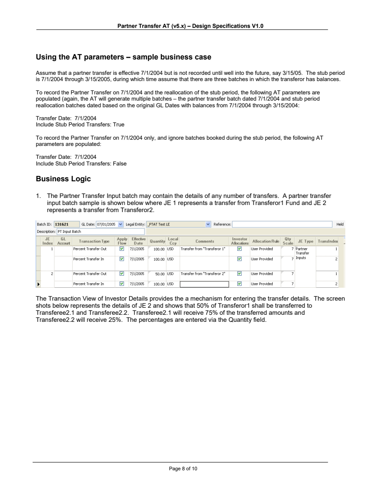
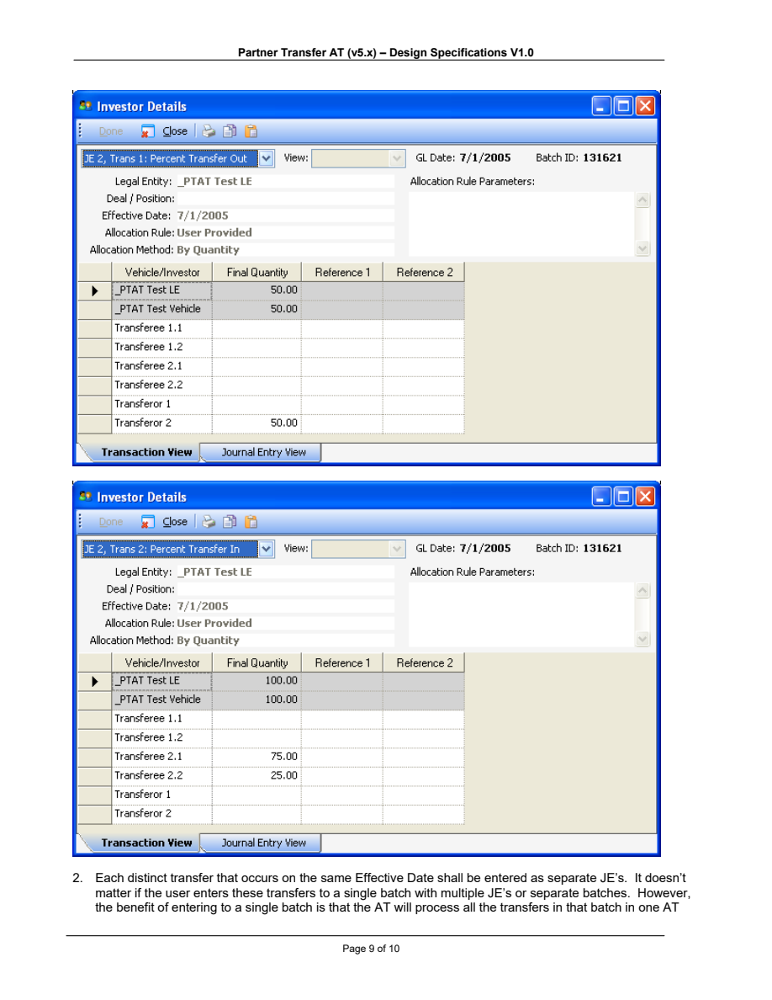
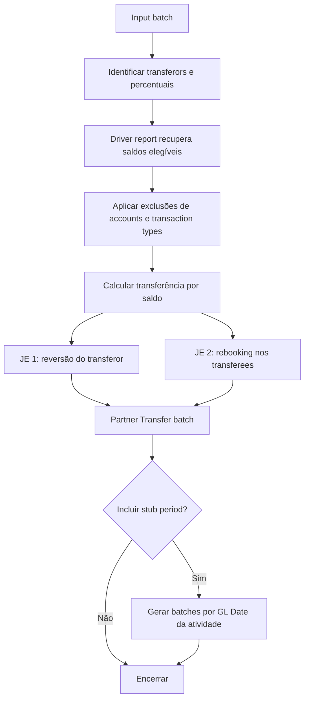

# Partner Transfer em profundidade

## Objetivo

Partner Transfer automatiza a transferência total ou parcial da participação de um **transferor** para um ou mais **transferees**. O processo pode movimentar saldos contábeis, commitment e unfunded commitment e, quando configurado, realocar atividade do período entre a data efetiva da transferência e a data de processamento.

O PDF disponível descreve uma implementação antiga chamada Partner Transfer Active Template (PTAT), versão 5.x. O manual de manutenção do Investran 7 também lista Partner Transfer como Business Event. Use a lógica abaixo para entendimento do domínio, mas confirme nomes, telas e comportamento na versão atual.

## Termos

| Termo | Significado operacional |
|---|---|
| Transferor | investor que transfere total ou parte de seus saldos e compromissos |
| Transferee | investor que recebe a participação transferida |
| Transfer Date | data contábil usada para registrar a transferência |
| Stub Period | intervalo entre a data efetiva e o momento em que a transferência é processada |
| Input Batch | batch que descreve transferor, transferees e percentuais |
| Partner Transfer G/L Account | conta usada para isolar a movimentação de capital/P&L no fluxo legado |

## Configuração documentada

O processo legado depende de:

- Account Types corretamente classificados como `Capital`, `Revenue` ou `Expense`;
- Batch Type `Partner Transfer`;
- transaction types `Percent Transfer Out` e `Percent Transfer In`;
- journal entry template com débito de Percent Transfer Out e crédito de Percent Transfer In;
- Journal Entry Types para transferência, stub period e inputs;
- hierarchy node `PTAT Excluded Transaction Types`;
- hierarchy node `PTAT Excluded Accounts`;
- driver report capaz de recuperar os saldos elegíveis.

## Montagem da entrada

*Fonte: Internal_Inv7_Partner.Transfer.Instructions.pdf, exemplo de caso e input batch, página 8.*

No exemplo documentado:

- cada transferência distinta é representada por um journal entry;
- o percentual transferido é informado em `Percent Transfer Out`;
- a distribuição entre os recebedores é informada em `Percent Transfer In`;
- os percentuais são preenchidos no campo de quantidade;
- várias transferências podem ser processadas na mesma execução quando pertencem ao input batch informado.

*Fonte: Internal_Inv7_Partner.Transfer.Instructions.pdf, Investor Details, página 9.*

Validações descritas no fluxo legado:

- `Percent Transfer Out` deve ser negativo, maior que zero em valor absoluto e menor ou igual a 100%;
- o total de `Percent Transfer In` deve ser positivo e igual a 100%;
- a GL Date do input batch deve corresponder à Transfer Date;
- accounts e transaction types presentes nas hierarquias de exclusão não são transferidos.

## Parâmetros documentados

| Parâmetro | Uso |
|---|---|
| Batch ID - Transfer Inputs | identifica o batch de entrada |
| Legal Entity Name | define a entidade onde a transferência ocorre |
| Transfer Date | define a GL Date do batch de transferência |
| Partner Transfer Account | conta usada para itens de P&L/capital conforme o modelo legado |
| Non-Dominant TransType | transaction type de balanceamento quando há exclusões |
| Partner Transfer JE Type | tipo do lançamento da transferência |
| Stub Period JE Type | tipo dos lançamentos de realocação |
| Include Stub Period Transfers | determina se a atividade do stub period será realocada |

Os parâmetros reais podem ser diferentes na implementação Business Event mais recente.

## Lógica de saída

O fluxo preserva atributos como transaction type, Deal e Position segundo o documento. Para contas de capital, receita e despesa, a implementação antiga passa pela Partner Transfer G/L Account. A saída contém reversão do transferor e rebooking para os transferees.

## Stub period

Quando a transferência é registrada depois da data em que passou a valer, a atividade posterior pode ter sido atribuída ao transferor. Com `Include Stub Period Transfers` habilitado, o processo realoca essa atividade.

- o período começa na própria Transfer Date;
- o batch principal recebe a Transfer Date;
- batches de realocação recebem as GL Dates originais das atividades;
- pode haver mais de um batch de stub period;
- o comportamento exato de effective date deve ser validado na versão instalada.

## Reconciliação obrigatória

Compare antes e depois por:

- Legal Entity e Vehicle;
- transferor e cada transferee;
- Deal e Position;
- account e transaction type;
- moeda e quantidade;
- original commitment e unfunded commitment;
- GL Date e effective date;
- valores excluídos pelas hierarquias;
- batch principal e batches de stub period.

O total líquido deve respeitar a lógica aprovada: o que sai do transferor precisa ser explicado pelo que entra nos transferees, considerando exclusões, arredondamento e tratamento contábil configurado.

## Riscos principais

- percentuais inconsistentes;
- input batch com data incorreta;
- account types classificados incorretamente;
- hierarquias de exclusão incompletas;
- alteração do driver report sem avaliação do BE;
- repetição após saída parcial;
- confusão entre transfer date, effective date e stub period;
- reconciliação apenas pelo total geral, ocultando erro por Deal/Position.

## KT específico de Partner Transfer

- qual implementação está ativa: AT legado, BE ou customização;
- onde o input é montado e aprovado;
- como transferor e transferees são selecionados;
- como commitment e unfunded commitment são tratados;
- quais UDFs e memo transaction types participam;
- quais reports e hierarquias dirigem/excluem saldos;
- como funcionam arredondamento, moedas e múltiplos transferees;
- como reconciliar stub period;
- procedimento aprovado quando existe batch parcial ou footprint.

