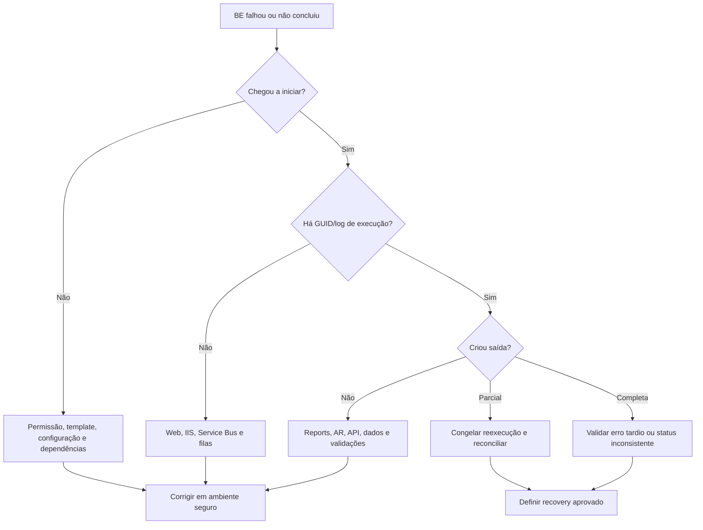

# Business Events - troubleshooting e recuperação

## Princípio

Uma falha de BE pode ocorrer antes da execução, no transporte da requisição, na lógica do evento, em um engine dependente ou durante a persistência da saída. Primeiro determine **em qual camada** a execução parou. Não reexecute antes de saber se houve gravação parcial.

## Coleta inicial

Registre:

- nome e versão do BE;
- ambiente, empresa/entidade e usuário;
- data/hora e timezone;
- parâmetros completos, sem credenciais;
- execution ID, GUID ou identificador equivalente;
- mensagem e captura do erro;
- serviço e servidor que processaram a execução;
- batches, lançamentos, arquivos ou registros já criados;
- última execução bem-sucedida e mudança recente.

## Árvore de diagnóstico

## Sintoma por camada

| Sintoma | Verificações iniciais |
|---|---|
| BE não aparece | importação, versão, status, sessão reaberta e permissões |
| Importação falha | `.ZIP`, compatibilidade da MR, permissão Add/Update e dependências |
| Execução não inicia | configuração, conta de serviço, IIS, BE services, bus/filas |
| Fica pendente | worker/serviço, mensagem presa, concorrência, timeout e dependência lenta |
| Falha ao consultar dados | driver report, parâmetros, Report Wizard Engine, segurança e volume |
| Falha em alocação | Allocation Rule, parâmetros, hierarquias e dados elegíveis |
| Falha ao salvar | validação do batch, locks, banco, permissões e saída parcial |
| Resultado incorreto | escopo, datas, exclusões, moeda, arredondamento e versão dos artefatos |

## Correlação de logs

Monte uma linha do tempo única:

1. requisição no Investran Web/IIS;
2. envio pelo Enterprise Service Bus/fila;
3. recebimento pelo serviço de execução;
4. chamadas a Investran API, Report Wizard e Allocation Rule Engine;
5. validações e persistência no banco;
6. criação de batch/output e retorno à interface.

Use horário, nome do BE, usuário e GUID para correlacionar. Se os relógios dos servidores não estiverem sincronizados, registre o desvio antes de interpretar a sequência.

## Reprocessamento seguro

Antes de repetir:

- confirme se a execução anterior terminou no servidor apesar do erro da tela;
- pesquise outputs pelo GUID, horário e escopo;
- identifique batches em hold, incompletos ou já processados;
- reconcilie os dados alterados;
- confirme se o BE é idempotente ou possui proteção contra duplicidade;
- obtenha aprovação funcional para remover/reverter qualquer saída;
- preserve logs da primeira tentativa.

Excluir footprint diretamente por SQL aparece em notas antigas, mas não constitui autorização operacional. Mudanças diretas no banco exigem procedimento vigente, backup, aprovação e envolvimento de FIS/DBA quando aplicável.

## Cancelamento, rollback e compensação

O diagrama de arquitetura mostra operações de `Cancel` e `Rollback`, mas isso não prova que todo BE ou toda fase possa ser revertida automaticamente. Para cada evento, confirme:

- quando o botão/ação de cancelamento é seguro;
- se cancelamento interrompe apenas a execução ou também desfaz saídas;
- quais objetos suportam rollback;
- quando é necessária reversão contábil ou compensação manual;
- como tratar mensagens ainda presentes na fila;
- como provar que o ambiente voltou a um estado consistente.

## Critérios de escalonamento

Escalone quando houver:

- saída parcial sem runbook aprovado;
- possível duplicidade contábil;
- mensagens presas ou repetidas no bus/fila;
- falha recorrente após validação de configuração;
- suspeita de incompatibilidade entre template e MR;
- necessidade de alteração direta em banco;
- divergência entre batches e saldos reconciliados;
- impacto em múltiplas entidades ou fechamento.

Envie no escalonamento a linha do tempo, GUID, parâmetros, versões, logs relevantes, outputs encontrados e tudo que já foi descartado.

## Checklist de encerramento

- [ ] Causa e camada da falha identificadas.
- [ ] Saída parcial descartada ou reconciliada.
- [ ] Correção validada com caso controlado.
- [ ] Resultado funcional reconciliado.
- [ ] Evidências anexadas ao incidente.
- [ ] Runbook e inventário atualizados.
- [ ] Ação preventiva e owner definidos.
