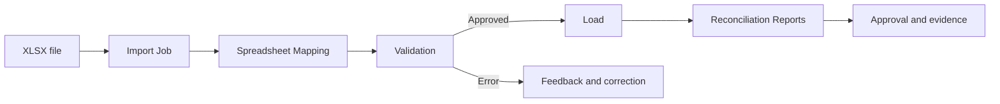

# Data Import

Data Import lets users add and update Investran data from Excel spreadsheets, with validation, scheduling, monitoring, and reconciliation. The manual also indicates SDK access for automated loads.

This section organizes the knowledge needed to prepare files, configure mappings, run jobs, and support the process.

## Guides

1. [Data Import practical guide](guia-pratico-data-import.md)
2. [Templates, entities, and mappings](templates-entidades-mappings.md)
3. [Troubleshooting and recovery](troubleshooting.md)
4. [Earlier summary: Data Import and interfaces](../10-data-import-e-interfaces.md)

## Summary flow

## Documented limits

- Only Excel 2007 or later `.XLSX` files.
- Maximum size of 100 MB in the manual version.
- Licenses and entitlements vary for market data, portfolio data, or transactions.
- Transactions can be added, but not updated, by the documented Data Import process.
- Team Security domains and entitlements are not imported.
- For UDFs, only values for existing UDFs are imported.

Confirm these limits in the installed version before treating any of them as an operating rule.

## Priority KT

- Official and customized templates used in the environment.
- Entities, volumes, frequency, and window for each load.
- File source, owner, and classification.
- Mappings, IDs, and cross-sheet reference rules.
- Licenses, users, domains, and entitlements.
- Application Server, Data Import Service, Master, and Staging.
- File naming, retention, and security convention.
- Functional and technical reconciliation.
- Cancellation, retry, and partial-load procedure.
- SDK automation and external integrations.
