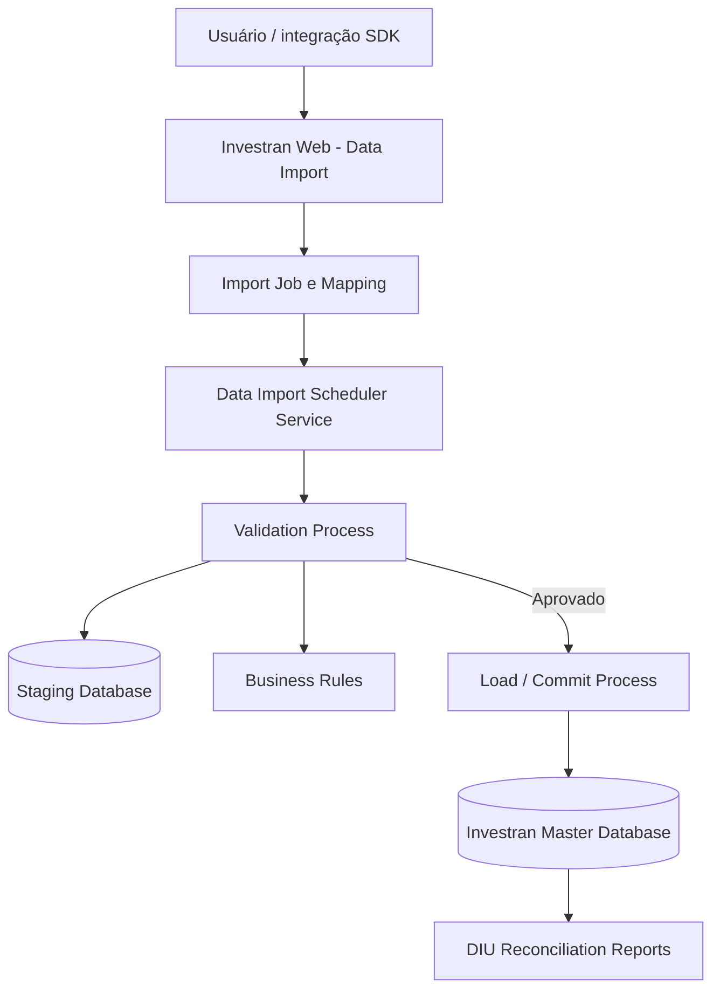
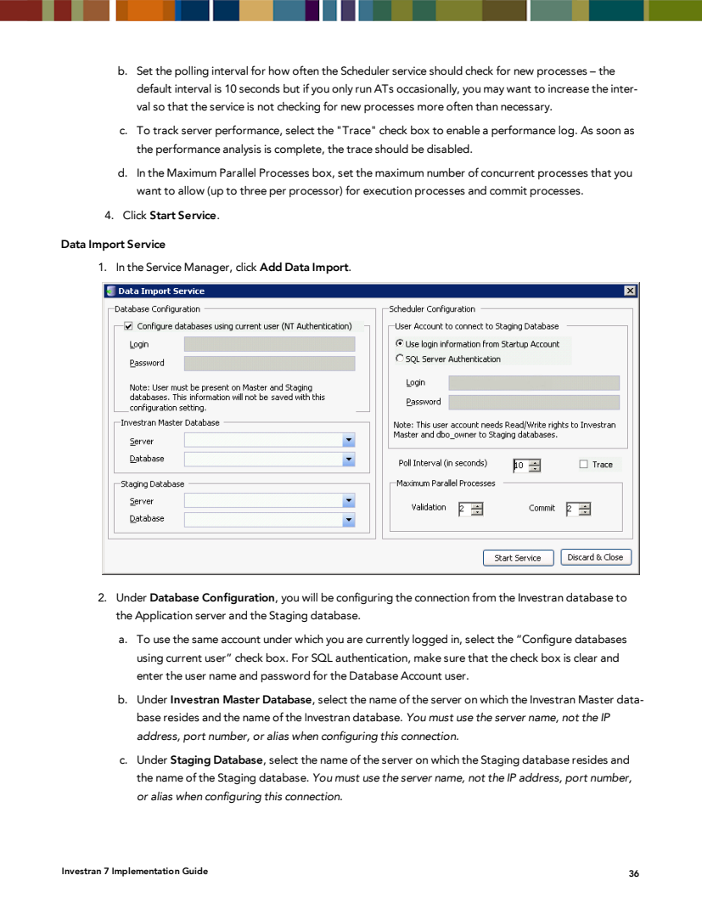
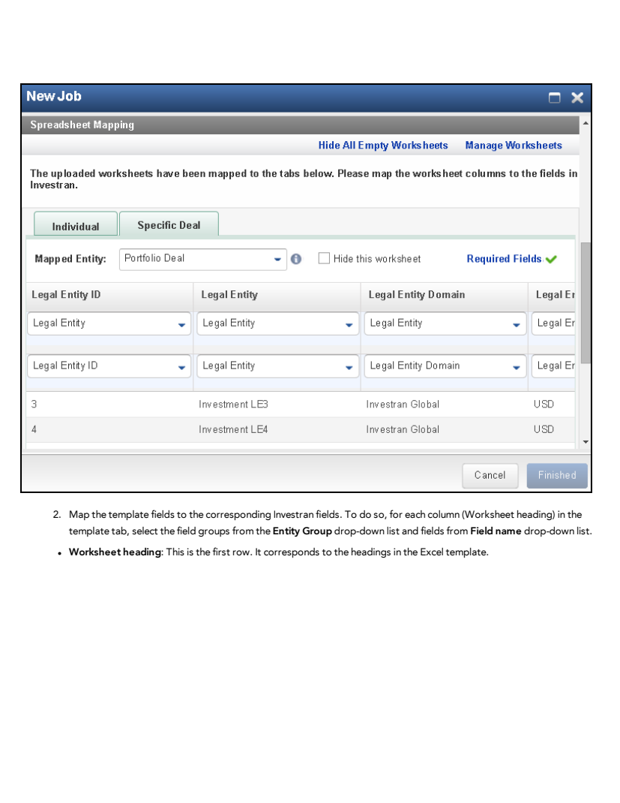
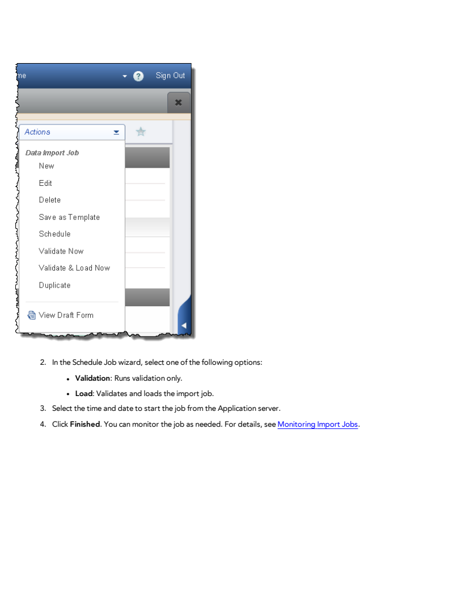
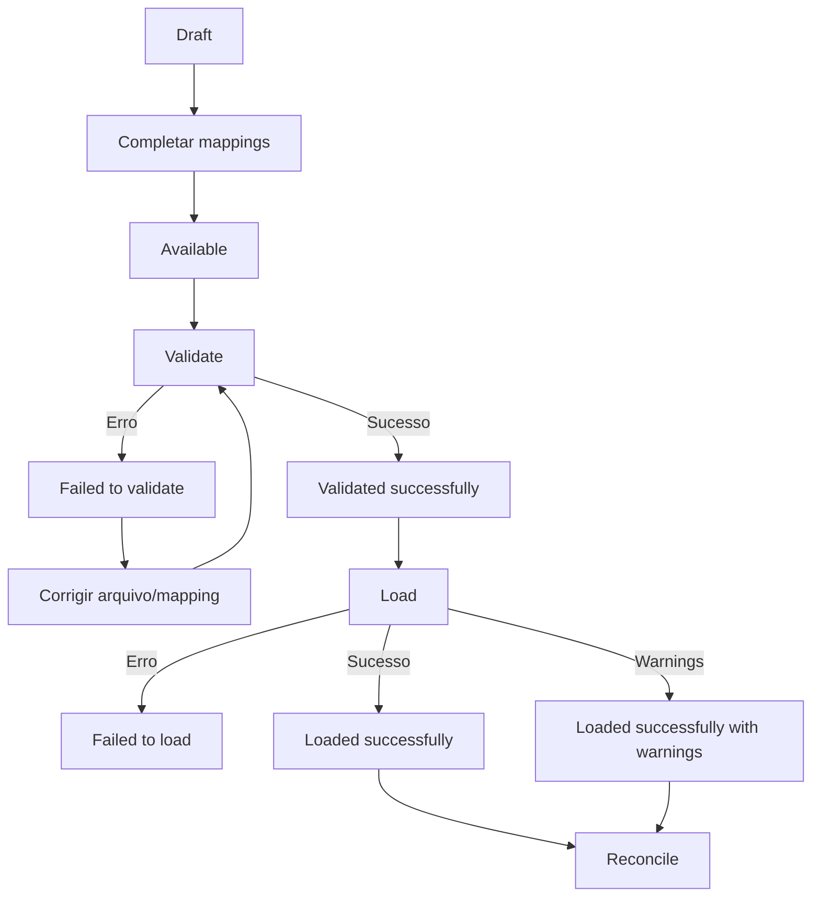
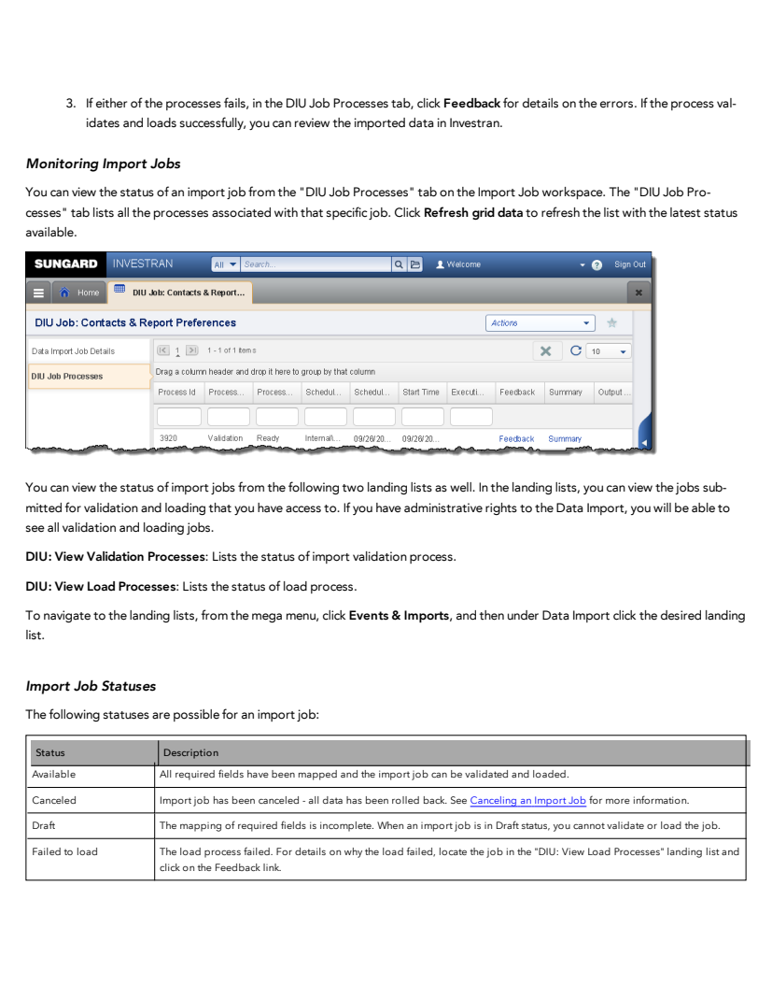
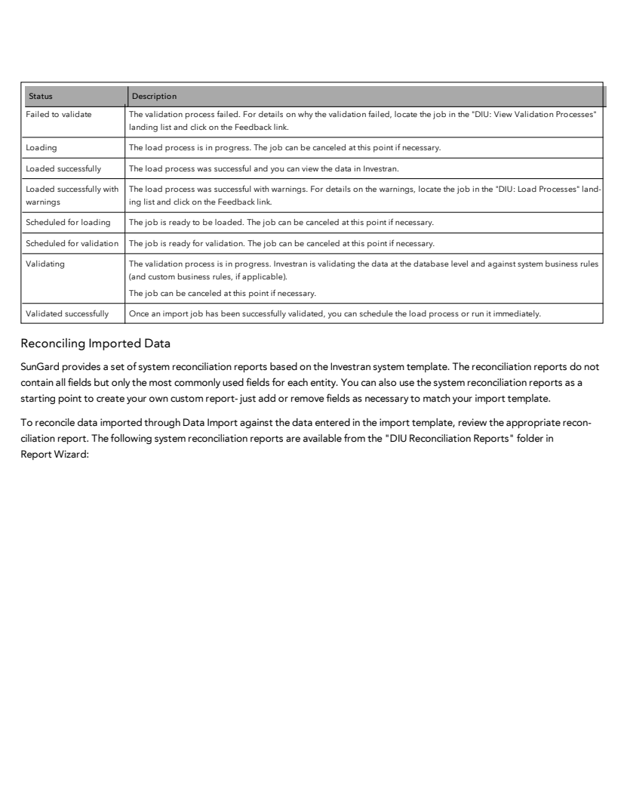

# Guia prático de Data Import

## 1. O que a ferramenta faz

O Data Import recebe dados em planilhas, associa cada worksheet a uma entidade do Investran, mapeia colunas para campos do sistema, valida o conteúdo e, se aprovado, carrega os registros. Ele atende três grupos amplos:

- dados do Investran Web;
- dados de portfólio e transacionais;
- dados de mercado.

O acesso real depende de licença, entitlement, domínio e permissão sobre as entidades envolvidas.

## 2. Componentes e arquitetura

### Data Import Service

O serviço deve estar configurado e em execução no Application Server. O manual de implementação mostra a configuração pelo Service Manager.

*Fonte: Internal_Inv7_INV_Implementation.pdf, Data Import Service, página impressa 36.*

A tela documentada contém:

- conexão com o Investran Master Database;
- conexão com o Staging Database;
- autenticação da configuração;
- conta usada pelo Scheduler;
- polling interval;
- máximo de processos paralelos para Validation e Commit;
- opção de trace;
- ação `Start Service`.

O manual antigo orienta usar o nome do servidor nas conexões, não IP, porta ou alias. Confirme se essa restrição permanece na versão atual.

### Conta e banco

A documentação atribui permissões elevadas à conta do Data Import sobre Staging. Não replique permissões literalmente sem revisão de segurança. Registre a configuração vigente, aplique privilégio mínimo suportado e valide com FIS/DBA.

## 3. Onde encontrar

No Investran Web, o caminho documentado é:

1. abrir o mega menu;
2. selecionar **Events & Imports**;
3. em **Data Import**, escolher **Add Job**.

Na mesma área ficam as listas **View Validation Processes** e **View Load Processes**. Um job também possui a aba `DIU Job Processes` para acompanhar as execuções ligadas a ele.

## 4. Pré-requisitos

Antes de preparar o arquivo, confirme:

- Data Import Service iniciado e saudável;
- Master e Staging corretos para o ambiente;
- licença `DataImport` para portfólio, quando aplicável;
- licença `DataImportTransactions` para transações;
- entitlement `ImportUtilityAdmin` ou `ImportUtilityUser`;
- direitos `Read`, `Add`, `Update`, `Remove` e/ou `Post` para `DataImportJob and Template`, conforme a função;
- entitlement de importação para cada entidade;
- acesso do usuário às entidades que serão criadas ou alteradas;
- capacidade e janela operacional para o volume esperado.

`ImportUtilityAdmin` possui acesso administrativo a jobs/templates públicos e privados. `ImportUtilityUser` fica restrito a objetos públicos ou criados pelo próprio usuário, conforme o manual.

## 5. Preparar o arquivo

Use um template versionado. O produto documenta o `DIU Generic Template`, disponível na lista de templates do sistema, e compatibilidade com templates DCT/TULT mediante pequenos ajustes.

Regras essenciais:

- formato `.XLSX`;
- uma ou mais worksheets, normalmente separadas por entidade;
- cabeçalhos únicos: colunas duplicadas podem ocultar mappings;
- colunas e abas vazias são ignoradas;
- a ordem das colunas não é significativa;
- espaços extras em texto são preservados, portanto normalize antes;
- valores em branco são ignorados;
- a palavra `NULL` remove o valor de um campo em uma atualização, segundo o manual;
- datas podem usar valor de data do Excel ou `YYYY/MM/DD`, `YYYY-MM-DD` e `YYYYMMDD` em células Text/General;
- use Investran IDs para atualizações sempre que possível.

> `NULL` é uma operação destrutiva sobre um valor existente. Exija revisão explícita das células que contenham essa palavra.

## 6. Criar o Import Job

No assistente **New Job**:

1. selecione o arquivo em `Select File To Import`;
2. defina um `Job Name` rastreável;
3. escolha `Map to Template`;
4. selecione o `Investran Domain`;
5. defina o acesso como `Private` ou `Public`;
6. revise as opções;
7. configure o Spreadsheet Mapping;
8. finalize o job.

### Opções documentadas

| Opção | Efeito | Risco operacional |
|---|---|---|
| Skip Top Rows | ignora linhas no topo | pode ocultar dados se configurado incorretamente |
| Add New Lookup Values | cria valores de lookup ausentes | amplia cadastros e pode introduzir valores inválidos |
| Allow Related Entries | permite carregar entidade relacionada na aba principal | aumenta dependências e dificuldade de reconciliação |
| Ignore Critical Warnings | ignora warnings críticos | não deve ser padrão sem justificativa |
| Skip Errors (Validation Only) | continua a validação para coletar todos os erros | não significa ignorar erros durante o load |

`Skip Errors` é útil para obter uma lista completa de problemas na validação. `Ignore Critical Warnings` e `Add New Lookup Values` exigem aprovação porque alteram a barreira de qualidade ou o cadastro de referência.

## 7. Configurar mappings

Cada aba do Excel deve ser associada a uma `Mapped Entity`. Depois, cada cabeçalho é ligado a `Entity Group` e `Field Name`.

*Fonte: INV_Data_Import_7.pdf, Mapping Template Fields, página 10.*

O manual usa cores para o estado das abas:

- **azul:** aba ainda não associada a uma entidade;
- **vermelho:** existem campos obrigatórios sem mapping;
- **verde:** todos os campos obrigatórios estão mapeados.

Verde significa apenas que os campos obrigatórios têm mapping. Ainda é necessário verificar se o campo de destino, a semântica, o tipo e a referência estão corretos.

Recursos úteis:

- `Required Fields` mostra os campos necessários da entidade;
- `Hide All Empty Worksheets` oculta abas vazias;
- `Hide this worksheet` faz o Data Import ignorar a aba;
- `Manage Worksheets` reexibe abas ocultadas;
- `Save as Template` preserva opções e mappings para reutilização.

## 8. Validar e carregar

O menu `Actions` oferece execução imediata ou agendada.

*Fonte: INV_Data_Import_7.pdf, Running an Import Job, página 14.*

### Modos

- **Validate Now:** executa somente validação;
- **Validate & Load Now:** valida e, se aprovado, carrega imediatamente;
- **Schedule - Validation:** agenda somente validação;
- **Schedule - Load:** agenda validação e carga.

Para uma carga nova ou de alto risco, prefira separar validação e load. Isso cria uma janela de revisão dos feedbacks antes da gravação.

## 9. Monitorar

*Fonte: INV_Data_Import_7.pdf, Monitoring Import Jobs, página 17.*

Registre o `Process ID` retornado. Consulte:

- aba `DIU Job Processes` do job;
- landing list `DIU: View Validation Processes`;
- landing list `DIU: View Load Processes`;
- link `Feedback` para erros e warnings;
- `Summary` e outputs disponíveis na versão.

*Fonte: INV_Data_Import_7.pdf, Import Job Statuses, página 18.*

Estados relevantes incluem `Draft`, `Available`, `Scheduled for validation`, `Validating`, `Validated successfully`, `Scheduled for loading`, `Loading`, `Loaded successfully`, `Loaded successfully with warnings`, `Failed to validate`, `Failed to load` e `Canceled`.

## 10. Reconciliar

Sucesso técnico não encerra a carga. O manual disponibiliza reports na pasta `DIU Reconciliation Reports` do Report Wizard, mas avisa que eles contêm apenas os campos mais comuns.

Crie reports customizados quando o template usar campos adicionais. A reconciliação deve comparar:

- linhas lidas, aceitas, rejeitadas e carregadas;
- inserts versus updates;
- IDs gerados ou atualizados;
- valores-chave de cada entidade;
- totais contábeis, moedas e datas para transações;
- entidades relacionadas;
- UDFs;
- warnings aceitos;
- arquivo original versus resultado consultado no Investran.

## 11. Cancelamento

O manual afirma que o cancelamento faz rollback das alterações concluídas antes do cancelamento e não realiza commit. Ele permite cancelamento nos estados `Ready`, `Scheduled for Validation`, `Validating`, `Scheduled for Loading` e `Loading` da versão documentada.

Mesmo assim, valide o comportamento na versão e no tipo de carga atuais. Depois de cancelar:

- confirme status `Canceled`;
- verifique jobs/filas ativos;
- execute reconciliação read-only;
- confirme ausência de registros ou batches parciais;
- preserve o Feedback e os logs.

## 12. Automação via SDK

O guia confirma que o SDK pode acessar Data Import para uploads automatizados, mas não fornece no material analisado um contrato completo de endpoints/métodos para documentar exemplos seguros. Para cada integração automatizada, capture no KT:

- biblioteca e versão do SDK;
- autenticação e conta técnica;
- criação e seleção do template;
- upload e submissão do job;
- polling de validation/load;
- download e interpretação de Feedback;
- timeout, retry e idempotência;
- armazenamento seguro do arquivo e das evidências.

## 13. Checklist operacional

### Antes

- [ ] Arquivo, owner e finalidade identificados.
- [ ] Template e mapping versionados.
- [ ] IDs e referências validados.
- [ ] Licenças, entitlements e domínio confirmados.
- [ ] Data Import Service e bancos corretos.
- [ ] Critério de reconciliação preparado.

### Depois

- [ ] Process ID e status registrados.
- [ ] Feedback revisado, inclusive warnings.
- [ ] Contagens e valores reconciliados.
- [ ] Inserts/updates confirmados.
- [ ] Arquivo e evidências armazenados com segurança.
- [ ] Aprovação funcional registrada.

## Fontes

- *INV_Data_Import_7.pdf*, configuração, jobs, mappings, execução, monitoramento e data entry guidelines.
- *Internal_Inv7_Data Import Utility User Guide.pdf*, instruções detalhadas por entidade do template legado.
- *Internal_Inv7_INV_Implementation.pdf*, configuração do Data Import Service.
