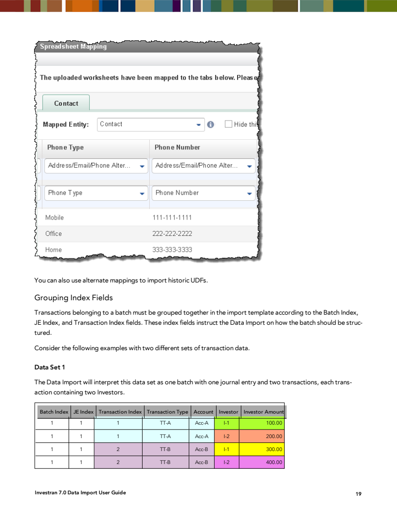

# Data Import - templates, entidades e mappings

## Entidades documentadas

O guia do Investran 7 lista as seguintes entidades como suportadas:

| Grupo prático | Entidades |
|---|---|
| Cadastros e CRM | Contact, Individual, Organization, Opportunity |
| Estrutura de investimento | LegalEntity, Vehicle, Investor, SpecificVehicle, SpecificInvestor |
| Investimentos | Deal, SpecificDeal, SpecificPosition, Lot, Pool |
| Contabilidade | Account, GL Account, TransactionType, Transaction |
| Securities e mercado | Security, IncomeSecurity, Issuer, MarketData |

Use a nomenclatura exibida pelo `Mapped Entity` da versão instalada. O catálogo acima não prova que todas estejam licenciadas ou habilitadas no ambiente.

## Inserir versus atualizar

| Operação | Identificação recomendada | Observação |
|---|---|---|
| Inserir entidade | Import ID temporário dentro do arquivo | permite referências entre abas na mesma carga |
| Atualizar entidade | Investran ID | evita ambiguidade e melhora performance |
| Inserir transação | índices e referências do batch | transações existentes não são atualizadas no fluxo documentado |
| Limpar campo | valor literal `NULL` | revisar como alteração destrutiva |

Contacts e Opportunities podem ter nomes duplicados; o manual exige o ID único para atualização dessas entidades.

## Referências entre entidades

Uma entidade primária pode depender de entidades de referência. Exemplos do manual:

- LegalEntity referencia Specific Fund Deals, Specific Direct Deals e Specific Positions;
- Vehicle referencia Specific Investor;
- Contact Import ID pode ligar contacts novos a relacionamentos ou UDFs na mesma carga.

Ao carregar pai e filho juntos:

1. atribua Import IDs únicos;
2. coloque os registros que criam a referência antes das linhas que a consomem quando o template exigir;
3. use `Allow Related Entries` apenas quando o desenho da carga estiver validado;
4. reconcilie os IDs definitivos gerados.

## Mandatory versus required

- **Mandatory fields:** conjunto mínimo para criar uma entidade nova;
- **Required fields:** campos ou combinação usados para identificar a entidade durante update ou resolução de referência.

Essas regras vêm das business rules do Investran. Não conclua que uma coluna é opcional apenas porque o Excel aceita célula vazia.

## Grouping Index para transações

Transações pertencentes a batches precisam ser agrupadas por:

- `BatchIndex`;
- `JEIndex`;
- `TransactionIndex`.



*Fonte: INV_Data_Import_7.pdf, Grouping Index Fields, página 23.*

A combinação define a hierarquia:

```text
BatchIndex
└── JEIndex
    └── TransactionIndex
        └── Investor allocations / detalhes
```

Linhas não precisam apenas “parecer iguais”: índices repetidos ou fora da ordem lógica podem agrupar investors em uma mesma transaction de forma diferente da desejada. Antes do load, gere uma visão agrupada e confirme quantos batches, JEs, transactions e allocations serão criados.

## UDFs

O manual descreve dois grupos:

- `UDFs`: preenchido dinamicamente com as UDFs existentes para a entidade;
- `UDF Alternate Mapping`: campos genéricos como UDF Type, UDF Name e UDF Value.

Alternate Mapping também pode transportar valores históricos. O Data Import não cria a definição da UDF: ele carrega valores para UDFs existentes.

Para Contact UDF, use `ContactImportID` mesmo ao atualizar um contact existente: associe o Contact ID ao Import ID dentro do processo e use o Import ID na linha da UDF, conforme a lógica documentada.

## Alternate mappings

Addresses, emails e phones podem usar pares genéricos, por exemplo:

| Tipo | Valor |
|---|---|
| PhoneType | PhoneNumber |
| EmailType | EmailAddress |
| AddressType | campos do endereço |

Isso evita uma coluna por tipo, mas exige valores de lookup consistentes. Não habilite `Add New Lookup Values` automaticamente para compensar erro de grafia.

## Checklist de revisão do template

- [ ] Nome e versão do template.
- [ ] Uma finalidade clara por worksheet.
- [ ] Cabeçalhos únicos.
- [ ] Entidade mapeada corretamente.
- [ ] Mandatory e required fields revisados.
- [ ] Investran IDs usados em updates.
- [ ] Import IDs únicos e referências resolvíveis.
- [ ] Datas normalizadas.
- [ ] Espaços, caracteres invisíveis e fórmulas removidos/avaliados.
- [ ] Células `NULL` revisadas.
- [ ] Grouping Index reconciliado para transactions.
- [ ] UDFs e lookups existentes.
- [ ] Aba oculta não contém dados necessários.
- [ ] Contagens de controle registradas.

## O que documentar por interface

| Item | Conteúdo esperado |
|---|---|
| Origem | sistema, relatório ou área fornecedora |
| Arquivo | nome, formato, encoding, planilhas e retenção |
| Template | nome no Investran, versão e owner |
| Mapping | worksheet, entidade, coluna, grupo e campo |
| Chave | Investran ID, Import ID ou chave composta |
| Dependências | entidades de referência, UDFs e lookups |
| Execução | manual, agendada ou SDK |
| Reconciliação | reports, totais e tolerâncias |
| Recovery | cancelamento, correção e retry |
| Segurança | domínio, entitlement e dados sensíveis |
