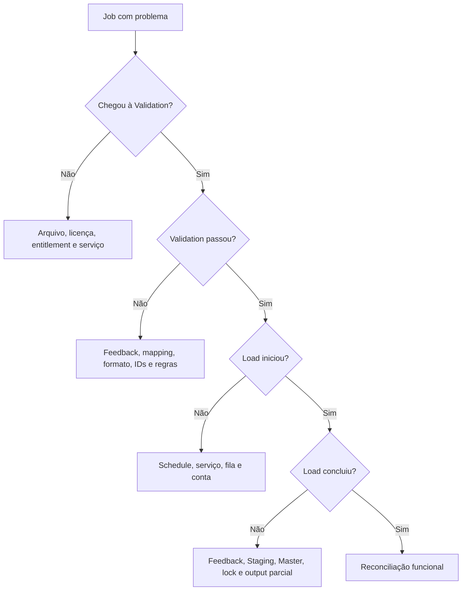

# Data Import - troubleshooting e recuperação

## Primeiro: Validation ou Load?

Separe a falha em duas fases:

- **Validation:** mapping, tipo, formato, referências, permissões e business rules;
- **Load:** persistência, locks, serviço, Staging/Master, concorrência e regras acionadas durante gravação.

O link `Feedback` da execução é a primeira evidência. Preserve-o antes de editar ou duplicar o job.

## Coleta inicial

- Job Name e Process ID;
- usuário, domínio, template e arquivo;
- checksum e tamanho do `.XLSX`;
- horário, timezone e Application Server;
- fase, status e duração;
- Feedback, Summary e mensagem completa;
- opções do job;
- worksheets e mappings afetados;
- contagem esperada e observada;
- alteração recente em template, entidade, UDF, lookup, licença ou serviço.

## Diagnóstico por sintoma

| Sintoma | Verificações |
|---|---|
| Job fica Draft | mandatory/required fields e worksheets sem Mapped Entity |
| Falha no upload | `.XLSX`, tamanho, acesso ao arquivo, sessão e servidor web |
| Failed to validate | Feedback, tipos, datas, IDs, referências, entitlements e business rules |
| Failed to load | serviço, Staging/Master, locks, permissões, espaço e concorrência |
| Loaded with warnings | revisar todos os warnings e impacto antes de aprovar |
| Fica Validating/Loading | Data Import Service, polling, processos paralelos, fila e banco |
| Entidades duplicadas | chave por nome, Investran ID ausente e configuração de nomes duplicados por domínio |
| Referência não encontrada | ordem, Import ID, Investran ID, domínio e Allow Related Entries |
| Batch/transação incorreto | BatchIndex, JEIndex, TransactionIndex e allocations |
| Campo não foi limpo | célula vazia é ignorada; confirmar uso intencional de `NULL` |
| UDF rejeitada | UDF não existe, tipo/lookup incompatível ou referência de Contact incorreta |

## Árvore de diagnóstico

## Serviço e infraestrutura

Confirme no Application Server:

- Data Import Service iniciado;
- configuração apontando para o Master e Staging corretos;
- conta do Scheduler válida e não bloqueada;
- polling interval coerente;
- limite de Validation/Commit não saturado;
- conectividade e permissões de banco;
- espaço, crescimento de log e bloqueios;
- trace desabilitado fora de uma análise controlada.

Não reinicie o serviço sem verificar jobs em andamento e impacto em outras cargas.

## Retry seguro

1. preserve o arquivo original, Feedback e Process ID;
2. determine se a falha ocorreu antes ou durante o load;
3. consulte os dados por IDs e critérios de reconciliação;
4. confirme se houve insert/update parcial;
5. corrija uma cópia versionada do arquivo ou mapping;
6. valide novamente sem load;
7. compare os resultados da validação;
8. carregue somente após aprovação;
9. reconcilie novamente.

Para transações, retry merece cuidado adicional porque o fluxo documentado inclui novas transações, não update. Uma repetição pode duplicar efeito contábil se a execução anterior tiver persistido dados.

## Cancelamento

O guia afirma que cancelamento nos estados suportados executa rollback e não efetiva mudanças no banco. Trate isso como comportamento da versão documentada, não como substituto da reconciliação.

Após cancelar:

- confirme `Canceled` no job e no processo;
- verifique se não existe processo filho ativo;
- consulte entidades e batches potencialmente afetados;
- preserve logs do serviço;
- documente por que o cancelamento ocorreu;
- só então decida se é seguro repetir.

## Reconciliation como diagnóstico

Use reports do Report Wizard ou consultas aprovadas para responder:

- quantas linhas foram efetivamente criadas/alteradas;
- quais IDs foram envolvidos;
- quais campos diferem do arquivo;
- se todos os relacionamentos foram formados;
- se batches, JEs, transactions e allocations batem com os índices;
- se warnings correspondem a diferenças funcionais.

Os reports padrão não cobrem todos os campos. Para interfaces críticas, mantenha report customizado alinhado ao template.

## Escalonamento

Escalone com:

- arquivo sanitizado ou amostra reproduzível;
- template e mapping exportado/documentado;
- Process ID e linha do tempo;
- Feedback completo;
- versão do Investran e do template;
- status do serviço;
- entidades/IDs afetados;
- evidência de reconciliação;
- confirmação sobre possível carga parcial.

Não envie arquivo com dados sensíveis sem canal autorizado.

## KT de troubleshooting

- onde ficam os logs do Data Import Service em cada ambiente;
- como correlacionar Process ID com logs e banco;
- como identificar mensagem/processo preso;
- quais erros são recorrentes por interface;
- quando cancelar versus aguardar;
- como provar rollback;
- quais consultas read-only são aprovadas;
- quando envolver DBA, infraestrutura, funcional ou FIS;
- qual é o runbook para transação carregada incorretamente.
