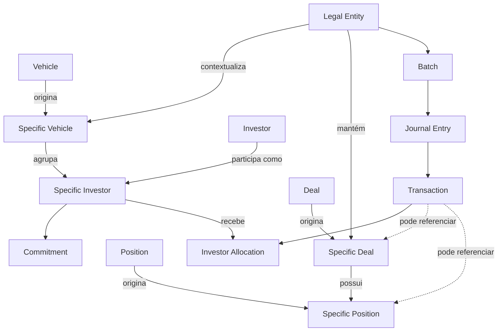

# Entidades e relacionamentos

## Como ler o modelo

O Investran possui entidades de cadastro reutilizáveis e entidades que representam esse cadastro dentro de um contexto de portfólio. A API e o Data Import expõem, entre outras, `LegalEntity`, `Investor`, `Vehicle`, `Deal`, `Position` e suas variantes `SpecificInvestor`, `SpecificVehicle`, `SpecificDeal` e `SpecificPosition`.

> O diagrama abaixo é um **modelo conceitual para suporte**, não um ERD físico do banco. Cardinalidades, nomes de chaves e variações por versão precisam ser confirmados no metadata/API e no ambiente atendido.

## Entidade mestre versus entidade específica

| Entidade mestre | Entidade contextual | Pergunta respondida |
|---|---|---|
| Investor | Specific Investor | Quem é a parte e como ela participa neste fundo/estrutura? |
| Vehicle | Specific Vehicle | O que é o veículo e como ele aparece nesta estrutura? |
| Deal | Specific Deal | O que é o investimento e como ele aparece neste portfólio? |
| Position | Specific Position | O que é a posição e como ela é mantida no contexto do investimento? |

Essa distinção é importante em integrações. O ID do cadastro mestre não deve ser usado como se fosse automaticamente o ID da participação contextual.

## Entidades organizacionais e de relacionamento

### Legal Entity

Representa a entidade legal/fundo no contexto de administração e contabilidade. Batches e configurações contábeis normalmente possuem uma Legal Entity como contexto.

### Investor

Representa a parte investidora como cadastro reutilizável. O relacionamento efetivo com a estrutura é representado pela entidade contextual apropriada, como Specific Investor.

### Vehicle

Representa um veículo usado na estrutura de participação. O significado exato e sua relação com Investor/Legal Entity devem ser confirmados para o modelo adotado pela organização.

### Specific Investor e Specific Vehicle

Expressam participação em um contexto concreto. O guia de Partner Transfer, por exemplo, chama transferor e transferee de Specific Investors e associa cada participação a Legal Entity/Vehicle.

## Entidades de investimento

### Deal

Representa o investimento/negócio de forma reutilizável. Transações podem carregar Deal e outros elementos como Position, Lot, Pool e Income Security.

### Position

Representa uma posição mantida no investimento. A composição exata depende do tipo de investimento e da configuração do cliente.

### Specific Deal e Specific Position

São as ocorrências contextuais do Deal/Position dentro do portfólio ou Legal Entity. O Data Import trata Deal como referência para Specific Deals/Positions, reforçando que os dois níveis não são intercambiáveis.

## Entidades contábeis

- **Batch:** envelope de processamento contábil.
- **Journal Entry:** lançamento balanceado ou agrupamento contábil dentro do batch.
- **Transaction:** linha/débito/crédito com Transaction Type, Account, valores, datas e dimensões.
- **Investor Allocation:** distribuição de uma transaction entre investidores.
- **GL Account:** conta contábil afetada.
- **Transaction Type:** semântica da transaction e comportamento contábil.

## Perguntas de diagnóstico

Quando um dado parece errado, determine primeiro:

1. O ID é de entidade mestre ou contextual?
2. A relação existe na Legal Entity/Vehicle corretos?
3. A vigência/data usada seleciona a participação correta?
4. O erro está no cadastro, na relação ou na transação que o referencia?
5. Team Security permite ao usuário enxergar a entidade?

## Fontes

- *INV_API_Training_Guide_7.pdf*, Object Model, DTOs e lista de service contracts.
- *INV_Data_Import_7.pdf*, Supported Entities e Reference Entities.
- *PT BE Guidebook_2018.06.29.docx*, definições de transferor/transferee e estrutura de Partner Transfer.
