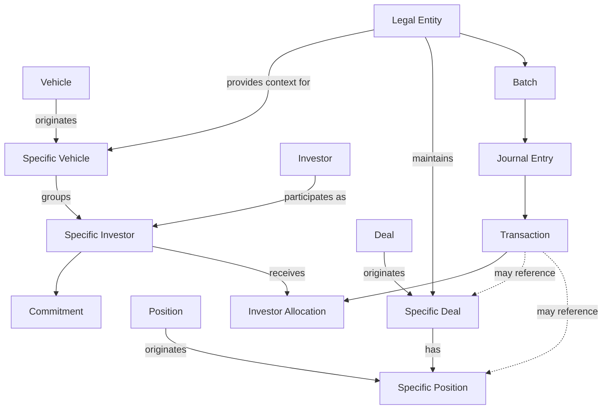

# Entities and relationships

## How to read the model

Investran has reusable master entities and entities that represent those records within a portfolio context. The API and Data Import expose `LegalEntity`, `Investor`, `Vehicle`, `Deal`, `Position`, and contextual variants: `SpecificInvestor`, `SpecificVehicle`, `SpecificDeal`, and `SpecificPosition`.

> The diagram is a **support conceptual model**, not a physical database ERD. Confirm cardinality, key names, and version-specific variations in metadata/API and the supported environment.

## Master versus contextual entity

| Master entity | Contextual entity | Question answered |
|---|---|---|
| Investor | Specific Investor | Who is the party and how does it participate in this fund/structure? |
| Vehicle | Specific Vehicle | What is the vehicle and how does it appear in this structure? |
| Deal | Specific Deal | What is the investment and how does it appear in this portfolio? |
| Position | Specific Position | What is the position and how is it held in the investment context? |

This distinction matters in integrations. A master-record ID must not be treated as the contextual-participation ID.

## Organizational and relationship entities

### Legal Entity

The legal entity/fund in the administration and accounting context. Batches and accounting configuration usually have a Legal Entity context.

### Investor and Vehicle

An Investor is a reusable investor-party record. A Vehicle represents a vehicle used in the participation structure. Confirm their exact meaning and relationship with Investor/Legal Entity for the organization model.

### Specific Investor and Specific Vehicle

These express participation in a concrete context. For example, the Partner Transfer guide calls transferor and transferee `Specific Investors` and associates each participation with a Legal Entity/Vehicle.

## Investment entities

### Deal and Position

A Deal is a reusable investment/business record. Transactions can carry a Deal and elements such as Position, Lot, Pool, and Income Security. A Position represents a holding in that investment; its exact composition depends on investment type and customer configuration.

### Specific Deal and Specific Position

These are the Deal/Position occurrences within a portfolio or Legal Entity. Data Import treats Deal as a reference for Specific Deals/Positions, so the two levels are not interchangeable.

## Accounting entities

- **Batch:** Accounting-processing container.
- **Journal Entry:** Balanced accounting entry or grouping within a batch.
- **Transaction:** Debit/credit line with Transaction Type, Account, values, dates, and dimensions.
- **Investor Allocation:** Distribution of a transaction across investors.
- **GL Account:** Affected general-ledger account.
- **Transaction Type:** Transaction meaning and accounting behavior.

## Diagnostic questions

1. Is the ID master or contextual: Vehicle/SpecificVehicle, Investor/SpecificInvestor, BatchID, TransID? Which customer domain is it from?
2. Does the relationship exist in the correct Legal Entity/Vehicle? Confirm Deal, Legal Entity, Investor, and Vehicle with the customer.
3. Does the effective date select the correct participation? A user date can select an older Legal Entity, investor commitment, or Deal configuration.
4. Is the error in the master record, relationship, or referring transaction?
5. Does Team Security allow the user to see the entity and perform the operation?

## Sources

- *INV_API_Training_Guide_7.pdf*, Object Model, DTOs, and service-contract list.
- *INV_Data_Import_7.pdf*, Supported Entities and Reference Entities.
- *PT BE Guidebook_2018.06.29.docx*, transferor/transferee definitions and Partner Transfer structure.
