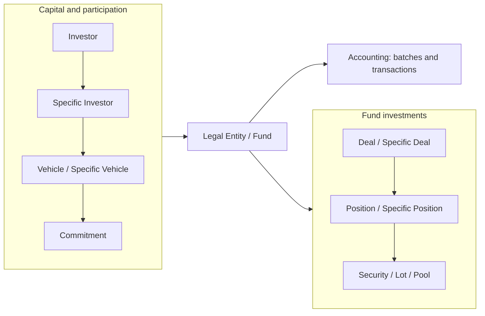
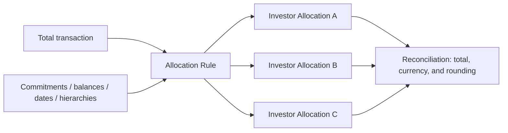

# Funds, investors, and investments

## Two perspectives of the same system

To understand Investran, separate the domain into two sides connected by accounting.

The left side answers **who provides capital and through which structure**. The right side answers **where the fund invests and which positions it holds**. Batches and transactions record events that change both sides.

## Commitment

Commitment is capital promised by the investor participation. In support, distinguish:

- Total commitment.
- Called/funded capital.
- Unfunded commitment.
- Commitment transfers or changes.
- Effective/closing date.
- Currency and Legal Entity/Vehicle context.

The simplified formula `unfunded = commitment - called capital` helps reasoning, but it does not replace official installation rules, transactions, and reports.

## Allocation

Allocation distributes a transaction value or quantity across investors. It can be static or dynamic, Top Down or Bottom Up, based on commitment, balance, cost, or another measure, and calculated by a system or customized ARM rule.

## Conceptual example

A Legal Entity has two Specific Investors. A capital call creates a batch. Each journal entry contains debit/credit transactions. The Allocation Rule reads the relevant data and creates Investor Allocations that split the transaction across the two investors. Report Wizard can then retrieve both the Legal Entity total and investor detail.

## Relationships to confirm during KT

- Legal Entity → Vehicle → Specific Investor structure used by the organization.
- Deal/Position types in use.
- Official source for commitment and unfunded values.
- Effective-date, closing, and transfer rules.
- Hierarchies and UDFs that change selection/allocation.
- Official reconciliation reports by entity.
