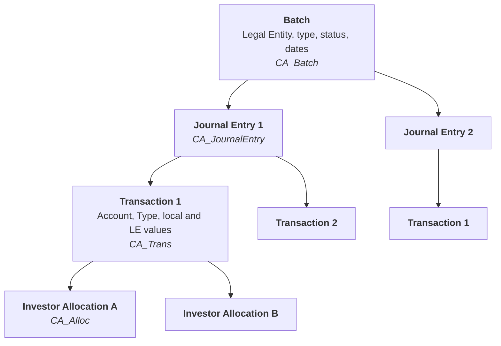

# Accounting cycle and batches

## Accounting hierarchy

The documented General Ledger Web Service treats batches, journal entries, transactions, and investor allocations as a hierarchy. Journal Entry and Transaction use indexes to preserve their relationship within a batch.

## How a batch is created

Every source has different retry behavior and evidence. Before reprocessing, confirm whether the batch already exists, whether partial writes occurred, and whether the mechanism is idempotent.

## Transaction elements

A transaction can reference GL Account, Transaction Type, local and Legal Entity values, currency and exchange rate, GL Date and Effective Date, Deal, Position, Lot, Pool, Income Security, investor allocations, UDFs, and lookups.

## Main tables

Batch and transaction tables normally use the `CA_` prefix:

- **CA_Trans:** Transaction data; points to JE, LE, Batch, and related data.
- **CA_Alloc:** Transaction values already allocated by investor; points to Trans and Investor.
- **CA_Batch:** Batch data.
- **CA_JournalEntry:** JE data; intermediary between Trans and Batches.

## States and controls

Exact states vary by configuration, but support should distinguish: created/generated; held in Staging/application; validated/rejected; held/approved when applicable; posted/final; exported/consumed downstream; and logically deleted or removed by maintenance.

Examples: `Held`, `Draft`, `Posted`, `Exported`, and `Deleted`.

## Technical versus business validation

| Technical validation | Business validation |
|---|---|
| Status and no exception | Correct business event |
| Number of JEs/transactions | Correct accounts, signs, and dates |
| Balanced batch | Correct investors and deals |
| Scheduler completed | Reconciled allocations |
| Record persisted | Consistent downstream report |

## Common failure points

- Incorrect contextual entity.
- Incompatible Transaction Type, GL Account, or Legal Entity.
- Missing currency/Deal in a multicurrency journal entry.
- Effective-date error.
- Allocation that does not close or rounds incorrectly.
- Batch created in Staging but not committed.
- Retry that creates duplication.
- Validation or posting blocked by configuration/permission.

## Monitoring and logs

For a single batch, verify the change in the database or CRM. For multiple-batch changes—Post, Unpost, create, or edit—originating from DIU, AT, BE, or CRM, `BatchSaveService` consumes the change queue. Check its Windows-service logs and Staging/Main processing tables, then confirm completion in the database, CRM, or BatchSaveService logs.

Log availability and location depend on input and configuration; they may be in FTP, a folder, or a database.

| Input type | Logs |
|---|---|
| Manual entry (CRM) | BFF Cache, AR Service logs |
| Active Template | AT Service, AR Service, Batch Save logs for multi-batch saves |
| Business Event | BE Service, AR Service, Batch Save logs for multi-batch saves |
| Data Import | DIU Service, AR Service, Batch Save logs for multi-batch saves |
| Custom API | API, AR Service, Batch Save logs for multi-batch saves |

## Batch Types

Batch Types are configurable for each Investran installation. The standard product has approximately 15 types; confirm the environment catalog.

## Sources

- *INV_API_Training_Guide_7.pdf*, General Ledger Web Service.
- *Internal_Inv7_INV_ATM_Dev_Guide_7.pdf*, AT Execution, Staging, and Commit.
- *Internal_Inv7_INV_Administrators_7.pdf*, Batch Validation.
- *PT BE Guidebook_2018.06.29.docx*, batch structure and multicurrency troubleshooting.
