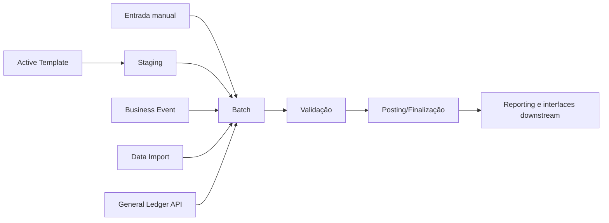

# Ciclo contábil e batches

## Hierarquia contábil

O General Ledger Web Service documentado trata batches, journal entries, transactions e investor allocations como uma hierarquia. Journal Entry e Transaction usam índices para preservar a relação dentro do batch.

## Como um batch nasce

Cada origem tem comportamento diferente de retry e evidência. Antes de reprocessar, confirme se o batch já foi criado, se existem writes parciais e se o mecanismo é idempotente.

## Elementos de uma transaction

Dependendo do processo, uma transaction pode referenciar:

- GL Account e Transaction Type;
- valores local e Legal Entity;
- moeda e exchange rate;
- GL Date e Effective Date;
- Deal, Position, Lot, Pool ou Income Security;
- investor allocations;
- UDFs e lookups.

## Principais tabelas

Normalmente as tabelas relacionadas a batches e transações terão o prefixo "CA_".

**CA_Trans**: Dados de transações. Aponta para JE, LE, Batch...

**CA_Alloc**: Valores das trasações já alocados por investidor. Aponta para Trans, Investor...

**CA_Batch**: Dados de batch.

**CA_JournalEntry**: Dados de JE. Intermediário entre Trans e Batches.

## Estados e controles

Os estados exatos variam por configuração, mas o raciocínio de suporte deve distinguir:

1. criado/gerado;
2. mantido em staging ou aplicação;
3. validado ou rejeitado;
4. held/aprovado quando aplicável;
5. postado/final;
6. exportado/consumido downstream;
7. excluído logicamente ou removido por manutenção.

### Exemplos de estados

1. Held
2. Draft
3. Posted
4. Exported
5. Deleted

## Validação técnica versus funcional

| Validação técnica | Validação funcional |
|---|---|
| status e ausência de exception | evento de negócio correto |
| quantidade de JEs/transactions | contas, sinais e datas corretos |
| batch balanceado | investors e deals corretos |
| scheduler concluído | allocations reconciliadas |
| registro persistido | report downstream consistente |

## Pontos comuns de falha

- entidade contextual incorreta;
- Transaction Type ou GL Account ou LE incompatível;
- moeda/Deal ausente em journal entry multicurrency;
- erro de vigência/data;
- allocation que não fecha ou arredonda incorretamente;
- batch gerado em staging, mas não commitado;
- retry que cria duplicidade;
- validação ou posting bloqueados por configuração/permissão.

## Monitoramento

### Manipulação de 1 único batch

Basicamente podemos verificar a modificação no banco ou diretamente no CRM.

### Manipulação de múltiplos batches

Não importa a mudança de status

- Post
- Unpost
- Criação
- Edição

Não importa a fonte da alteração

- DIU
- AT
- BE
- CRM

Existe um serviço responsável por consumir a fila de alterações múltiplas em batches chamado BatchSaveService.

Este serviço windows possui seus próprios logs e processos de stagin/main. Possíveis erros podem ser encontrados tanto nos logs quanto nas tabelas stagin.

Ao final do processo a confirmação de que todas as alterações/manipulação dos batches foram executadas pode ser realizada tanto diretamente no banco como no CRM ou logs do BatchSaveService.

## Logs

Dependendo da entrada do batch ele poderá ou não gerar alguns logs.

Dependendo da configuração o Investran pode ou não gerar alguns desses logs.

A localização desses logs também depende de configuração, podendo ser FTP, pasta, banco...

| Tipos de entradas | Logs |
|---|---|
| Entrada manual (CRM) | BFF Cache, AR Service logs |
| Active Template | AT Service logs, AR Service logs, Batch Save logs (caso sejam vários batches sendo salvos de uma só vez) |
| Business Event | BE Service logs, AR Service logs, Batch Save logs (caso sejam vários batches sendo salvos de uma só vez) |
| Data Import | DIU Service logs, AR Service logs, Batch Save logs (caso sejam vários batches sendo salvos de uma só vez) |
| Custom API | API logs, AR Service logs, Batch Save logs (caso sejam vários batches sendo salvos de uma só vez) |

## Batch Types

Configurável para cada instalação do Investran.

Por padrão o Investran possui aproximadamente 15 Batch Types.

## Fontes

- *INV_API_Training_Guide_7.pdf*, General Ledger Web Service.
- *Internal_Inv7_INV_ATM_Dev_Guide_7.pdf*, AT Execution, Staging e Commit.
- *Internal_Inv7_INV_Administrators_7.pdf*, Batch Validation.
- *PT BE Guidebook_2018.06.29.docx*, batch structure e multicurrency troubleshooting.
